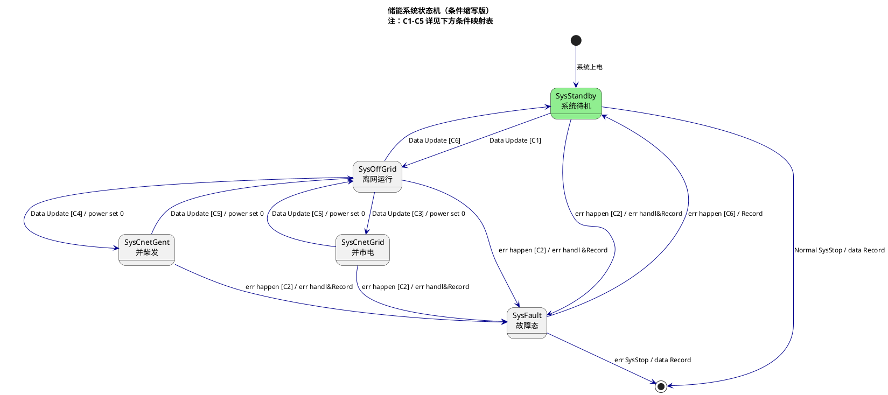

# 01-PRD.md - 产品需求文档 (Product Requirements Document)

> **文档版本**: 1.9  
> **最后更新**: 2026-04-12  
> **关联文档**: [00-Context.md](./00-Context.md), [references/MPC_ESS_Academic_Analysis.md](./references/MPC_ESS_Academic_Analysis.md)

---

## 版本变更记录

| 版本 | 日期 | 变更内容 |
|------|------|---------|
| 1.9 | 2026-04-12 | **修正**: 3.1绿电消纳场景 - 明确<88%区间PCS功率=0（光伏直流直充）；v1.8描述不完整 |
| 1.8 | 2026-04-12 | **修正**: 3.1绿电消纳场景 - PCS功率=负载×95%（原误写为PCS=0）；防逆流判断依据改为关口表功率（原误写为总PCS输出功率） |
| 1.7 | 2026-04-10 | **⚠️ 拓扑纠正**: 明确MPPT直流输出直接到直流母线，与电池并联（不经过PCS）；**新增**: 直流侧功率平衡方程注释 P_bat = P_pv - P_clu/η；**修正**: 绿电消纳场景描述（光伏直接充电，PCS功率=0）；**修正**: 需量保护描述（PCS从电网吸收的充电功率） |
| 1.6 | 2026-04-09 | MPPT控制逻辑更新: 主机分配 → EMS直接控制各台；新增MPPT运行模式约束 |

---

## 1. 产品概述

### 1.1 产品定位
**Cot EMS** 是一套面向缅甸地区光储柴微网场景的能源管理系统，部署于 WL-EMS-1000-M 边缘控制器，实现储能、光伏、柴发的协同控制，确保系统在并网/离网/并柴发模式下的稳定运行。

### 1.2 核心价值主张
| 价值维度 | 描述 |
|----------|------|
| **绿电最大化** | 优先消纳光伏，减少化石能源依赖 |
| **供电可靠性** | 市电中断时无缝切换至储能/柴发，保障重要负载 |
| **运维智能化** | 本地+云端双通道监控，支持远程策略下发 |

### 1.3 目标用户画像

| 用户角色 | 使用场景 | 核心需求 |
|----------|----------|----------|
| **现场运维工程师** | 设备安装调试、故障排查 | 本地屏幕操作、实时数据查看、手动控制、模式切换 |
| **能源管理专员** | 日常运行监控、策略优化 | 绿电消纳策略配置、报表分析、告警处理 |
| **云端管理员** | 多站点集中管理、远程维护 | 批量策略下发、固件升级、数据可视化 |
| **系统维护人员** | 系统维护、版本升级 | Web升级、日志导出、参数备份恢复、手动关机 |

---

## 2. 系统拓扑

### 2.1 电气拓扑结构

```
┌─────────────────────────────────────────────────────────────────┐
│                         交流母线 (AC Bus)                        │
│  ┌─────────┐    ┌─────────┐    ┌─────────┐                     │
│  │ 簇1 PCS │    │ 簇2 PCS │    │  负载   │                     │
│  │1#2#3#   │    │4#5#     │    │         │                     │
│  │(375kW)  │    │(250kW)  │    │         │                     │
│  └────┬────┘    └────┬────┘    └─────────┘                     │
│       │              │                                         │
│       └──────────────┴──────────────┐                          │
│                                     ▼                          │
│                              ┌──────────┐                      │
│                              │   STS    │                      │
│                              └────┬─────┘                      │
│                                   │                            │
│                              ┌────┴─────┐                      │
│                              │   ATS    │                      │
│                              └────┬─────┘                      │
│                     ┌─────────────┴─────────────┐              │
│                     ▼                             ▼              │
│                ┌─────────┐                 ┌─────────┐         │
│                │  市电   │                 │  柴发   │         │
│                └─────────┘                 └─────────┘         │
└─────────────────────────────────────────────────────────────────┘

┌─────────────────────────────────────────────────────────────────┐
│                    直流母线（簇1）- DC Bus 1                     │
│  ┌──────────┐    ┌──────────┐    ┌──────────┐                  │
│  │ MPPT 1~4 │────│ 电池1~2  │────│ PCS 1~3  │                  │
│  │ (400kW)  │    │ (260kW)  │    │ (375kW) │                  │
│  └──────────┘    └──────────┘    └──────────┘                  │
└─────────────────────────────────────────────────────────────────┘

┌─────────────────────────────────────────────────────────────────┐
│                    直流母线（簇2）- DC Bus 2                     │
│  ┌──────────┐    ┌──────────┐    ┌──────────┐                  │
│  │ MPPT 5~7 │────│ 电池3~4  │────│ PCS 4~5  │                  │
│  │ (300kW)  │    │ (260kW)  │    │ (250kW) │                  │
│  └──────────┘    └──────────┘    └──────────┘                  │
└─────────────────────────────────────────────────────────────────┘
```

**拓扑特征**:
- **两簇PCS交流侧并联**，共接交流母线，与负载、STS连接
- **每簇独立直流母线**：MPPT、电池、PCS直流侧**并联在直流母线上**
- **⚠️ 重要**: MPPT直流输出直接到直流母线，与电池并联（不经过PCS）
- **⚠️ 重要**: PCS是AC/DC双向变换器，只连接交流侧和直流侧，不参与MPPT→电池的直流路径
- **直流侧功率平衡**: P_bat = P_pv - P_clu/η
- **ATS**：市电优先级高，保证只有一个电压源输入（市电/柴发二选一）
- **STS**：控制并网/离网切换

### 2.2 簇定义

| 簇 | PCS | MPPT | DC柜 | BAM | 额定功率 |
|----|-----|------|------|-----|----------|
| **簇1** | 1#~3# | 1#~4# | 1#~2# | BAM1 (TCP1) | PCS: 375kW / MPPT: 400kW / 电池: 260kW |
| **簇2** | 4#~5# | 5#~7# | 3#~4# | BAM2 (TCP2) | PCS: 250kW / MPPT: 300kW / 电池: 260kW |

---

## 3. 用户故事 (User Stories)

### 3.1 绿电消纳场景
> **作为** 能源管理专员，  
> **我希望** 系统优先使用光伏发电供负载，多余电量充入储能，不足时储能放电补充，  
> **从而** 最大化绿电消纳率，减少从电网购电。

**前置条件**：绿电阈值设置为 **90%（滞环±2%，即92%开启放电，88%停止放电）**

**验收标准**:
- 当两簇最小SOC ≥ 绿电阈值(92%)且并网时，通过PCS做负载跟随：
  - 当 PV总功率 ≥ 负载功率时，光伏通过直流母线直接给电池充电（PCS功率=负载功率×95%）
  - 当 PV总功率 < 负载功率时，PCS放电补充缺口（PCS功率=负载功率×95%）
- 当两簇最小SOC < 绿电阈值(88%)时，不通过PCS进行放电：
  - PV通过直流母线直接给电池充电（PCS功率=0），负载交给市电
- 每簇PV功率限制值 = 95% × (簇电池总充电需求 + 簇PCS总实时功率)
  - 注：此公式基于直流侧功率平衡 P_bat = P_pv - P_clu/η，P_clu为负表示PCS从电网充电
- 关口表功率 > 防逆流余量（可设置，暂定5kW），禁止向电网送电
- 功率调节周期 ≤ 4s

**异常分支**:
- 若SOC达到上限（95%），停止充电，多余PV功率限发
- 若SOC达到下限（20%），停止放电，电池从电网充电(若并网)

### 3.2 系统备电场景（并离网切换）
> **作为** 现场运维工程师，  
> **我希望** 市电中断时系统自动切换至离网模式，由储能供电；当SOC不足时自动启动柴发，切换至柴发供电，  
> **从而** 保障重要负载不间断供电。

**前置条件**：备电阈值设置为 **70%（滞环±1%，即71%停止充电，69%开始充电）**

**验收标准**:
- Grid电压跌落至 < 0.85Un 持续200ms，系统检测到异常
- 500ms内完成STS切换至离网，负载电压跌落 < 10%
- PCS自动从并网(PQ)模式切换至离网(VF)模式
- **四层SOC阈值管理**：
  - **柴发启动**：SOC ≤ 20%时发出启动信号（DO-1）
  - **备电恢复**：SOC < 70%时，市电充电恢复备电能力（仅需量约束）
  - **柴发停机**：SOC ≥ 80% 或 市电恢复且ATS切到市电侧
  - **绿电消纳**：SOC ≥ 92%时允许PCS放电做负载跟随
- 柴发启动稳定后（电压/频率正常），ATS切换至柴发侧，STS闭合，PCS并入柴发电压源
- **备电充电策略**（市电恢复场景）：
  - SOC < 70%：市电充电（仅需量约束，快速恢复备电）
  - 71%~90%：只用光伏充电
  - >90%：光伏充电（需PV功率 > 负载功率）

**异常分支**:
- 柴发启动失败：保持储能供电，告警通知，尝试多次启动
- 柴发停机失败：保持储能供电，告警通知，尝试多次停机，并切除柴发侧断路器（人工操作）
- 柴发燃料不足：告警通知，建议减小负载或等待市电恢复

**设计约束**：储能系统按额定负载持续输出**2小时**设计

### 3.3 远程监控场景
> **作为** 云端管理员，  
> **我希望** 通过Web/App查看站点实时状态并下发控制指令，  
> **从而** 实现无人值守站点的远程管理。

**验收标准**:
- 数据刷新延迟 < 5s（4G网络正常时）
- 控制指令下发至执行 < 1s
- 通信中断时本地自主运行，恢复后自动续传断点数据
- 支持远程模式切换（需权限验证）

---

## 4. 功能需求 (Functional Requirements)

### 4.1 数据采集与监控

#### FR-001 设备数据接入
| 属性 | 描述 |
|------|------|
| **需求描述** | 系统应支持接入PCS、BAM、MPPT、电表、液冷机、除湿机、STS、变压器温控仪、ATS等设备 |
| **优先级** | Must |
| **通信协议** | Modbus-RTU、Modbus-TCP、DLT645 |
| **采集周期** | 遥测：秒级；遥信：变化上送+周期扫描 |
| **测点范围** | 电压、电流、功率、SOC、温度、状态字、告警码等 |

#### FR-002 实时数据展示
| 属性 | 描述 |
|------|------|
| **需求描述** | 本地屏幕和Web界面应实时展示系统运行状态 |
| **展示内容** | 功率流向图、设备状态、SOC、运行模式、告警列表、DI/DO状态 |
| **刷新频率** | 本地屏幕：1s；Web：30s |
| **优先级** | Must |

#### FR-003 断点续传
| 属性 | 描述 |
|------|------|
| **需求描述** | 4G/5G通信中断时，EMU本地存储数据，恢复后自动补传 |
| **存储容量** | ≥3天数据，1min间隔，循环覆盖 |
| **存储介质** | 256GB SSD |
| **优先级** | Must |

### 4.2 能量管理策略

#### FR-004 手动模式
| 属性 | 描述 |
|------|------|
| **需求描述** | 人工设定PCS功率值和运行模式，用于调试和应急 |
| **功率范围** | -额定功率 ~ +额定功率（单台PCS） |
| **模式选项** | 停机/恒功率充电/恒功率放电/恒压模式（VF） |
| **权限要求** | 仅管理员/操作员可操作 |
| **优先级** | Must |

#### FR-005 绿电消纳策略-自动模式
| 属性 | 描述 |
|------|------|
| **需求描述** | 满足SOC>绿电阈值时，最大化使用光伏，剩余充电，不足时放电补充 |
| **控制目标** | pcs功率=负载功率*95%，电网功率 P_grid ∈ [0, +5kW]（防逆流限制） |
| **响应速度** | 功率调节周期 < 1s |
| **约束条件** | SOC上下限保护、PCS功率限制、防逆流 |
| **优先级** | Must |

#### FR-006 备电策略-自动模式
| 属性 | 描述 |
|------|------|
| **需求描述** | 满足soc<备电阈值时，系统如果处于离网，则使用光伏优先给电池充电，系统如果处于并网，使用市电直接给电池充电 |
| **控制目标** | 并网下，PCS功率 =-(电池充电需求*95%)，电网功率 P_grid ∈ （防逆流限制）[ +5kw, 800kW]（需量限制） |
| **响应速度** | 功率调节周期 < 1s |
| **约束条件** | SOC上下限保护、PCS功率限制、防逆流 |
| **优先级** | Must |

#### FR-007 柴发联动策略-自动模式
| 属性 | 描述 |
|------|------|
| **需求描述** | SOC低于阈值时自动启动柴发，恢复后停机；柴发稳定后支持PCS并柴发运行 |
| **控制方式** | DO-1硬线启停信号（干接点） |
| **启动条件** | SOC ≤ 20% 或 人工启动指令（本地HMI或远程监控） |
| **停机条件** | SOC ≥ 80% 或 市电恢复（可配置）或 人工停机指令 |
| **柴发并机条件** | 柴发输出电压/频率稳定（C4条件满足） |
| **柴发启动时序** | 柴发启动→ATS切换→STS闭合，总时间受柴发机型、ATS动作时间、STS判断逻辑共同影响，EMS需根据实际工况设定超时阈值 |
| **ATS切换逻辑** | ATS不由EMS控制，柴发停机后市电切换由ATS自主判断：若市电存在且稳定则自动切市电；若无市电，柴发停机后ATS仅断开柴发侧开关 |
| **优先级** | Must |

**状态机定义**:



**状态流转表**:

| 当前状态 | 触发条件 | 目标状态 | 动作 | 说明 |
|----------|----------|----------|------|------|
| 待机 | C1: 开机就绪 | 离网 | 开机自检通过 | 首次上电或人工开机 |
| 离网 | C3: 市电正常 | 并市电 | PCS功率设0，同步后并网 | STS闭合，ATS在市电侧 |
| 离网 | C4: 柴发正常 | 并柴发 | PCS功率设0，同步后并柴发 | STS闭合，ATS在柴发侧 |
| 并市电 | C5: 市电异常 | 离网 | PCS功率设0，切换至离网 | STS断开，切VF模式 |
| 并柴发 | C5: 柴发异常 | 离网 | PCS功率设0，切换至离网 | STS断开，切VF模式 |
| 任意态 | C2: 故障发生 | 故障态 | 故障处理，记录日志 | 保护性停机 |
| 故障态 | C6: 故障清除 | 待机 | 恢复待机 | 【待定】人工确认后恢复 |
| 待机 | 人工关机指令 | 关机 | 数据记录后下电 | 【待定】关机流程 |

**条件定义**:

| 条件 | 名称 | 详细定义 |
|------|------|----------|
| **C1** | 开机就绪 | 所有设备通讯正常 ∧ 所有设备无故障 ∧ 系统各功能节点无故障 ∧ PCS簇设备(主从、运行模式、运行状态=开机) ∧ 配置与状态正常 ∧ MPPT簇设备(主从、运行模式、运行状态) ∧ 配置与状态正常 ∧ BMS主从与配置数量匹配 ∧ 其他设备配置与参数正常 ∧ 直流侧电压参数满足离网供电高压(870V±压差) ∧ 交流母线电压参数满足离网供电(50Hz,电压相序正常) |
| **C2** | 故障条件 | 所有设备通讯不正常 ∨ 存在有故障设备 ∨ 存在故障的系统功能节点 |
| **C3** | 并市电条件 | 所有设备通讯正常 ∧ 所有设备无故障 ∧ 系统各功能节点无故障 ∧ ATS市电IO=1 ∧ STS并网状态位=1 ∧ 【可选】关口表市电电压参数正常(电压、相序、频率) |
| **C4** | 并柴发条件 | 所有设备通讯正常 ∧ 所有设备无故障 ∧ 系统各功能节点无故障 ∧ ATS市电IO=0 ∧ 备用IO=1(柴发) ∧ STS并网状态位=1 ∧ 【可选】柴发侧电压参数正常(电压、相序、频率) |
| **C5** | 切离网条件 | 所有设备通讯正常 ∧ 所有设备无故障 ∧ 系统各功能节点无故障 ∧ STS并网状态位=0 ∧ 【可选】关口表市电电压异常(电压跌落<0.85Un或频率异常) |
| **C6** | 转待机条件 | 所有设备通讯正常 ∧ 所有设备无故障 ∧ 系统各功能节点无故障 ∧ PCS簇设备(运行状态=关机) ∧ 配置与状态正常 ∧ 直流侧电压参数满足待机高压(870V±压差) ∧ 交流母线电压参数正常(电压≈0,频率≈0) |

**业务规则**:
1. **切换前功率归零**：任何状态切换前，必须先将PCS功率设0，避免电气冲击
2. **同步条件**：并市电/并柴发前，必须检测电压、频率、相序满足同步条件（压差<5%，频差<0.5Hz，相角差<10°）
3. **VF模式切换**：离网运行时，主PCS转VF（电压源）模式，其他PCS转PQ模式跟随
4. **故障锁定**：进入故障态后，禁止自动切换，需人工确认后恢复（流程待定）
5. **柴发并网解释**：C4的"并柴发"指STS闭合、ATS切至柴发侧，PCS作为电流源并入柴发电压源，非柴发并网运行

### 4.3 设备控制与保护

#### FR-008 防逆流保护
| 属性 | 描述 |
|------|------|
| **需求描述** | 防止电能倒送电网。防逆流作为周期性约束计算，实时根据关口表功率和负载功率计算PCS放电上限，确保向电网送电不超过余量阈值 |
| **约束计算** | 防逆流放电上限 = max(0, 负载功率 - 防逆流余量)。PCS放电功率不得超过此上限 |
| **余量阈值** | 5kW（可配置），表示距离产生逆流还有多少安全余量 |
| **响应时间** | < 200ms（计算至功率限制生效） |
| **持续逆流处理** | 若实际逆流持续超过60s，触发切换至离网模式保护 |
| **优先级** | Must |

#### FR-009 需量保护
| 属性 | 描述 |
|------|------|
| **需求描述** | 限制系统最大功率，避免变压器过载 |
| **触发条件** | 关口表功率 > 需量阈值（变压器容量的80%） |
| **保护动作** | 通过限制PCS从电网吸收的充电功率，满足关口表功率 < 需量阈值（变压器容量的80%）- 5kW(余量) |
| **优先级** | Should |

#### FR-010 SOC均衡
| 属性 | 描述 |
|------|------|
| **需求描述** | 多簇储能间SOC均衡，避免单簇过充过放 |
| **均衡策略** | 此处只做狭义的均衡，只在并网情况下收到需量限制时，根据每簇SOC情况，实现SOC高的少充，SOC低的多充；不受需量限制时，根据电池充电需求充电 |
| **优先级** | Should |

#### FR-019 PCS簇控制
| 属性 | 描述 |
|------|------|
| **需求描述** | 实现PCS簇的启停控制、功率分配及故障管理，确保簇内多机协调运行 |
| **控制对象** | 簇1 PCS（1#、2#、3#），簇2 PCS（4#、5#） |
| **优先级** | Must |

**PCS开机顺序（离网状态）**：
1. 先将所有PCS功率设置为0
2. 按 **1# → 2# → 3# → 4# → 5#** 顺序依次开机
3. 每台PCS开机后需确认运行状态正常，再开启下一台

**PCS关机顺序**：
1. 先将所有PCS功率设置为0
2. 按 **2# → 3# → 4# → 5# → 1#** 顺序依次关机（1#最后关闭，确保VF模式主站最后退出）

**PCS功率分配（并网状态）**：
| 簇 | 主控PCS | 从控PCS | 功率分配方式 | 功率边界 |
|----|---------|---------|--------------|----------|
| **簇1** | 1# | 2#、3# | 1#作为主控，计算总需求后均分给2#、3# | [-375kW, +375kW] |
| **簇2** | 4# | 5# | 4#作为主控，计算总需求后分配给5# | [-250kW, +250kW] |

**PCS故障复位**：
- 每台PCS的故障复位指令**一一对应**，独立下发
- 支持单台复位和批量复位两种模式
- 复位前需确认故障已清除，避免重复触发

**簇间功率分配公式**：待补充

---

#### FR-020 MPPT簇控制
| 属性 | 描述 |
|------|------|
| **需求描述** | 实现MPPT簇的启停控制、功率限制分配，最大化光伏消纳同时保护电池 |
| **控制对象** | 簇1 MPPT（1#、2#、3#、4#），簇2 MPPT（5#、6#、7#） |
| **优先级** | Must |

**MPPT运行模式约束**（⚠️ 关键设计约束）:

MPPT出厂默认为**自动运行模式**，EMS必须正确处理以下场景：

| 场景 | 行为特征 | EMS处理要求 |
|------|---------|------------|
| **系统首次上电/MPPT重新上电** | 电压正常后**自动开机** | EMS只需监控确认MPPT已启动，**无需显式发送开机指令** |
| **EMS主动关机后** | 必须显式发送46001=1才能重新开机，不会自动恢复 | EMS关机时必须记录标志位，下次开机**必须先发46001=1** |
| **故障自动恢复后** | 故障清除后**自动重新开机** | EMS只需监控，无需干预 |
| **EMS重启后** | MPPT可能仍在运行（若之前未正常关机） | EMS启动时需读取状态，若已运行则避免重复发送开机指令 |

**MPPT开机顺序**（需考虑运行模式约束）：
1. 先将所有MPPT功率限制设置为0
2. 检查每台MPPT当前运行状态（45200状态字）
3. 若MPPT未运行且需EMS开机：按升序依次发送46001=1开启：**1# → 2# → 3# → 4# → 5# → 6# → 7#**
4. 若MPPT已自动运行：确认通讯正常即可，无需重复开机
5. 每台开启后确认通讯正常，再处理下一台

**MPPT关机顺序**：
1. 先将所有MPPT功率限制设置为0
2. 按降序依次发送46001=0关闭：**7# → 6# → 5# → 4# → 3# → 2# → 1#**
3. 记录`shutdown_by_ems`标志，供下次开机判断使用

**MPPT功率限制控制**：

EMS直接对每个MPPT设备独立设置功率限制，不再通过主从机分配：

| 簇 | MPPT设备 | 功率控制方式 | 功率边界 |
|----|----------|--------------|----------|
| **簇1** | 1#、2#、3#、4# | EMS单独控制每台MPPT的46110功率百分比 | [0kW, 400kW] |
| **簇2** | 5#、6#、7# | EMS单独控制每台MPPT的46110功率百分比 | [0kW, 300kW] |

**MPPT功率限制计算**：
- 每簇PV功率限制总值 = 95% × (簇电池总充电需求 - 簇PCS总实时功率)
  - **公式依据**：基于直流侧功率平衡 P_charge_total = P_pv + P_clu（P_clu为负表示PCS从电网充电）
- EMS根据各MPPT实时状态，将总限制值分配给各台MPPT
- 各MPPT功率百分比 = (分配功率 / 基准功率) × 100%

**MPPT故障复位**：
- MPPT支持通过46003寄存器写1清除故障
- 故障自动复位使能(46121)默认开启，故障恢复后可自动重启

**注意事项**：
- MPPT为单向设备（仅充电），功率边界下限为0kW
- 功率限制调整周期 ≤ 4s，避免频繁调节导致MPPT抖动
- EMS必须维护每台MPPT的`shutdown_by_ems`状态，确保下次开机逻辑正确

### 4.4 告警与事件管理

#### FR-011 告警分级
| 级别 | 描述 | 示例 | 处理要求 |
|------|------|------|----------|
| **紧急** | 危及人身安全或设备安全 | 消防信号、急停触发、绝缘故障、STS故障 | 立即停机，声光告警，通知云端 |
| **重要** | 影响系统正常运行 | 通信中断、PCS故障、柴发启动失败、电网异常 | 自动切换模式，告警通知 |
| **一般** | 提示性信息，可延后处理 | 温度过高、SOC偏低、滤网堵塞 | 记录日志，定期提示 |

#### FR-012 告警处理流程
- **本地告警**：本地屏幕弹窗+声光提示（蜂鸣器）+ DO故障灯输出
- **云端告警**：实时推送至云端（MQTT），支持短信/App推送
- **告警确认**：支持本地屏幕/远程Web确认，记录确认人和时间
- **告警屏蔽**：支持非关键告警临时屏蔽（单次/周期性），避免干扰
- **告警抑制**：状态切换期间（如并离网切换500ms内）抑制无效告警

#### FR-013 事件记录
- 记录所有状态变化、控制指令、模式切换、参数修改
- 支持按时间范围、设备类型、事件级别查询
- 本地存储 ≥ 6个月，云端永久存储
- 支持CSV导出，便于分析

### 4.5 人机交互

#### FR-014 本地屏幕功能
| 页面 | 功能描述 |
|------|----------|
| **概览页** | 系统功率流向图、关键参数（SOC、PV功率、负载功率、电网功率、运行模式） |
| **设备页** | 各设备详情（PCS、BAM、MPPT、电表、液冷机等）、参数设置、启停控制 |
| **策略页** | 模式切换（绿电消纳/手动/待机）、策略参数配置、柴发启停 |
| **告警页** | 实时告警列表、历史告警查询、告警确认/屏蔽 |
| **设置页** | 网络配置（IP/4G）、时间同步、用户管理、系统升级 |
| **状态机页** | 当前状态显示、状态流转记录、切换条件监控 |

#### FR-015 Web/App功能
| 页面 | 功能描述 |
|------|----------|
| **首页** | 站点地图、运行状态概览、告警统计、快速控制入口 |
| **监控页** | 实时数据、趋势曲线（功率/SOC/电压）、功率流向动画 |
| **控制页** | 远程模式切换、策略下发、柴发启停（需二次确认） |
| **报表页** | 发电量统计、收益分析、告警统计、运行时长 |
| **管理页** | 站点管理、用户权限、固件升级、配置备份/恢复 |

### 4.6 系统管理

#### FR-016 用户权限管理
| 角色 | 权限 | 适用场景 |
|------|------|----------|
| **管理员** | 所有操作，包括系统配置、用户管理、参数修改、固件升级 | 系统维护人员 |
| **操作员** | 策略配置、手动控制、柴发启停、告警确认 | 现场运维工程师 |
| **观察员** | 仅查看实时数据和历史记录，无控制权限 | 管理人员、访客 |

#### FR-017 系统升级
- **Web升级**：前端页面在线升级（OTA）
- **控制器升级**：固件OTA升级，支持断点续传、版本回滚
- **配置备份/恢复**：参数导出为JSON文件，支持批量导入、配置模板

#### FR-018 系统关机（待定）
| 属性 | 描述 |
|------|------|
| **需求描述** | 人工触发系统安全关机流程 |
| **触发条件** | 本地屏幕关机按钮 / 远程指令 |
| **关机流程** | 【待定】：功率归零→PCS停机→数据保存→断开连接→下电 |
| **优先级** | Should |

---

## 5. 非功能需求 (Non-Functional Requirements)

### 5.1 性能需求

| 指标 | 要求 | 说明 |
|------|------|------|
| **并离网切换时间** | < 500ms | 从Grid异常检测到负载切换完成（C5触发到STS切换） |
| **防逆流响应时间** | < 200ms | 检测到逆流至功率限制生效 |
| **柴发启动延迟** | < 10s（信号发出） | 从DO-1闭合到柴发开始启动（柴发本身启动时间另计） |
| **数据刷新延迟** | 本地< 1s，云端< 5s | 正常网络条件下 |
| **状态机扫描周期** | 100ms | 条件检测和状态判断周期 |
| **并发连接** | ≥ 10个客户端 | Web/App同时在线 |

### 5.2 可靠性需求

| 指标 | 要求 | 说明 |
|------|------|------|
| **系统可用性** | ≥ 99.5% | 年停机时间 < 44小时 |
| **MTBF** | > 100,000小时 | 硬件平均无故障时间 |
| **数据完整性** | 100% | 断网期间数据不丢失，恢复后补传 |
| **故障恢复** | < 60s | 软件故障自动重启时间 |
| **状态机容错** | 单次误判不触发切换 | 条件持续满足3个周期（300ms）才触发 |

### 5.3 兼容性需求

| 项目 | 要求 |
|------|------|
| **浏览器** | Chrome 90+, Firefox 88+, Edge 90+ |
| **移动端** | iOS 14+, Android 10+ |
| **协议兼容** | Modbus-RTU/TCP, DLT645-2007, MQTT 3.1.1, IEC 104, ONVIF |
| **南向设备** | 恩玖PCS、定制BAM、通用MPPT、标准电表 |

### 5.4 安全需求

| 项目 | 要求 |
|------|------|
| **认证** | 用户名/密码+Token，支持双因素认证（可选） |
| **加密** | 通信TLS 1.2+，敏感数据（密码、密钥）AES-256加密存储 |
| **审计** | 所有控制操作记录审计日志（操作人、时间、结果） |
| **权限控制** | 基于角色的访问控制（RBAC），关键操作需二次确认 |
| **隔离** | 控制网与管理网逻辑隔离，外部访问需VPN/白名单 |

### 5.5 可维护性需求

| 项目 | 要求 |
|------|------|
| **日志级别** | DEBUG/INFO/WARN/ERROR/FATAL，支持动态调整 |
| **远程诊断** | 支持远程SSH/Telnet调试、日志实时查看 |
| **模块化** | 核心功能模块化，支持独立升级 |
| **配置热加载** | 非关键参数修改无需重启 |

---

## 6. 优先级划分 (MoSCoW)

### Must Have (必须有) - 核心功能
| ID | 需求 | 说明 |
|----|------|------|
| FR-001 | 设备数据接入 | 基础数据采集 |
| FR-002 | 实时数据展示 | 基本监控能力 |
| FR-003 | 断电续传 | 可靠性保障 |
| FR-004 | 手动模式 | 调试和应急 |
| FR-005 | 绿电消纳策略 | 核心能量策略 |
| FR-006 | 备电策略 | 核心能量策略 |
| FR-007 | 柴发联动策略 | 备电核心，含DO控制 |
| FR-008 | 防逆流保护 | 安全底线 |
| FR-011 | 告警分级 | 安全运营 |
| FR-012 | 告警处理流程 | 本地+云端通知 |
| FR-014 | 本地屏幕功能 | 现场运维必需 |
| FR-019 | PCS簇控制 | 能量分配核心 |
| FR-020 | MPPT簇控制 | 能量分配核心 |

### Should Have (应该有) - 增强功能
| ID | 需求 | 说明 |
|----|------|------|
| FR-009 | 需量保护 | 变压器保护 |
| FR-010 | SOC均衡 | 多簇电池寿命优化 |
| FR-013 | 事件记录 | 详细日志和审计 |
| FR-015 | Web/App功能 | 远程管理能力 |
| FR-016 | 用户权限管理 | 多角色安全控制 |
| FR-017 | 系统升级 | OTA和配置管理 |

### Could Have (可以有) - 增值功能
| ID | 需求 | 说明 |
|----|------|------|
| - | 视频监控集成 | ONVIF摄像头接入 |
| - | 语音告警播报 | 本地语音提醒 |
| - | 多语言支持 | 缅甸语/英语界面 |
| - | 报表自动邮件 | 日报/月报自动发送 |

### Won't Have (暂不做) - 超出范围
| ID | 需求 | 说明 |
|----|------|------|
| - | V2G（车辆到电网） | 无充电桩接口 |
| - | 氢能管理 | 无氢能设备 |
| - | AI故障预测 | 需历史数据积累 |
| - | 区块链碳交易 | 业务无关 |

### To Be Determined (待定)
| ID | 需求 | 待确认内容 |
|----|------|-----------|
| FR-018 | 系统关机 | 关机流程、安全下电机制 |
| - | 故障恢复流程 | C6条件、自动/人工恢复策略 |
| - | 负载分级切除 | 是否支持、切除优先级、执行逻辑 |
| - | 削峰填谷 | 缅甸是否有电价差、是否适用 |

---

## 7. 附录

### 7.1 术语表
参见 [00-Context.md](./00-Context.md#4-关键术语表)

### 7.2 状态机条件速查
| 条件 | 触发场景 | 关键信号 |
|------|----------|----------|
| C1 | 开机就绪 | 通讯正常、无故障、PCS开机、电压正常 |
| C2 | 故障发生 | 通讯中断、设备故障、功能节点故障 |
| C3 | 并网 | ATS市电=1, STS并网=1, 市电电压正常 |
| C4 | 并柴发 | ATS市电=0, 备用=1, STS并网=1, 柴发电压正常 |
| C5 | 切离网 | STS并网=0, 市电/柴发异常 |
| C6 | 转待机 | 通讯正常、无故障、PCS关机、电压正常 |

### 7.3 待确认问题清单

| 序号 | 问题 | 影响范围 | 当前状态 |
|------|------|----------|----------|
| 1 | ~~滞环值~~ | ~~防抖动、避免频繁切换~~ | **已确认：绿电90%±2%，备电70%±1%** |
| 2 | **STS切换时间** | 负载供电连续性 | 待确认 |
| 3 | **保护余量** | SOC的DOD保护具体百分比 | 待确认（建议10%或15%） |
| 4 | **负载优先级** | 是否支持分级负载切除 | 待确认 |
| 5 | ~~柴发启动延迟~~ | ~~柴发从启动到稳定输出的时间~~ | **已确认：包含柴发启动+ATS切换+STS判断，EMS需设超时阈值** |
| 6 | **并机同步机制** | 主备控制器状态同步协议 | 待确认 |
| 7 | **关机流程** | 安全关机步骤、数据保存机制 | 待定 |
| 8 | **故障恢复** | 故障清除后自动/人工恢复 | 待定 |
| 9 | ~~削峰填谷~~ | ~~缅甸是否有电价差~~ | **已确认：本项目不适用** |
| 10 | **视频监控** | ONVIF摄像头是否为必须功能 | 待确认 |
| 11 | ~~防逆流判定逻辑~~ | ~~关口表功率阈值及动作策略~~ | **已确认：功率<5kW触发限制，持续逆流60s进离网** |
| 12 | **PCS簇控制公式** | 簇间功率分配算法 | 待补充 |
| 13 | **MPPT簇控制公式** | 簇间功率限制算法 | 待补充 |

---

## 8. 变更记录

| 版本 | 日期 | 变更内容 | 作者 |
|------|------|----------|------|
| 1.0 | 2026-04-07 | 初始版本，基础功能定义 | AI Assistant |
| 1.1 | 2026-04-07 | 细化FR-006状态机，增加C1-C6条件定义，澄清柴发并网概念，增加待定项 | AI Assistant |
| 1.2 | 2026-04-07 | **用户故事细化**：绿电消纳场景增加前置条件和详细验收标准；备电场景增加四层SOC阈值、备电充电策略、异常分支；更新待确认问题清单 | AI Assistant |
| 1.3 | 2026-04-07 | **更新FR-007/008/009/010**：柴发联动添加启动时序说明和ATS自主切换逻辑；防逆流明确功率限制策略、持续逆流60s判定；需量保护明确限制充电功率策略；SOC均衡明确"狭义均衡"定义 | AI Assistant |
| 1.4 | 2026-04-08 | **同步用户本地1.2版本**：修正FR-004（控制目标[0,+5kW]、响应<1s）、FR-002（Web刷新30s）、FR-001（去掉ONVIF）、章节编号统一（3.x/4.x） | AI Assistant |
| 1.6 | 2026-04-09 | **MPPT控制逻辑变更**：FR-020功率限制由"主机分配"改为"EMS直接控制各台"，删除主从分配表格，更新控制流程 | Kimi Claw |
| 1.5 | 2026-04-08 | **结构调整**：重新编排策略章节（FR-004手动、FR-005绿电消纳、FR-006备电、FR-007柴发联动）；**新增设备簇控制**：FR-019 PCS簇控制、FR-020 MPPT簇控制；修正所有HTML实体编码和格式错误 | AI Assistant |

---

*本文档为产品需求定义，状态机详细定义参见 [04-State-Machine.md](./04-State-Machine.md)（待生成）*
