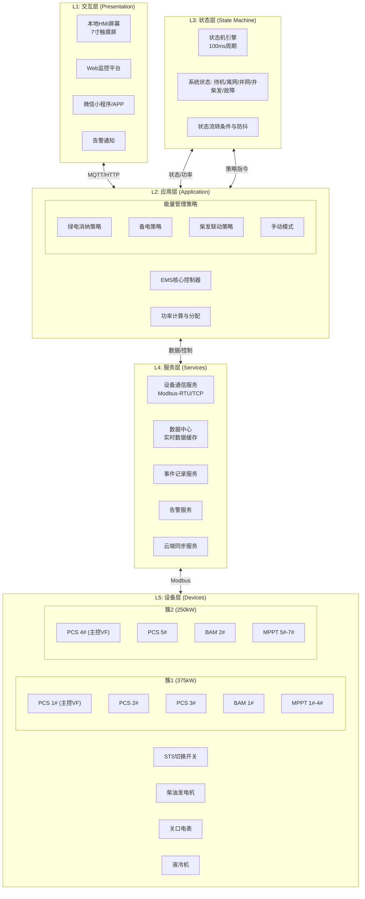
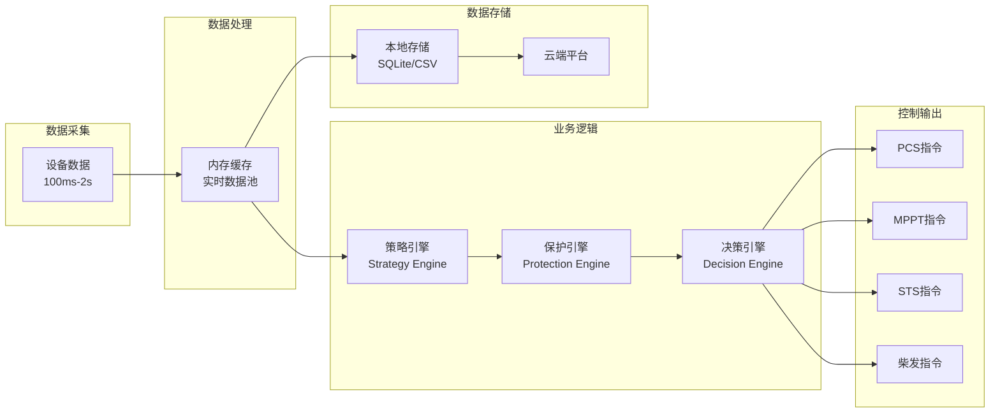
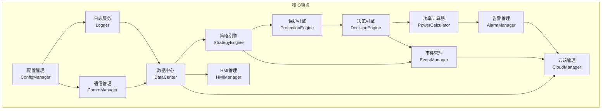
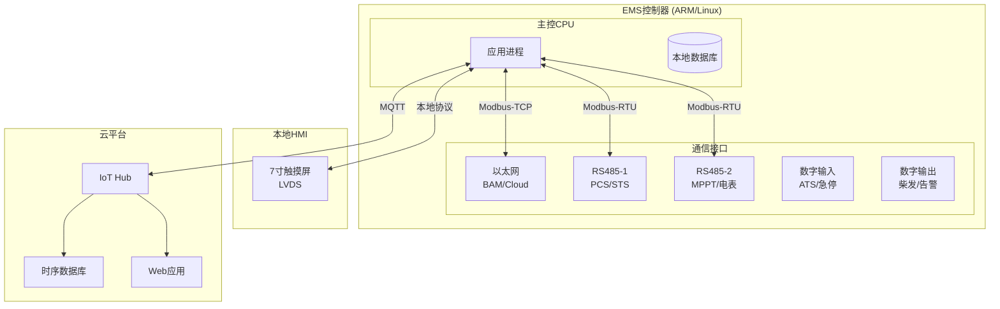

# 03-Architecture.md - 系统架构设计 (System Architecture)

> **文档版本**: 1.0  
> **最后更新**: 2026-04-10  
> **关联文档**: [01-PRD.md](./01-PRD.md), [02-Domain-Model.md](./02-Domain-Model.md)

---

## 1. 架构概述

Cot EMS采用**分层架构**设计，分为五层：

| 层级 | 名称 | 职责 | 对应文档 |
|------|------|------|----------|
| L1 | 交互层 | 用户界面、远程监控、告警通知 | 05-Functional-Spec |
| L2 | 应用层 | 能量管理策略、模式控制、功率分配 | 05-Functional-Spec |
| L3 | 状态层 | 系统状态机、状态流转、安全防护 | 04-State-Machine |
| L4 | 服务层 | 设备通信、数据存储、事件记录 | 05-Functional-Spec |
| L5 | 设备层 | PCS/MPPT/BAM/STS等物理设备 | 02-Domain-Model |

---

## 2. 系统架构图



---

## 3. 核心组件设计

### 3.1 数据流架构



**数据流说明**:

| 阶段 | 组件 | 职责 | 输入 | 输出 |
|------|------|------|------|------|
| **数据采集** | 设备接口 | 从各设备读取实时数据 | Modbus寄存器 | 原始设备数据 |
| **数据处理** | 内存缓存 | 实时数据池，维护最新状态 | 原始数据 | 结构化状态数据 |
| **业务逻辑-策略** | 策略引擎 | 计算能量管理策略（绿电/备电/柴发） | SOC、功率、模式配置 | 目标功率指令 |
| **业务逻辑-保护** | 保护引擎 | 检查约束条件（防逆流/需量/电压） | 策略输出+实时数据 | 受限功率指令 |
| **业务逻辑-决策** | 决策引擎 | 最终决策+状态机触发 | 保护输出+状态条件 | 控制指令+状态跳转 |
| **控制输出** | 设备指令 | 下发到各执行设备 | 决策指令 | Modbus写操作 |
| **数据存储** | 本地/云端 | 持久化记录 | 所有数据 | 事件/告警/趋势 |

### 3.2 模块依赖关系



---

## 4. 部署架构

### 4.1 硬件部署



### 4.2 软件部署结构

```
/opt/cot-ems/
├── bin/
│   └── ems-core              # 主程序
├── etc/
│   ├── config.json           # 系统配置
│   ├── devices.json          # 设备配置
│   └── thresholds.json       # 保护阈值
├── lib/
│   └── libmodbus.so          # 通信库
├── data/
│   ├── events/               # 事件记录
│   ├── alarms/               # 告警记录
│   └── cache/                # 断点续传缓存
├── log/
│   └── ems.log               # 运行日志
└── update/
    └── firmware/             # OTA升级包
```

---

## 5. 关键技术选型

| 技术领域 | 选型方案 | 说明 |
|----------|----------|------|
| **操作系统** | Linux (Buildroot/Yocto) | 嵌入式Linux，实时性满足100ms周期 |
| **编程语言** | C/C++ | 核心控制程序，高性能 |
| **数据库** | SQLite + 本地CSV | 本地轻量存储 |
| **通信协议** | Modbus-RTU/TCP | 设备通信 |
| **云端协议** | MQTT over TLS | 安全数据传输 |
| **Web框架** | Vue.js + Spring Boot | 前端+后端分离 |
| **HMI** | Qt/QML 或 LVGL | 嵌入式GUI |

---

## 6. 接口定义概览

### 6.1 内部模块接口

| 接口 | 方向 | 数据格式 | 调用频率 |
|------|------|----------|----------|
| DataCenter.read(deviceId, register) | 读 | 结构化数据 | 100ms-2s |
| DataCenter.write(deviceId, register, value) | 写 | 指令确认 | 按需 |
| StateEngine.getCurrentState() | 读 | State对象 | 100ms |
| StrategyManager.calculate() | 计算 | PowerCommand | 1s |
| AlarmManager.trigger(alarm) | 写 | Alarm对象 | 事件触发 |
| EventManager.record(event) | 写 | Event对象 | 事件触发 |

### 6.2 外部系统接口

| 接口 | 协议 | 方向 | 说明 |
|------|------|------|------|
| BAM | Modbus-TCP | 读 | 电池数据，1s周期 |
| PCS/STS | Modbus-RTU | 读/写 | 控制指令，100ms-1s |
| MPPT | Modbus-RTU | 读/写 | 功率限制，1s周期 |
| 电表 | Modbus-RTU | 读 | 关口数据，1s周期 |
| 云端 | MQTT | 上行/下行 | JSON格式，QoS1 |

---

## 7. 架构约束与原则

### 7.1 设计原则

1. **分层解耦**：各层通过明确定义的接口通信，禁止跨层调用
2. **状态驱动**：所有控制逻辑基于状态机状态，避免散乱的if-else
3. **实时性优先**：状态机100ms周期必须保证，其他任务不得阻塞
4. **故障安全**：任何异常必须进入安全状态，禁止带病运行
5. **数据一致性**：设备数据缓存+事件记录保证可追溯

### 7.2 技术约束

| 约束项 | 要求 | 说明 |
|--------|------|------|
| 状态机周期 | ≤100ms | 硬实时要求 |
| 通信超时 | ≤1s | 设备离线判定 |
| 本地存储 | ≥6个月 | 事件记录保留 |
| 云端延迟 | ≤5s | 非关键数据同步 |
| 启动时间 | ≤60s | 系统启动到就绪 |
| OTA升级 | 支持回滚 | 失败自动恢复 |

---

## 8. 变更记录

| 版本 | 日期 | 变更内容 | 作者 |
|------|------|----------|------|
| 1.0 | 2026-04-10 | 初始版本，新增系统架构设计文档 | AI Assistant |

---

*本文档定义系统整体架构，状态机细节参见 [04-State-Machine.md](./04-State-Machine.md)，功能逻辑参见 [05-Functional-Spec.md](./05-Functional-Spec.md)*
