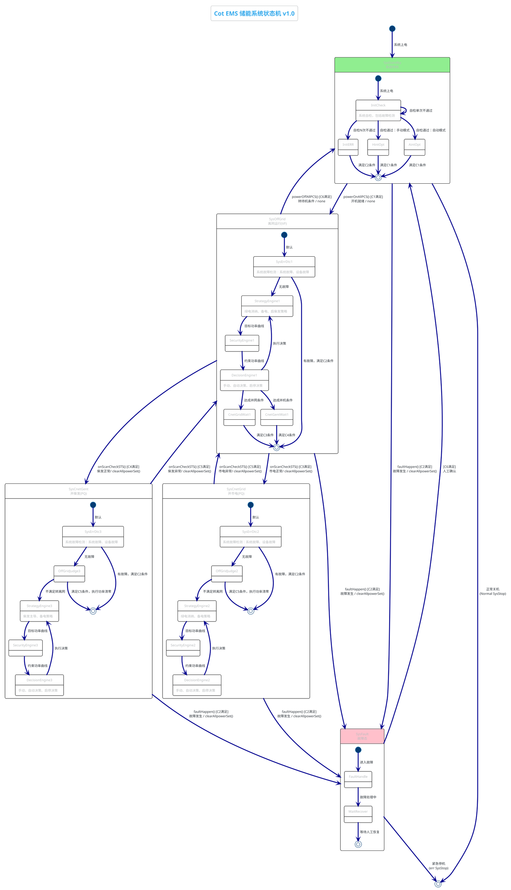

# 04-State-Machine.md - 状态机定义 (State Machine)

> **文档版本**: 1.20  
> **最后更新**: 2026-04-13  
> **关联文档**: [01-PRD.md](./01-PRD.md), [02-Domain-Model.md](./02-Domain-Model.md)

---

## 版本变更记录

| 版本 | 日期 | 变更内容 |
|------|------|---------|
| 1.20 | 2026-04-13 | **重构**: 第6章重写 - 明确EMS实际控制边界，区分EMS下发/设备自主/监测等待，增加超时处理说明；补充MPPT限功率控制；纠正STS自动切换描述（EMS不能控制，只能监测） |
| 1.19 | 2026-04-13 | **重构**: 第6章状态切换动作序列格式 - 改为事件/条件/动作三要素分离；`checkSTS_ATS()`改名为`onScanCheckSTS()` |
| 1.18 | 2026-04-12 | **修正**: 5.3.4/5.3.5/5.4.3/5.4.5 防逆流公式、constrainedPCS下发、柴发停机OR条件、并柴发PCS不放电 |
| 1.17 | 2026-04-12 | **修正**: 重新梳理三场景功率系数 - 并网95%/0%/充电、离网100%/100%/95%、并柴发0% |
| 1.16 | 2026-04-12 | **修正**: 5.2.3 SecurityEngine1明确注释 - 离网时PCS自主运行，EMS仅监测不下发功率 |
| 1.15 | 2026-04-12 | **修正**: 5.2.2/5.3.3 StrategyEngine功率系数 - 绿电/中间区间满功率(100%)，仅备电恢复区间降载(95%) |
| 1.14 | 2026-04-12 | **更新**: 附录8.1增加SOC管理策略表（并网/离网对比），明确70%/90%为可配置参数 |
| 1.13 | 2026-04-12 | **修正**: 5.3.3 StrategyEngine2明确注释-并网状态下<20%区间通过市电充电恢复备电（不能启柴发） |
| 1.12 | 2026-04-12 | **紧急修正**: 5.3.3 StrategyEngine2中间区间(71%-92%) targetPCS=0（PCS待机，光伏直流直充）；v1.11误写为-(PV×95%) |
| 1.11 | 2026-04-12 | **修正**: 5.3.3 StrategyEngine2绿电区间逻辑 - PCS功率=负载×95%；5.3.4 SecurityEngine2防逆流约束 - 关口表功率判断；对齐01-PRD v1.8修正 |
| 1.10 | 2026-04-11 | **架构澄清**: 明确StrategyEngine为统一策略模块，PlantUML图中显示为1/2/3仅为区分状态；DecisionEngine为分场景执行层，离网时PCS自主VF带载，策略计算的PCS仅作参考 |
| 1.9 | 2026-04-11 | **重构**: 5.2/5.3/5.4策略引擎结构对齐，统一四层SOC阈值逻辑（绿电/备电/柴发）；5.2增加备电策略（柴发启动逻辑）；5.3重写为四层阈值结构；5.4重写为柴发主导的四层逻辑；附录增加备电阈值参数 |
| 1.7 | 2026-04-10 | **修正**: 5.2.2绿电阈值按PRD 3.1更正为90%±2%滞环（92%开启/88%停止），替代之前脑补的SOC区间；附录参数同步更新 |
| 1.6 | 2026-04-10 | **修正**: 5.1.1 InitCheck明确模式选择来源（配置文件/上位机）；5.2.2 StrategyEngine1增加绿电区间SOC判断(GREEN_SOC_MIN/MAX)，修正绿电消纳策略逻辑 |
| 1.5 | 2026-04-10 | **修正**: 条件定义更新 - C1(PCS1On→PCSAllOn), C3/C4/C5(STS_Grid→STS_Close) |
| 1.4 | 2026-04-10 | **更新**: 状态流转增加触发函数（powerOnAllPCS/checkSTS_ATS/faultHappen等）和动作（clearAllpowerSet）；状态流转矩阵和切换动作序列同步更新 |
| 1.3 | 2026-04-10 | **重构**: 状态机子状态细化，Standby增加InitCheck/InitERR/HintOpt/AintOpt；运行状态增加SysErrDtc→StrategyEngine→SecurityEngine→DecisionEngine流水线；状态机图同步更新 |
| 1.2 | 2026-04-10 | **⚠️ 功率方向统一**: 明确定义电池正=充电/负=放电，PCS正=放电/负=充电；**修正**: 直流侧功率平衡公式 P_bat = P_pv - P_pcs/η |
| 1.1 | 2026-04-10 | **⚠️ 拓扑纠正**: 修正绿电消纳（离网状态）的功率流向描述；明确光伏直接通过直流母线给电池充电（PCS功率=0） |
| 1.0 | 2026-04-07 | 初始版本 |

---

## 1. 状态机概述

Cot EMS采用**分层状态机**设计：
- **顶层**：系统运行状态（SysStandby, SysOffGrid, SysCnetGrid, SysCnetGent, SysFault）
- **底层**：各状态内的子状态或执行模式

状态机扫描周期：**100ms**
状态切换条件持续满足：**3个周期（300ms）**才触发（防抖）

---

## 2. 状态定义

### 2.1 状态清单

| 状态ID | 状态名称 | 状态码 | 说明 |
|--------|----------|--------|------|
| S0 | SysStandby | 0x00 | 系统待机（初始状态） |
| S1 | SysOffGrid | 0x01 | 离网运行（VF模式） |
| S2 | SysCnetGrid | 0x02 | 并市电运行（PQ模式） |
| S3 | SysCnetGent | 0x03 | 并柴发运行（PQ模式，柴发主导） |
| S4 | SysFault | 0xFF | 故障态（保护性停机） |

### 2.2 状态属性

每个状态包含以下属性：
```c
struct State {
    uint8_t  stateId;           // 状态ID
    char*    stateName;         // 状态名称
    uint8_t  pcsMode;           // PCS模式: 0=待机, 1=PQ, 2=VF
    uint8_t  stsTarget;         // STS目标: 0=分闸, 1=合闸
    uint8_t  genControl;        // 柴发控制: 0=停机, 1=启动
    bool     powerControl;      // EMS是否下发功率: true/false
    void     (*onEnter)();      // 进入回调
    void     (*onExecute)();    // 执行回调（每100ms）
    void     (*onExit)();       // 退出回调
};
```

### 2.3 子状态说明

根据状态机图，各顶层状态包含以下子状态：

| 顶层状态 | 子状态 | 说明 |
|----------|--------|------|
| **Standby** | InitCheck | 系统自检，包括故障检测 |
| | InitERR | 自检N次不通过，故障处理 |
| | HintOpt | 自检通过：手动模式等待 |
| | AintOpt | 自检通过：自动模式等待 |
| **OffGrid** | SysErrDtc1 | 系统故障检测 |
| | StrategyEngine1 | 绿电消纳、备电、启柴发策略 |
| | SecurityEngine1 | 安全约束计算（目标功率曲线） |
| | DecisionEngine1 | 决策执行（手动/自动/启停） |
| | CnetGridWait1 | 等待并网条件满足 |
| | CnetGentWait1 | 等待并机条件满足 |
| **CnetGrid** | SysErrDtc2 | 系统故障检测 |
| | OffGridJudge2 | 离网条件判断 |
| | StrategyEngine2 | 绿电消纳、备电策略 |
| | SecurityEngine2 | 安全约束计算 |
| | DecisionEngine2 | 决策执行 |
| **CnetGent** | SysErrDtc3 | 系统故障检测 |
| | OffGridJudge3 | 离网条件判断 |
| | StrategyEngine3 | 绿电消纳、备电策略 |
| | SecurityEngine3 | 安全约束计算 |
| | DecisionEngine3 | 决策执行 |
| **Fault** | FaultHandle | 故障处理 |
| | WaitRecover | 等待人工恢复 |

---

## 3. 状态机图

### 3.1 完整状态机



### 3.2 状态流转矩阵

| 当前状态 | 触发函数 | 条件 | 目标状态 | 动作 | 说明 |
|----------|----------|------|----------|------|------|
| 待机 | powerOnAllPCS() | C1 | 离网 | none | 开机自检通过 |
| 待机 | faultHappen() | C2 | 故障 | clearAllpowerSet() | 故障发生 |
| 离网 | onScanCheckSTS() | C3 | 并市电 | clearAllpowerSet() | 市电正常 |
| 离网 | onScanCheckSTS() | C4 | 并柴发 | clearAllpowerSet() | 柴发正常 |
| 离网 | faultHappen() | C2 | 故障 | clearAllpowerSet() | 故障发生 |
| 离网 | powerOffAllPCS() | C6 | 待机 | none | 转待机条件 |
| 并市电 | onScanCheckSTS() | C5 | 离网 | clearAllpowerSet() | 市电异常 |
| 并市电 | faultHappen() | C2 | 故障 | clearAllpowerSet() | 故障发生 |
| 并柴发 | onScanCheckSTS() | C5 | 离网 | clearAllpowerSet() | 柴发异常 |
| 并柴发 | faultHappen() | C2 | 故障 | clearAllpowerSet() | 故障发生 |
| 故障 | - | C6+人工 | 待机 | - | 故障恢复确认 |
| 故障 | - | 紧急 | 关机 | - | 紧急停机 |
| 待机 | - | 人工 | 关机 | - | 正常关机 |

---

## 4. 条件定义（C1-C6）

### 4.1 条件详细定义

| 条件 | 名称 | 逻辑表达式 | 关键参数 |
|------|------|------------|----------|
| **C1** | 开机就绪 | `AllCommOK ∧ AllNoFault ∧ SysNodesOK ∧ PCSAllOn ∧ PCSConfigOK ∧ MPPTConfigOK ∧ BMSMatch ∧ DCVoltOK(870V±Δ) ∧ ACVoltOK(50Hz)` | 通讯、故障、配置、电压、频率 |
| **C2** | 故障条件 | `AnyCommFail ∨ AnyDeviceFault ∨ AnySysNodeFault` | 通讯中断、设备故障、功能节点故障 |
| **C3** | 并市电条件 | `AllCommOK ∧ AllNoFault ∧ ATS_Grid=1 ∧ STS_Close=1 ∧ 【可选】GridVoltOK` | ATS市电=1, STS合闸=1, 市电电压正常 |
| **C4** | 并柴发条件 | `AllCommOK ∧ AllNoFault ∧ ATS_Grid=0 ∧ ATS_Gen=1 ∧ STS_Close=1 ∧ GenVoltOK` | 市电=0, 备用=1, STS合闸=1, 柴发电压正常 |
| **C5** | 切离网条件 | `AllCommOK ∧ AllNoFault ∧ STS_Close=0 ∧ 【可选】GridVoltFail` | STS分闸=0, 市电/柴发异常 |
| **C6** | 转待机条件 | `AllCommOK ∧ AllNoFault ∧ PCS_AllOff ∧ DCVoltOK(870V±Δ) ∧ ACVoltZero` | PCS关机, 电压正常, 交流归零 |

### 4.2 条件检测实现

```c
// 条件检测函数（每100ms调用）
bool CheckConditionC1(void) {
    return CheckAllCommOK() && 
           CheckAllNoFault() && 
           CheckSysNodesOK() &&
           (PCS[1].runStatus == STATUS_ON) &&
           CheckPCSConfig() &&
           CheckMPPTConfig() &&
           CheckBMSMatch() &&
           (DCVoltage > 870 - VOLT_HYSTERESIS) &&
           (DCVoltage < 870 + VOLT_HYSTERESIS) &&
           (ACFreq > 49.5 && ACFreq < 50.5) &&
           CheckACPhaseSeq();
}

bool CheckConditionC3(void) {
    return CheckAllCommOK() && 
           CheckAllNoFault() &&
           (DI_ATS_Grid == 1) &&
           (STS_GridStatus == 1) &&
           (GridVoltage > GRID_VOLT_MIN);
}

// ... C2, C4, C5, C6 类似实现
```

---

## 5. 各状态执行内容

### 5.1 SysStandby (系统待机)

**状态属性**:
- PCS模式: 待机
- STS目标: 分闸
- 柴发控制: 停机
- EMS功率控制: **否**

**子状态流转**:
```
系统上电 → InitCheck → [自检通过] → HintOpt(手动) / AintOpt(自动)
                    ↓
              [N次不通过] → InitERR → [满足C2] → Fault
```

#### 5.1.1 InitCheck (初始化自检)

**进入动作 (onEnter)**:
1. 初始化所有设备通信
2. 加载系统配置参数
3. 故障计数器清零
4. **读取运行模式**（来自配置文件或上位机设置）
   - `sysMode = 0`: 手动模式 → 跳转至 HintOpt
   - `sysMode = 1`: 自动模式 → 跳转至 AintOpt

**循环执行 (onExecute - 每100ms)**:
```
执行自检项目:
  - PCS主从设置确认（1#主机，其他从机）
  - PCS均流设置确认
  - MPPT运行状态检查（通讯正常、无故障）
  - BMS主从数量匹配检查
  - 直流侧电压检查（870V±压差）
  - 交流母线电压/频率/相序检查

IF (所有自检通过) THEN
    IF (sysMode == 0) THEN
        跳转至 HintOpt(手动模式)
    ELSE
        跳转至 AintOpt(自动模式)
    END IF
ELSE IF (单次自检失败) THEN
    故障计数器++
    继续自检
ELSE IF (故障计数器 ≥ N次) THEN
    跳转至 InitERR
END IF

IF (C2条件满足) THEN
    触发状态转换: Standby → Fault
END IF
```

**退出动作 (onExit)**:
- 记录自检结果日志

#### 5.1.2 InitERR (自检故障)

**进入动作 (onEnter)**:
1. 记录自检失败原因
2. 本地声光告警提示
3. 上报云端故障信息

**循环执行 (onExecute)**:
```
IF (C2条件满足且持续3周期) THEN
    触发状态转换: Standby → Fault
END IF
```

**退出动作 (onExit)**:
- 保存故障记录

#### 5.1.3 HintOpt (手动模式等待)

**进入动作 (onEnter)**:
1. 显示"手动模式-等待开机指令"
2. 就绪指示灯亮

**循环执行 (onExecute)**:
```
IF (C1条件满足 AND 人工开机指令 AND 持续3周期) THEN
    触发状态转换: Standby → OffGrid
ELSE IF (C2条件满足) THEN
    触发状态转换: Standby → Fault
END IF
```

**退出动作 (onExit)**:
- 记录状态转换日志
- 保存待机状态数据

#### 5.1.4 AintOpt (自动模式等待)

**进入动作 (onEnter)**:
1. 显示"自动模式-等待开机条件"
2. 就绪指示灯亮

**循环执行 (onExecute)**:
```
IF (C1条件满足 AND 持续3周期) THEN
    触发状态转换: Standby → OffGrid
ELSE IF (C2条件满足) THEN
    触发状态转换: Standby → Fault
END IF
```

**退出动作 (onExit)**:
- 记录状态转换日志
- 保存待机状态数据

---

### 5.2 SysOffGrid (离网运行)

**状态属性**:
- PCS模式: VF（电压源）
- STS目标: 分闸
- 柴发控制: 根据策略
- EMS功率控制: **否**（PCS自主均流）

**子状态流转**:
```
进入 → SysErrDtc1 → [无故障] → StrategyEngine1 → SecurityEngine1 → DecisionEngine1
                            ↓                                    ↓
                      [有故障]                              [执行决策]
                            ↓                                    ↓
                     [满足C2] → Fault                    StrategyEngine1(循环)
                                                                 ↓
                                    ┌────────────────────────────┘
                                    ↓
                            CnetGridWait1 / CnetGentWait1
                                    ↓
                            [满足C3/C4] → 切目标状态
```

#### 5.2.1 SysErrDtc1 (系统故障检测)

**进入动作 (onEnter)**:
1. PCS1转VF模式（主机）
2. PCS2~5转PQ跟随模式
3. STS分闸确认

**循环执行 (onExecute)**:
```
执行故障检测:
  - 系统故障检查（节点状态）
  - 设备故障检查（PCS/BMS/MPPT/STS）
  - 通讯故障检查

IF (所有无故障) THEN
    跳转至 StrategyEngine1
ELSE IF (有故障 AND C2条件满足) THEN
    触发状态转换: OffGrid → Fault
END IF
```

**退出动作 (onExit)**:
- 记录故障检测结果

#### 5.2.2 StrategyEngine1 (策略引擎)

**⚠️ 重要说明**: StrategyEngine1/2/3 为**同一套策略逻辑**，PlantUML图中分别标注为1/2/3仅为区分不同状态下的策略节点。实际代码实现为统一的 `StrategyEngine()` 函数，所有运行状态（离网/并网/并柴发）共用同一套策略计算逻辑。

**功能**: 绿电消纳、备电、启柴发策略计算，输出**目标PCS功率**（假设PCS可控的理想情况）

**输入**: 
- 两簇SOC、光伏功率、负载功率、柴发状态、运行模式

**输出**:
- `targetPCS`: 目标PCS功率（正=放电，负=充电）
- `genStartRequest`: 柴发启动请求
- 电池功率（直流侧平衡计算）

**循环执行 (onExecute) - 离网策略逻辑**:
```
策略计算:

  // 获取两簇最小SOC
  minSOC = MIN(SOC_cluster1, SOC_cluster2)

  IF (minSOC ≥ 绿电开启阈值: 92%) THEN
      // 【绿电消纳区间】优先使用光伏，PCS满功率放电带载
      targetPCS = 负载
      
  ELSE IF (minSOC ≥ 备电停止阈值: 71%) THEN
      // 【中间区间】维持供电，PCS满功率放电带载
      targetPCS = 负载
      
  ELSE IF (minSOC ≥ 柴发启动阈值: 20%) THEN
      // 【备电恢复区间】SOC偏低，准备启动柴发，PCS降载5%
      IF (柴发未启动) THEN
          genStartRequest = TRUE
          DO_1 = 1 (发出柴发启动信号)
      END IF
      targetPCS = 负载 × 95%
      
  ELSE
      // 【柴发强制区间】SOC ≤ 20%，柴发必须启动
      IF (柴发已启动且稳定) THEN
          targetPCS = 0
      ELSE
          targetPCS = 最小必要负载
      END IF
  END IF

  // 计算电池功率（直流侧平衡）
  IF (targetPCS > 0) THEN
      电池功率 = PV - targetPCS/η
  ELSE
      电池功率 = PV（仅光伏充电）
  END IF

跳转至 SecurityEngine1
```

**四层SOC阈值**（来自PRD 3.2）:
| 阈值 | 数值 | 动作 |
|------|------|------|
| 绿电开启 | 92% | 允许PCS放电做负载跟随 |
| 备电停止 | 71% | 停止市电充电（并网时）/维持供电（离网时） |
| 备电开启 | 69% | 开始市电充电（并网时）/准备启动柴发（离网时） |
| 柴发启动 | 20% | 强制启动柴发（离网/并柴发时） |

**绿电阈值参数**（来自PRD 3.1，主要适用于并网状态）:
- **绿电阈值**: 90%（滞环±2%）
- **开启放电**: SOC ≥ 92%（两簇最小SOC，允许PCS放电做负载跟随）
- **停止放电**: SOC < 88%（两簇最小SOC，禁止PCS放电，只用光伏充电）
- **滞环区间**: 88% ~ 92%（并网时保持原状态，避免频繁切换；离网时PCS仍需带载）

**⚠️ 功率方向定义（统一标准）**:
- **电池功率**: 正=充电(流入)，负=放电(流出)
- **PCS功率**: 正=放电(逆变DC→AC)，负=充电(整流AC→DC)
- **光伏功率**: 总是正值(发电)

**⚠️ 直流侧功率平衡**:
```
P_bat = P_pv - P_pcs/η

其中:
- P_bat > 0: 电池充电
- P_bat < 0: 电池放电
- P_pcs > 0: PCS放电(逆变)
- P_pcs < 0: PCS充电(整流)
```

#### 5.2.3 SecurityEngine1 (安全约束引擎)

**功能**: 目标功率曲线安全约束计算

**⚠️ 重要说明**: 离网(VF)场景下，PCS作为电压源**自主带载**，EMS**无法直接控制PCS功率**。SecurityEngine计算的约束仅用于：
1. **记录与监测**：记录策略建议功率与实际功率偏差
2. **安全告警**：当实际功率超出安全边界时触发告警
3. **并网准备**：为后续切换并网提供功率参考值

**循环执行 (onExecute)**:
```
约束计算（仅用于监测与记录）:
  - 防逆流约束（离网无此问题，预留）
  - SOC边界约束: 监测 P_discharge ≤ f(SOC_lower)，超限时告警
  - 功率变化率约束: 监测 ΔP，异常波动时告警
  - 簇间均衡约束: 监测两簇实际功率分配差异

输出:
  - constrainedPCS = targetPCS（策略建议值，不下发）
  - 告警状态（如功率异常）
  - 记录: "策略建议PCS = " + targetPCS + ", 实际PCS = " + 实测值

跳转至 DecisionEngine1
```

#### 5.2.4 DecisionEngine1 (决策执行引擎)

**⚠️ 重要说明**: DecisionEngine 是**分场景执行层**，三种运行状态的决策逻辑不同：
- **离网(VF)**: PCS自主均流带载，策略计算的 `targetPCS` **仅作参考/记录**，不下发
- **并网(PQ)**: 直接下发策略计算的 `targetPCS` 给PCS
- **并柴发(PQ)**: 柴发主导带载，PCS待机或辅助，策略计算的 `targetPCS` 按需调整

**功能**: 根据运行模式执行策略决策

**循环执行 (onExecute)**:
```
// ==================== 离网(VF)场景 ====================
// PCS运行在VF模式，作为电压源，自主均流带载
// 策略计算的targetPCS仅用于：1)记录日志 2)切换并网时作为初始给定

决策执行:
  CASE 当前模式 OF
    手动模式: 
        // 人工设定PCS参数（VF电压/频率参考值）
        下发VF参数给PCS1（主机）
        PCS2~5自动跟随
    自动模式: 
        // 不下发功率给定！PCS自主根据负载调整
        // targetPCS仅记录到日志，用于后续并网时参考
        记录: "策略建议PCS功率 = " + targetPCS
  END CASE

状态流转判断:
  IF (C3条件满足 AND 持续3周期) THEN
      // 保存当前targetPCS，作为并网后的初始给定
      gridInitPower = targetPCS
      跳转至 CnetGridWait1
  ELSE IF (C4条件满足 AND 持续3周期) THEN
      gentInitPower = targetPCS
      跳转至 CnetGentWait1
  ELSE IF (C6条件满足 AND 持续3周期) THEN
      触发状态转换: OffGrid → Standby
  ELSE IF (C2条件满足) THEN
      触发状态转换: OffGrid → Fault
  ELSE
      跳转回 StrategyEngine1 (循环执行)
  END IF
```

#### 5.2.5 CnetGridWait1 (等待并网)

**进入动作 (onEnter)**:
1. 等待同步条件（压差<5%，频差<0.5Hz，相角<10°）

**循环执行 (onExecute)**:
```
IF (C3条件满足 AND 同步条件满足 AND 持续3周期) THEN
    触发状态转换: OffGrid → CnetGrid
ELSE IF (同步条件不满足超时可配置) THEN
    返回 StrategyEngine1
END IF
```

#### 5.2.6 CnetGentWait1 (等待并柴发)

**进入动作 (onEnter)**:
1. 确认柴发已启动且稳定

**循环执行 (onExecute)**:
```
IF (C4条件满足 AND 柴发稳定 AND 持续3周期) THEN
    触发状态转换: OffGrid → CnetGent
ELSE IF (等待超时) THEN
    返回 StrategyEngine1
END IF
```

**退出动作 (onExit - 整个OffGrid状态)**:
- 记录状态转换日志

---

### 5.3 SysCnetGrid (并市电)

**状态属性**:
- PCS模式: PQ（功率源）
- STS目标: 合闸
- 柴发控制: 停机
- EMS功率控制: **是**

**子状态流转**:
```
进入 → SysErrDtc2 → [无故障] → OffGridJudge2 → [不转离网] → StrategyEngine2
                            ↓                          ↓
                      [有故障]                   [满足C5]
                            ↓                          ↓
                     [满足C2] → Fault         [功率清零] → OffGrid

StrategyEngine2 → SecurityEngine2 → DecisionEngine2 → StrategyEngine2(循环)
                                                          ↓
                                              [C4满足+备电需求] → CnetGent
```

#### 5.3.1 SysErrDtc2 (系统故障检测)

**进入动作 (onEnter)**:
1. 等待同步条件（压差<5%，频差<0.5Hz，相角<10°）
2. STS合闸
3. PCS转PQ模式

**循环执行 (onExecute)**:
```
执行故障检测:
  - 系统故障检查
  - 设备故障检查
  - 通讯故障检查

IF (所有无故障) THEN
    跳转至 OffGridJudge2
ELSE IF (有故障 AND C2条件满足) THEN
    触发状态转换: CnetGrid → Fault
END IF
```

#### 5.3.2 OffGridJudge2 (离网条件判断)

**功能**: 判断是否满足切离网条件

**循环执行 (onExecute)**:
```
IF (C5条件满足 OR 防逆流触发) THEN
    执行功率清零
    触发状态转换: CnetGrid → OffGrid
ELSE
    跳转至 StrategyEngine2
END IF
```

#### 5.3.3 StrategyEngine2 (策略引擎)

**⚠️ 重要说明**: StrategyEngine2 与 StrategyEngine1 **共用同一套策略逻辑**（见5.2.2）。图中标注为2仅为PlantUML区分状态节点。

**本状态特有处理**:
- 并网状态下策略计算需叠加**防逆流约束**和**需量约束**
- 绿电区间逻辑：PCS做负载跟随，targetPCS = 负载 × 95%

**循环执行 (onExecute)**:
```
// 调用统一策略引擎计算基础targetPCS
baseTargetPCS = StrategyEngine_Common(SOC, PV, Load, GenStatus)

// 叠加并网特有约束
IF (minSOC ≥ 绿电开启阈值: 92%) THEN
    // 【绿电消纳区间】PCS做负载跟随，放电95%带载（留5%余量防逆流）
    targetPCS = 负载 × 95%
    // 注：PV≥负载时，多余光伏直流侧直接充电池；PV<负载时PCS放电补充
    
ELSE IF (minSOC ≥ 备电停止阈值: 71%) THEN
    // 【中间区间】只用光伏充电，PCS待机
    // 光伏通过直流母线直接给电池充电，PCS不参与
    targetPCS = 0
    
ELSE IF (minSOC ≥ 备电开启阈值: 69%) THEN
    // 【备电恢复区间】滞环区
    targetPCS = 上一周期PCS功率
    
ELSE
    // 【备电强制区间】并网状态下通过市电充电恢复备电（不能启柴发）
    // 需量约束：确保总用电功率不超过需量上限
    maxCharge = 需量上限 - 负载 - 5kW
    targetPCS = -MIN(电池充电需求, maxCharge)
END IF

跳转至 SecurityEngine2
```

#### 5.3.4 SecurityEngine2 (安全约束引擎)

**功能**: 约束功率曲线计算

**循环执行 (onExecute)**:
```
约束计算:
  - 防逆流约束: P_discharge为防逆流约束边界
    antiReverseMargin = 关口表功率 - 负载 - 防逆流余量(5kW)
    IF (antiReverseMargin > 0) THEN
        0 ≤ P_discharge ≤ antiReverseMargin
    ELSE
        P_discharge = 0
    END IF
  - 需量约束: P_charge ≤ P_demand_limit - P_load
  - SOC边界约束: P_charge ≤ f(SOC_upper), P_discharge ≤ f(SOC_lower)
  - 功率变化率约束: ΔP ≤ RAMP_LIMIT
  - 光伏限发约束: PV_limit = 95% × (电池充电需求 - PCS实时功率)

生成: constrainedPCS（约束后功率） → DecisionEngine2
```

#### 5.3.5 DecisionEngine2 (决策执行引擎)

**⚠️ 重要说明**: 并网(PQ)场景，PCS作为功率源可控，**不能直接下发策略计算的targetPCS，要下发经过安全引擎约束后的constrainedPCS**。

**循环执行 (onExecute)**:
```
// ==================== 并网(PQ)场景 ====================
// PCS运行在PQ模式，作为功率源，EMS直接控制

决策执行:
  CASE 当前模式 OF
    手动模式: 
        // 读取人工设定功率
        finalPCS = 人工设定值
    自动模式: 
        // 使用策略计算的约束后功率
        finalPCS = constrainedPCS
  END CASE

功率分配:
  // 簇间功率分配（考虑SOC均衡）
  P_cluster1 = f(finalPCS, SOC1, SOC2)  // 簇1功率
  P_cluster2 = f(finalPCS, SOC1, SOC2)  // 簇2功率
  // 簇内均分
  P_PCS1 = P_cluster1 / 3  // 均分给1#~3#
  P_PCS4 = P_cluster2 / 2  // 均分给4#~5#

执行决策:
  - 下发PCS功率设定值到各台PCS
  - 记录执行结果

状态流转判断:
  IF (C4条件满足 AND 备电需求) THEN
      触发状态转换: CnetGrid → CnetGent
  ELSE IF (C2条件满足) THEN
      触发状态转换: CnetGrid → Fault
  ELSE
      跳转回 StrategyEngine2 (循环执行)
  END IF
```

**退出动作 (onExit)**:
- 功率设0
- STS分闸准备

---

### 5.4 SysCnetGent (并柴发)

**状态属性**:
- PCS模式: PQ（电流源，跟随柴发）
- STS目标: 合闸
- 柴发控制: 启动
- EMS功率控制: **否**（柴发主导）

**子状态流转**:
```
进入 → SysErrDtc3 → [无故障] → OffGridJudge3 → [不转离网] → StrategyEngine3
                            ↓                          ↓
                      [有故障]                   [满足C5]
                            ↓                          ↓
                     [满足C2] → Fault         [功率清零] → OffGrid

StrategyEngine3 → SecurityEngine3 → DecisionEngine3 → StrategyEngine3(循环)
                                                          ↓
                                              [C3满足+柴发停机条件] → CnetGrid
```

#### 5.4.1 SysErrDtc3 (系统故障检测)

**进入动作 (onEnter)**:
1. 确认柴发已启动且稳定
2. ATS切换至柴发侧
3. STS合闸（柴发侧）
4. PCS转PQ模式（跟随柴发电压）

**循环执行 (onExecute)**:
```
执行故障检测:
  - 系统故障检查
  - 设备故障检查
  - 柴发状态监测（电压/频率/功率）

IF (所有无故障) THEN
    跳转至 OffGridJudge3
ELSE IF (有故障 AND C2条件满足) THEN
    触发状态转换: CnetGent → Fault
END IF
```

#### 5.4.2 OffGridJudge3 (离网条件判断)

**功能**: 判断是否满足切离网条件

**循环执行 (onExecute)**:
```
IF (C5条件满足 OR 柴发异常) THEN
    执行功率清零
    触发状态转换: CnetGent → OffGrid
ELSE
    跳转至 StrategyEngine3
END IF
```

#### 5.4.3 StrategyEngine3 (策略引擎)

**⚠️ 重要说明**: 并柴发场景下**柴发为主电源**，PCS默认待机，仅在柴发功率不足时辅助。

**循环执行 (onExecute)**:
```
// 并柴发策略逻辑：柴发主导，PCS辅助或待机
IF (minSOC ≥ 柴发停机阈值: 80% OR 市电恢复) THEN
    // 【柴发停机条件】准备切回市电
    DO_1 = 0 (发出柴发停机信号)
    targetPCS = 0
    
ELSE IF (minSOC ≥ 绿电开启阈值: 92%) THEN
    // 【绿电消纳区间】柴发带载，PCS默认待机
    // 柴发功率足够时PCS=0；不足时辅助放电
    IF (柴发功率不足) THEN
        targetPCS = 补充功率（电池放电辅助）
    ELSE
        targetPCS = 0（柴发完全带载）
    END IF
    
ELSE IF (minSOC ≥ 柴发启动阈值: 20%) THEN
    // 【柴发正常运行区间】柴发带载，PCS待机
    targetPCS = 0
    
ELSE
    // 【柴发强制区间】SOC ≤ 20%，柴发必须维持运行
    targetPCS = 0
    // 如柴发功率不足，触发负载切除
END IF

// 柴发运行时，光伏直接给电池充电
电池功率 = PV

跳转至 SecurityEngine3
```

#### 5.4.4 SecurityEngine3 (安全约束引擎)

**功能**: 约束功率曲线计算

**循环执行 (onExecute)**:
```
约束计算:
  - 柴发功率限制: 不超过柴发额定功率
  - SOC边界约束: 保留足够备电容量
  - 功率变化率约束: ΔP ≤ RAMP_LIMIT

生成: 约束后功率曲线 → DecisionEngine3
```

#### 5.4.5 DecisionEngine3 (决策执行引擎)

**⚠️ 重要说明**: 并柴发(PQ)场景，**柴发主导带载，PCS不放电**。

**循环执行 (onExecute)**:
```
// ==================== 并柴发(PQ)场景 ====================
// 柴发作为主导电源带载，PCS默认待机

决策执行:
  CASE 当前模式 OF
    手动模式: 
        // 人工设定PCS辅助功率（通常设为0）
        finalPCS = 人工设定值
    自动模式: 
        // 柴发场景下PCS不放电
        finalPCS = 0
  END CASE

执行决策:
  - 下发PCS功率设定值（通常为0，柴发带载）
  - 记录执行结果

状态流转判断:
  IF (C3条件满足 AND 柴发已停机) THEN
      触发状态转换: CnetGent → CnetGrid
  ELSE IF (C2条件满足) THEN
      触发状态转换: CnetGent → Fault
  ELSE
      跳转回 StrategyEngine3 (循环执行)
  END IF
```

**退出动作 (onExit)**:
- 停止柴发信号（如转市电）
- 功率设0

---

### 5.5 SysFault (故障态)

**状态属性**:
- PCS模式: 停机或保持
- STS目标: 保持当前
- 柴发控制: 根据策略
- EMS功率控制: **否**

**子状态流转**:
```
进入 → FaultHandle → WaitRecover → [C6满足+人工确认] → Standby
                              ↓
                        [紧急停机] → SysStop
```

#### 5.5.1 FaultHandle (故障处理)

**进入动作 (onEnter)**:
1. 记录故障代码和时间
2. 所有PCS功率设0
3. 本地声光告警
4. 云端告警推送
5. DO故障灯输出

**故障分类处理**:

| 故障级别 | 处理动作 |
|----------|----------|
| 紧急故障 | 立即停机，切断输出，声光告警 |
| 重要故障 | 自动切换至安全状态（如切离网），告警通知 |
| 一般故障 | 记录日志，提示处理 |

**循环执行 (onExecute)**:
```
IF (紧急停机指令) THEN
    触发状态转换: Fault → SysStop
ELSE IF (故障处理完成) THEN
    跳转至 WaitRecover
END IF

执行内容:
- 故障分类处理（根据故障级别）
- 设备状态监测
- 记录故障日志
```

#### 5.5.2 WaitRecover (等待恢复)

**进入动作 (onEnter)**:
1. 显示"等待人工恢复"
2. 停止声光告警（保留指示灯）

**循环执行 (onExecute)**:
```
IF (故障清除 AND C6满足 AND 人工确认) THEN
    触发状态转换: Fault → Standby
END IF

执行内容:
- 监测故障清除状态
- 等待人工恢复指令
- 定时记录等待状态
```

**退出动作 (onExit)**:
- 清除故障标志
- 恢复就绪状态

---

## 6. 状态切换动作序列

### 6.1 EMS实际控制能力边界

**EMS可直接下发的控制指令**:

| 控制对象 | 指令类型 | 说明 |
|---------|---------|------|
| `clearAllpowerSet()` | PCS功率设定值清零 | 所有PCS功率设定值设为0（准备切换） |
| `setPCSPower()` | PCS功率设定值 | PQ模式下下发有功/无功功率设定 |
| `setMPPTLimit()` | MPPT限功率值 | 防逆流或故障时限制光伏输出功率 |
| `genStartStop()` | 柴发启停信号 | DO输出（柴发启动=1，停机=0） |

**EMS只能监测的状态**（设备自主运行，EMS只读）:

| 监测对象 | 信号来源 | 说明 |
|---------|---------|------|
| `STS_Status` | STS反馈 | STS合闸/分闸状态（设备自动切换） |
| `Sync_Ready` | PCS检测 | 同步条件满足标志（压差/频差/相角） |
| `PCS_Mode` | PCS上报 | PCS实际运行模式（VF/PQ/待机） |
| `ATS_Status` | ATS反馈 | 市电/柴发/离线状态 |

**关键原则**: STS切换由设备根据电能质量**自动完成**，EMS只能监测状态，不能干预。

### 6.2 离网 → 并市电 (C3)

**触发事件**: 状态机扫描周期到达（100ms周期性扫描）

**条件判断**: C3条件持续满足3个周期（防抖）
```
C3 = AllCommOK ∧ AllNoFault ∧ ATS_Grid=1 ∧ STS_Close=1 ∧ GridVoltOK
```

**EMS操作流程**:

```
【EMS下发动作】
Step 1: clearAllpowerSet()
    └─ 所有PCS功率设定值设为0
    └─ 目的：准备并网，避免切换瞬间功率冲击

【EMS等待监测】（设备自主执行）
Step 2: 等待同步条件
    └─ PCS内部检测市电与母线压差<5%、频差<0.5Hz、相角<10°
    └─ EMS读取PCS上报的Sync_Ready标志位
    └─ 超时处理：若500ms内未就绪，返回StrategyEngine1

Step 3: 等待STS自动合闸
    └─ STS检测到电能质量满足条件后自动合闸
    └─ EMS监测STS_Status状态位变为"合闸"
    └─ 超时处理：若1s内未合闸，上报STS故障

Step 4: 等待PCS自动转PQ模式
    └─ PCS检测到STS合闸后自动切换至PQ模式
    └─ EMS监测PCS_Mode上报值
    └─ 超时处理：若2s内未切换完成，上报PCS模式切换故障

【EMS启动策略】
Step 5: 启动绿电消纳策略
    └─ StrategyEngine2开始计算并下发PCS功率设定值
    └─ 初始给定值从0逐步爬坡（RAMP_LIMIT约束）
```

**EMS可控 vs 设备自主**:
| 步骤 | EMS动作 | 设备自主 | 监测信号 |
|------|---------|----------|----------|
| 1 | ✅ 功率清零 | - | - |
| 2 | - | ✅ PCS内部同步检测 | Sync_Ready |
| 3 | - | ✅ STS自动合闸 | STS_Status |
| 4 | - | ✅ PCS自动转模式 | PCS_Mode |
| 5 | ✅ 启动策略计算 | - | - |

**关键说明**: STS合闸完全由设备根据电能质量自动完成，EMS只能监测状态，不能下发合闸指令。

### 6.3 并市电 → 离网 (C5/防逆流)

**触发事件**: 状态机扫描周期到达（100ms周期性扫描）

**条件判断**: C5条件持续满足3个周期（防抖）
```
C5 = AllCommOK ∧ AllNoFault ∧ STS_Close=0 ∧ GridVoltFail
或：防逆流触发（关口表功率超限）
```

**EMS操作流程**:

```
【EMS下发动作】
Step 1: clearAllpowerSet()
    └─ 所有PCS功率设定值设为0
    └─ 同时下发MPPT限功率指令（如需要）
    └─ 目的：消除并网功率，准备离网

【EMS等待监测】（设备自主执行）
Step 2: 等待STS自动分闸
    └─ STS检测到市电异常或PCS功率归零后自动分闸
    └─ EMS监测STS_Status状态位变为"分闸"
    └─ 超时处理：若1s内未分闸，上报STS故障

Step 3: 等待PCS自动转VF模式
    └─ PCS1检测到STS分闸后自动切换至VF模式（主机）
    └─ PCS2~5自动切换至PQ跟随模式（从机）
    └─ EMS监测PCS_Mode上报值
    └─ 超时处理：若2s内未切换完成，上报PCS模式切换故障

【EMS启动策略】
Step 4: 启动离网绿电消纳策略
    └─ StrategyEngine1开始计算目标功率（仅监测/记录，不下发）
    └─ 监测负载功率，判断是否需要启动柴发

Step 5: 柴发判断
    └─ IF (minSOC < 20%) THEN
        genStartStop(1)  // 下发柴发启动信号
    └─ 等待柴发稳定（监测Gen_Ready标志）
```

**EMS可控 vs 设备自主**:
| 步骤 | EMS动作 | 设备自主 | 监测信号 |
|------|---------|----------|----------|
| 1 | ✅ 功率清零/MPPT限功率 | - | - |
| 2 | - | ✅ STS自动分闸 | STS_Status |
| 3 | - | ✅ PCS自动转VF | PCS_Mode |
| 4 | ✅ 启动策略（只监测） | - | Load_Power |
| 5 | ✅ 柴发启停信号 | ✅ 柴发启动过程 | Gen_Ready |

### 6.4 待机 → 离网 (C1)

**触发事件**: 开机指令触发（手动模式）或自动开机条件满足（自动模式）

**条件判断**: C1条件持续满足3个周期（防抖）
```
C1 = AllCommOK ∧ AllNoFault ∧ SysNodesOK ∧ PCSAllOn ∧ PCSConfigOK 
     ∧ MPPTConfigOK ∧ BMSMatch ∧ DCVoltOK(870V±Δ) ∧ ACVoltOK(50Hz)
```

**EMS操作流程**:

```
【EMS确认自检】
Step 1: 自检确认
    └─ EMS读取各设备状态字，确认自检项目通过
    └─ 包括：PCS主从设置、MPPT状态、BMS匹配、电压频率正常

【EMS下发动作】
Step 2: PCS开机指令
    └─ 下发PCS开机指令序列（按VF主机→PQ从机顺序）
    └─ 注：PCS实际启动过程由设备自主完成，EMS只下发启动指令

【EMS等待监测】（设备自主执行）
Step 3: 等待PCS启动完成
    └─ PCS1建立VF电压（主机）
    └─ PCS2~5自动跟随（从机）
    └─ EMS监测PCS_RunStatus状态位
    └─ 超时处理：若5s内未启动完成，上报PCS启动故障

Step 4: 确认STS分闸状态
    └─ EMS读取STS_Status，确认处于分闸状态
    └─ 若STS异常合闸，上报故障并禁止开机

【EMS启动策略】
Step 5: 启动离网绿电消纳策略
    └─ StrategyEngine1开始运行（循环监测/记录）
```

**EMS可控 vs 设备自主**:
| 步骤 | EMS动作 | 设备自主 | 监测信号 |
|------|---------|----------|----------|
| 1 | ✅ 读取自检状态 | - | AllCommOK, AllNoFault |
| 2 | ✅ 下发开机指令 | ✅ PCS启动过程 | PCS_RunStatus |
| 3 | - | ✅ VF建立/PQ跟随 | PCS_Mode |
| 4 | ✅ 读取STS状态 | - | STS_Status |
| 5 | ✅ 启动策略 | - | - |

### 6.5 离网 → 待机 (C6)

**触发事件**: 停机指令触发（手动模式）或自动停机条件满足（自动模式）

**条件判断**: C6条件持续满足3个周期（防抖）
```
C6 = AllCommOK ∧ AllNoFault ∧ PCS_AllOff ∧ DCVoltOK(870V±Δ) ∧ ACVoltZero
```

**EMS操作流程**:

```
【EMS下发动作】
Step 1: 功率归零
    └─ 停止绿电消纳策略计算
    └─ clearAllpowerSet()：所有PCS功率设定值设为0
    └─ 等待PCS功率实际归零（读取PCS_Power反馈）
    └─ 超时处理：若3s内功率未归零，上报PCS停机异常

Step 2: PCS关机指令
    └─ 下发PCS关机指令序列（按从机→主机顺序）
    └─ 注：PCS实际停机过程由设备自主完成

【EMS等待监测】（设备自主执行）
Step 3: 等待PCS停机完成
    └─ EMS监测PCS_RunStatus状态位变为"待机"
    └─ 监测直流电压稳定在870V±Δ范围
    └─ 监测交流电压归零
    └─ 超时处理：若5s内未停机完成，上报PCS停机故障
```

**EMS可控 vs 设备自主**:
| 步骤 | EMS动作 | 设备自主 | 监测信号 |
|------|---------|----------|----------|
| 1 | ✅ 停止策略/功率清零 | ✅ PCS功率归零 | PCS_Power |
| 2 | ✅ 下发关机指令 | ✅ PCS停机过程 | PCS_RunStatus |
| 3 | ✅ 读取状态确认 | - | DCVolt, ACVolt |

### 6.6 任意状态 → 故障 (C2)

**触发事件**: 故障检测扫描周期到达（100ms周期性扫描）

**条件判断**: C2条件满足（立即触发，无需防抖）
```
C2 = AnyCommFail ∨ AnyDeviceFault ∨ AnySysNodeFault
```

**EMS操作流程**:

```
【EMS紧急响应】
Step 1: clearAllpowerSet()
    └─ 立即将所有PCS功率设定值设为0
    └─ 故障响应时间要求：< 100ms

Step 2: 记录故障
    └─ 读取故障代码和设备状态字
    └─ 记录故障发生时间戳
    └─ 本地声光告警（DO输出驱动）
    └─ 云端告警推送（MQTT上报）

Step 3: 故障分类处理
    └─ 读取故障级别（紧急/重要/一般）
    └─ 根据故障级别执行预设动作：
        - 紧急故障：保持功率为0，等待人工处理
        - 重要故障：尝试自动切换至安全状态（如切离网）
        - 一般故障：记录日志，提示处理

【EMS监测】
Step 4: 持续监测故障清除状态
    └─ 循环检测AllNoFault是否恢复
    └─ 等待人工恢复指令（手动模式）或自动恢复（自动模式）
```

**EMS可控 vs 设备自主**:
| 步骤 | EMS动作 | 设备自主 | 监测信号 |
|------|---------|----------|----------|
| 1 | ✅ 紧急功率清零 | - | - |
| 2 | ✅ 故障记录/告警 | - | Fault_Code |
| 3 | ✅ 分级处理逻辑 | - | Fault_Level |
| 4 | ✅ 监测故障状态 | ✅ 故障自行恢复 | AllNoFault |

### 6.7 紧急停机 (任意状态)

**触发事件**: 紧急停机指令（急停按钮、远程急停、保护动作）

**条件判断**: 无（紧急指令立即执行，无需条件判断）

**EMS操作流程**:

```
【EMS紧急响应】
Step 1: clearAllpowerSet()
    └─ 立即将所有PCS功率设定值设为0
    └─ 同时下发MPPT限功率至0（如有必要）
    └─ 响应时间要求：< 100ms

【EMS监测设备响应】（设备自主执行）
Step 2: 等待STS自动分闸
    └─ 检测到PCS功率异常后，STS自动分闸保护
    └─ EMS监测STS_Status状态
    └─ 注：EMS不能主动控制STS，只能等待其自动保护动作

Step 3: 等待PCS停机
    └─ PCS检测到急停信号后自主停机
    └─ EMS监测PCS_RunStatus状态

【EMS保护动作】
Step 4: 柴发停机（如运行中）
    └─ genStartStop(0)  // 下发柴发停机信号
    └─ 等待柴发停机完成（监测Gen_Ready标志）

Step 5: 数据保存
    └─ 保存关键运行数据（故障前1秒数据）
    └─ 记录停机日志和堆栈信息
```

**EMS可控 vs 设备自主**:
| 步骤 | EMS动作 | 设备自主 | 监测信号 |
|------|---------|----------|----------|
| 1 | ✅ 功率清零/MPPT限功率 | - | - |
| 2 | - | ✅ STS自动分闸 | STS_Status |
| 3 | - | ✅ PCS自主停机 | PCS_RunStatus |
| 4 | ✅ 柴发停机信号 | ✅ 柴发停机过程 | Gen_Ready |
| 5 | ✅ 数据保存 | - | - |

**重要说明**: 紧急停机时EMS只能做"软停机"（功率清零、柴发停机信号），PCS和STS的物理停机由其自主保护逻辑完成。

---

## 7. 事件与日志

### 7.1 状态转换事件

| 事件ID | 事件名称 | 记录内容 |
|--------|----------|----------|
| E001 | 开机就绪 | C1条件满足，进入离网 |
| E002 | 并网成功 | C3条件满足，进入并市电 |
| E003 | 并柴发成功 | C4条件满足，进入并柴发 |
| E004 | 切离网 | C5条件满足，返回离网 |
| E005 | 故障发生 | C2条件满足，进入故障 |
| E006 | 故障恢复 | C6条件满足，返回待机 |
| E007 | 正常关机 | 人工指令，系统关机 |
| E008 | 紧急停机 | 急停触发，立即停机 |

### 7.2 状态记录格式

```json
{
    "timestamp": "2026-04-07T16:30:00+08:00",
    "event": "StateTransition",
    "fromState": "SysOffGrid",
    "toState": "SysCnetGrid",
    "trigger": "C3",
    "duration": 320,
    "conditions": {
        "ATS_Grid": 1,
        "STS_Grid": 1,
        "GridVolt": 380.5
    }
}
```

---

## 8. 附录

### 8.1 状态机配置参数

| 参数名 | 默认值 | 可配置 | 说明 |
|--------|--------|--------|------|
| SCAN_PERIOD | 100ms | 否 | 状态机扫描周期 |
| DEBOUNCE_CYCLES | 3 | 否 | 防抖周期数 |
| SYNC_VOLT_DIFF | 5% | 否 | 同步压差阈值 |
| SYNC_FREQ_DIFF | 0.5Hz | 否 | 同步频差阈值 |
| SYNC_PHASE_DIFF | 10° | 否 | 同步相角阈值 |
| GRID_VOLT_MIN | 323V | 否 | 市电电压下限(0.85Un) |
| GEN_START_SOC | 20% | 是 | 柴发启动SOC阈值 |
| GEN_STOP_SOC | 80% | 是 | 柴发停机SOC阈值 |
| BACKUP_THRESHOLD | 70% | **是** | 备电阈值（基准值） |
| BACKUP_HYSTERESIS | ±1% | 否 | 备电阈值滞环 |
| BACKUP_CHARGE_ON | 69% | 否 | 备电充电开启阈值（70%-1%） |
| BACKUP_CHARGE_OFF | 71% | 否 | 备电充电停止阈值（70%+1%） |
| GREEN_THRESHOLD | 90% | **是** | 绿电阈值（基准值） |
| GREEN_HYSTERESIS | ±2% | 否 | 绿电阈值滞环 |
| GREEN_DISCHARGE_ON | 92% | 否 | 绿电放电开启阈值（90%+2%） |
| GREEN_DISCHARGE_OFF | 88% | 否 | 绿电放电停止阈值（90%-2%） |

#### SOC管理策略表（并网 vs 离网 vs 并柴发）

| SOC区间 | 并网模式(5.3.3) | 离网模式(5.2.2) | 并柴发模式(5.4.3) | 策略说明 |
|---------|-----------------|-----------------|-------------------|----------|
| **≥92%** | PCS = 负载×95% | PCS = 负载 | PCS = 0 / 辅助 | 并网防逆流留5%余量；离网满功率；柴发主导 |
| **71%-92%** | **PCS = 0** | PCS = 负载 | PCS = 0 | 并网待机；离网满功率；柴发主导 |
| **69%-71%** | 滞环保持 | 滞环保持 | 滞环保持 | 滞环区间（±1%），防止频繁切换 |
| **<69%** | **市电充电** | PCS = 负载×95% | PCS = 0 | 并网市电充电；离网降载待柴发；柴发主导 |
| **≤20%** | 市电充电 | **柴发启动** | PCS = 0 | 极低电量保护；离网强制启柴；柴发主导 |

**各场景功率系数总结**:
| 场景 | ≥92% | 71%-92% | <69% |
|------|------|---------|-------|
| **并网** | 95% | 0% | 市电充电 |
| **离网** | 100% | 100% | 95% |
| **并柴发** | 0%（辅助）| 0% | 0% |

**策略特点说明**：
- 71%-92%区间并网时PCS=0是**保守策略**（备电优先），市电供电为主，绿电消纳率低
- 70%和90%为可配置参数，可根据现场电价调整：
  - 峰谷差价大 → 阈值设低，让电池多充放套利
  - 防逆流要求严 → 阈值设高，保持高SOC待命
  - 柴发油费贵 → 放电阈值降低，减少柴发启动

### 8.2 与其他文档的关联

- **01-PRD.md**: 状态机的需求来源（FR-006）
- **02-Domain-Model.md**: 设备数据模型（用于条件检测）
- **05-Technical-Design.md**: 策略和控制算法实现

---

*本文档定义了系统的状态流转，控制策略和算法实现参见 [06-Technical-Design.md](./06-Technical-Design.md)*
