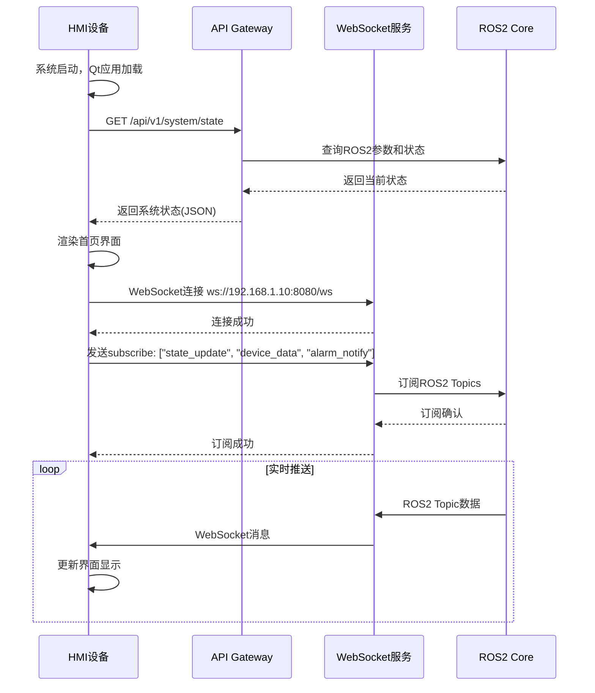
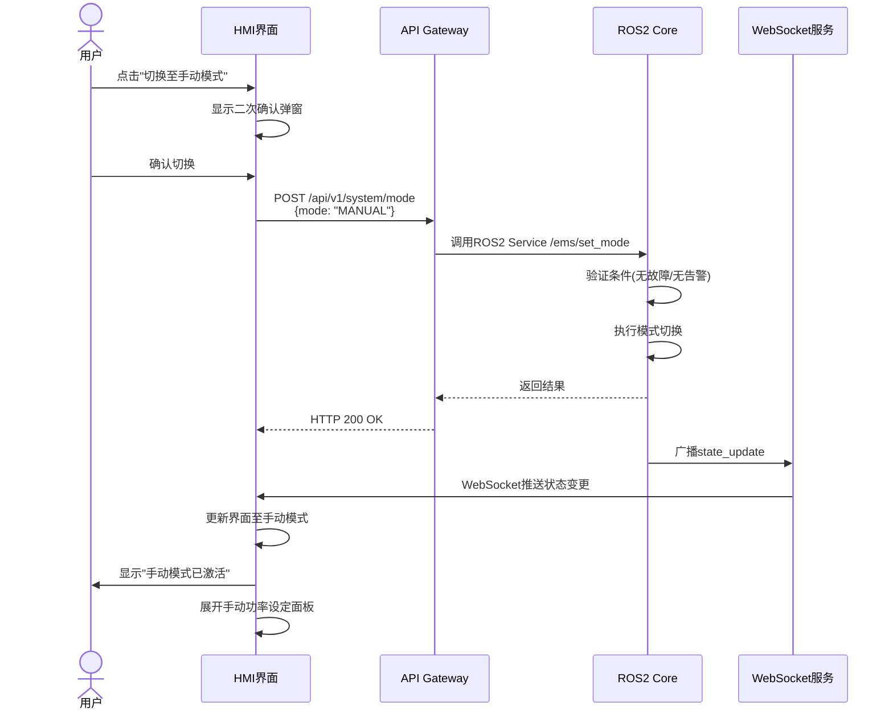
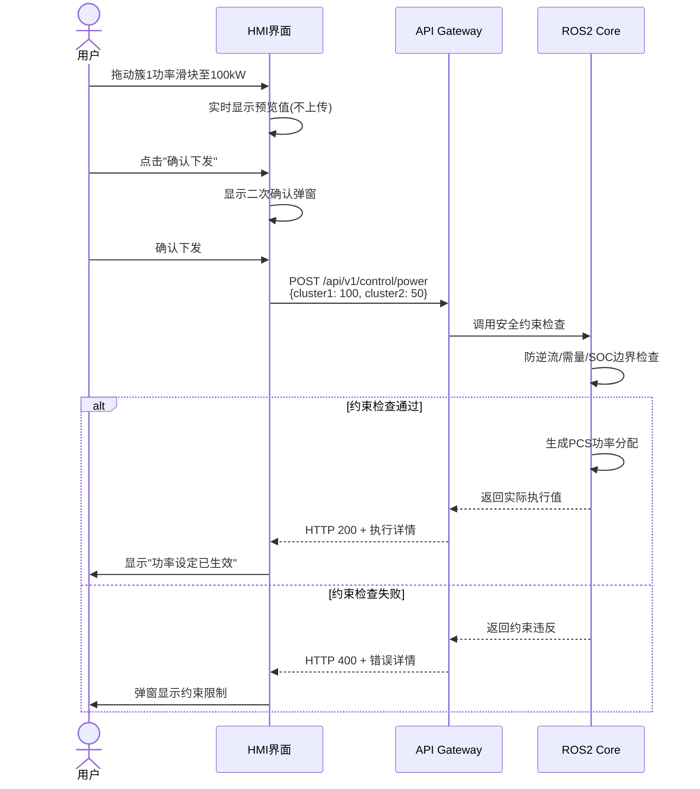
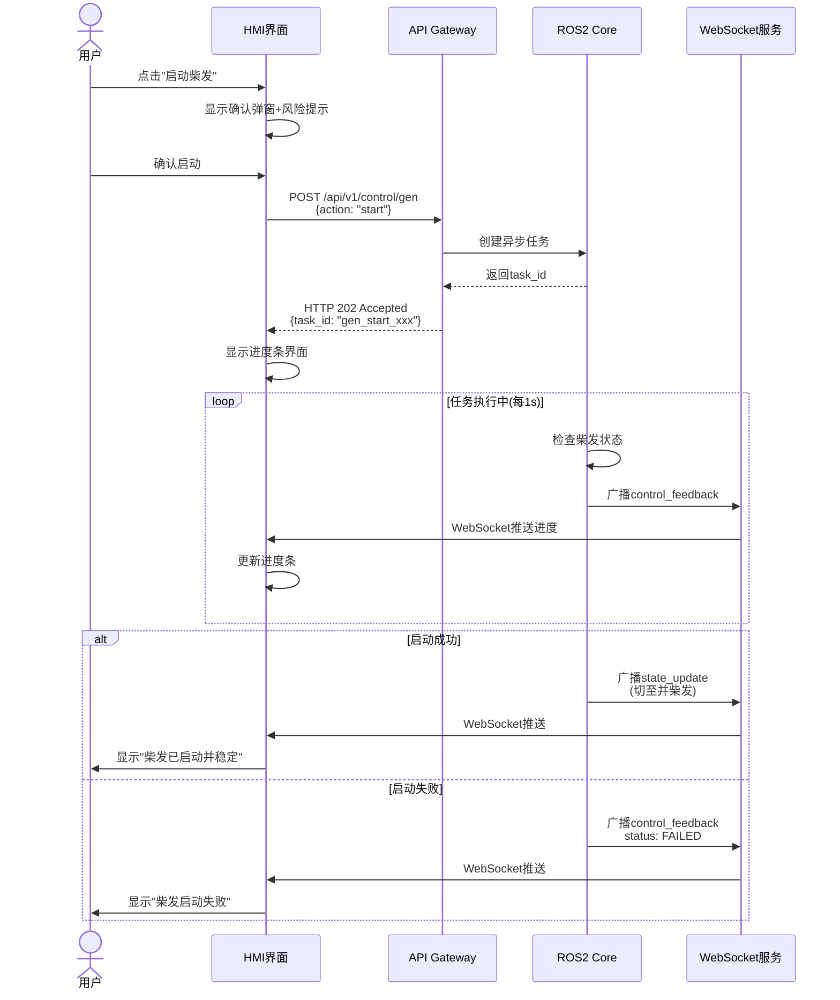
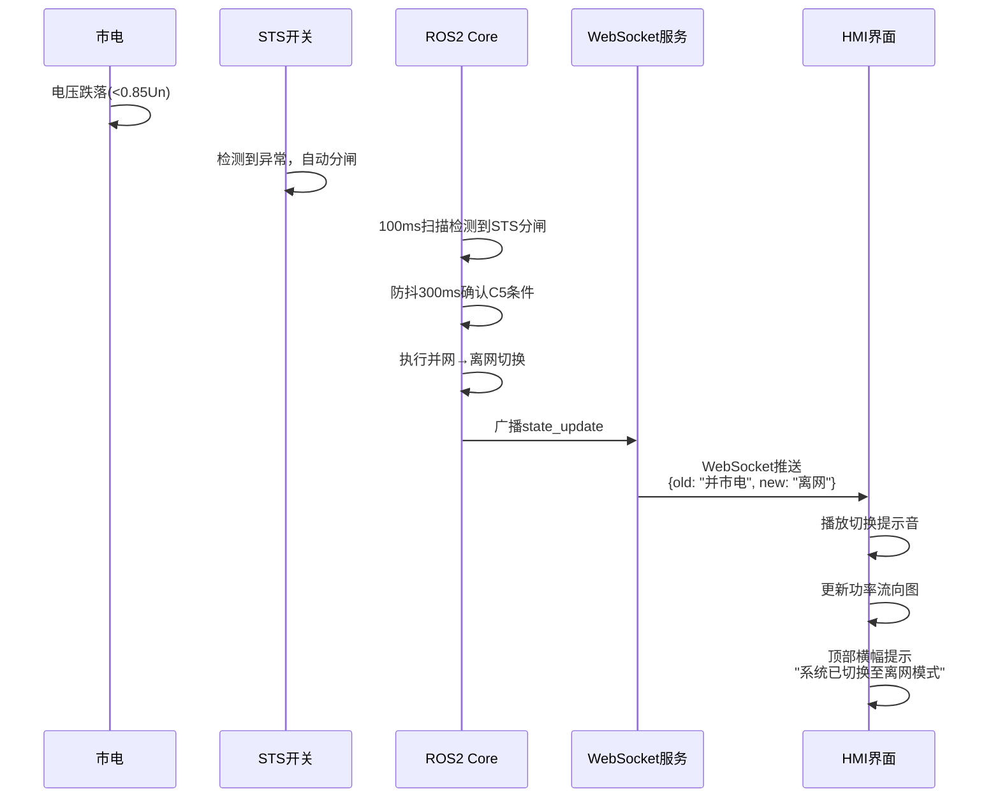
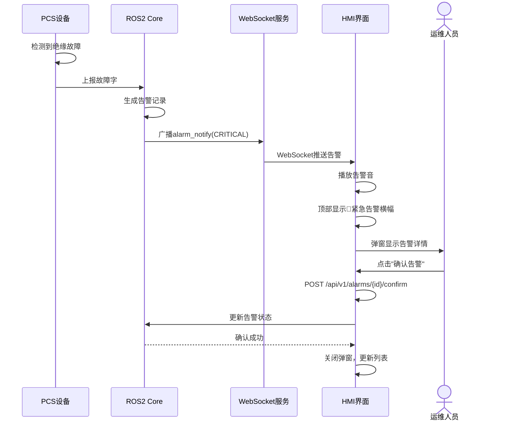

# 10-Frontend-Backend-Interaction.md - 前后端交互设计

> **文档版本**: 2.0  
> **最后更新**: 2026-04-14  
> **关联文档**: [01-PRD.md](./01-PRD.md), [04-State-Machine.md](./04-State-Machine.md), [05-Functional-Spec.md](./05-Functional-Spec.md), [HMI-Design.md](./HMI-Design.md), [06-Technical-Design.md](./06-Technical-Design.md)

---

## 1. 架构设计

### 1.1 设备分离架构

**Cot EMS采用设备分离架构**：
- **HMI前端设备**: 11寸工业触摸屏（独立ARM板），运行嵌入式Linux + Qt/QML
- **EMS后端设备**: WL-EMS-1000-M控制器（独立工控机），运行ROS2 + 实时Linux
- **通信方式**: HTTP REST API + WebSocket（以太网连接）

```
┌─────────────────────────────────────────────────────────────────────────────┐
│                         物理设备分离架构                                      │
│                                                                             │
│  ┌──────────────────────────┐              ┌──────────────────────────────┐ │
│  │    HMI前端设备            │              │      EMS后端设备              │ │
│  │  (11寸触摸屏)             │              │   (WL-EMS-1000-M)            │ │
│  │                          │              │                              │ │
│  │  ┌────────────────────┐  │   HTTP/      │  ┌────────────────────────┐  │ │
│  │  │   HMI Application  │  │   WebSocket  │  │   API Gateway          │  │ │
│  │  │   (Qt/QML/Vue)     │◄─┼───(以太网)───┼─►│   (FastAPI/Flask)      │  │ │
│  │  │                    │  │   TCP/JSON   │  │   - REST API           │  │ │
│  │  │  • 用户界面渲染     │  │              │  │   - WebSocket推送       │  │ │
│  │  │  • 本地状态缓存     │  │              │  │   • HTTP→ROS2桥接      │  │ │
│  │  │  • 离线数据缓存     │  │              │  │   • 设备认证管理       │  │ │
│  │  └────────────────────┘  │              │  └──────────┬─────────────┘  │ │
│  │           │              │              │             │                │ │
│  │  ┌────────▼────────┐     │              │  ┌──────────▼─────────┐      │ │
│  │  │ 本地SQLite缓存  │     │              │  │   ROS2 Core        │      │ │
│  │  │ (离线数据/配置) │     │              │  │   /ems/state_mgr   │      │ │
│  │  └─────────────────┘     │              │  │   /ems/strategy    │      │ │
│  │                          │              │  │   /ems/security    │      │ │
│  │  IP: 192.168.1.100       │              │  │   /ems/dispatcher  │      │ │
│  │                          │              │  │   /ems/southbound  │      │ │
│  └──────────────────────────┘              │  └──────────┬─────────┘      │ │
│                                             │             │                 │ │
│  Web/App客户端                              │             ▼                 │ │
│  (通过4G/5G远程访问)                         │  ┌──────────────────────┐   │ │
│       │                                     │  │    物理设备层         │   │ │
│       │ MQTT over 4G                        │  │   PCS/BMS/MPPT/STS   │   │ │
│       └─────────────────────────────────────┼──┼──────────────────────┘   │ │
│                                             │  │                          │ │
│                                             │  IP: 192.168.1.10           │ │
│                                             └─────────────────────────────┘ │
└─────────────────────────────────────────────────────────────────────────────┘
```

### 1.2 通信协议栈

| 层级 | 协议 | 用途 | 端口 | 数据格式 |
|------|------|------|------|----------|
| 应用层 | HTTP/1.1 | API调用 | 80/443 | JSON |
| 实时推送 | WebSocket | 状态订阅 | 8080/ws | JSON |
| 传输层 | TCP | 可靠传输 | - | - |
| 网络层 | IPv4 | 设备互联 | - | - |
| 物理层 | Ethernet | 百兆以太网 | RJ45 | - |

**通信距离**: 同一机柜内，网线长度 < 3米  
**网络拓扑**: 直连或接入交换机  
**IP配置**: 静态IP（HMI: 192.168.1.100, EMS: 192.168.1.10）

---

## 2. HTTP API设计

### 2.1 RESTful API规范

**基础URL**: `http://192.168.1.10/api/v1`

**通用响应格式**:
```json
{
  "code": 200,
  "message": "success",
  "data": { ... },
  "timestamp": "2026-04-14T14:32:15.123Z"
}
```

**错误响应格式**:
```json
{
  "code": 400,
  "message": "参数错误: 功率超出允许范围",
  "error_type": "VALIDATION_ERROR",
  "timestamp": "2026-04-14T14:32:15.123Z"
}
```

### 2.2 API端点清单

| 方法 | 端点 | 描述 | 权限 |
|------|------|------|------|
| GET | `/system/state` | 获取系统状态 | 观察员+ |
| POST | `/system/mode` | 切换运行模式 | 操作员+ |
| GET | `/devices` | 获取所有设备数据 | 观察员+ |
| GET | `/devices/{type}/{id}` | 获取指定设备 | 观察员+ |
| POST | `/control/power` | 手动设定PCS功率 | 操作员+ |
| POST | `/control/gen` | 启停柴发 | 操作员+ |
| POST | `/control/pcs/{id}` | 单台PCS控制 | 操作员+ |
| GET | `/alarms` | 获取告警列表 | 观察员+ |
| POST | `/alarms/{id}/confirm` | 确认告警 | 操作员+ |
| GET | `/parameters` | 获取参数列表 | 观察员+ |
| POST | `/parameters` | 修改参数 | 管理员 |
| GET | `/logs/audit` | 审计日志 | 管理员 |

### 2.3 核心API详情

#### GET /api/v1/system/state
获取系统完整状态（HMI首页刷新）

**响应**:
```json
{
  "code": 200,
  "data": {
    "state": {
      "id": 2,
      "name": "并市电运行",
      "sub_state": "StrategyEngine",
      "run_mode": "AUTO",
      "timestamp": "2026-04-14T14:32:15.123Z"
    },
    "conditions": {
      "c1_ready": true,
      "c2_fault": false,
      "c3_grid_ready": true,
      "c4_gen_ready": false,
      "c5_off_grid": false
    },
    "power_flow": {
      "pv_total": 450.5,
      "pcs_total": -120.3,
      "grid_power": 80.2,
      "load_power": 410.4,
      "gen_power": 0
    },
    "soc": {
      "cluster1": 85.2,
      "cluster2": 82.1,
      "min": 82.1
    }
  }
}
```

#### POST /api/v1/system/mode
切换自动/手动模式

**请求**:
```json
{
  "mode": "MANUAL",
  "user_id": "user_003",
  "timestamp": "2026-04-14T14:32:15.123Z"
}
```

**响应**:
```json
{
  "code": 200,
  "message": "模式切换成功",
  "data": {
    "old_mode": "AUTO",
    "new_mode": "MANUAL",
    "transition_time": 0.15
  }
}
```

#### POST /api/v1/control/power
手动设定PCS功率

**请求**:
```json
{
  "cluster1_power": 100.0,
  "cluster2_power": 50.0,
  "ramp_rate": 50.0,
  "user_id": "user_003"
}
```

**响应**:
```json
{
  "code": 200,
  "message": "功率设定已生效",
  "data": {
    "requested": {
      "cluster1": 100.0,
      "cluster2": 50.0
    },
    "actual": {
      "cluster1": 95.0,
      "cluster2": 50.0
    },
    "constraints_applied": ["anti_reverse"],
    "constraint_details": {
      "anti_reverse": "防逆流约束触发，簇1功率限制为95kW"
    }
  }
}
```

#### POST /api/v1/control/gen
柴发启停控制

**请求**:
```json
{
  "action": "start",
  "user_id": "user_003"
}
```

**响应** (立即返回，异步执行):
```json
{
  "code": 202,
  "message": "柴发启动任务已接受",
  "data": {
    "task_id": "gen_start_20260414143215",
    "status": "PENDING",
    "estimated_time": 60
  }
}
```

---

## 3. WebSocket实时推送

### 3.1 WebSocket连接

**URL**: `ws://192.168.1.10:8080/ws`  
**协议**: Socket.IO 或原生WebSocket  
**心跳**: 30s  
**重连**: 自动重连，指数退避

### 3.2 消息类型

| 消息类型 | 方向 | 描述 | 频率 |
|----------|------|------|------|
| `state_update` | Server→Client | 系统状态变更 | 实时(事件触发) |
| `device_data` | Server→Client | 设备数据刷新 | 1Hz |
| `alarm_notify` | Server→Client | 告警推送 | 实时 |
| `control_feedback` | Server→Client | 控制执行反馈 | 实时 |
| `heartbeat` | 双向 | 连接保活 | 30s |
| `subscribe` | Client→Server | 订阅主题 | 连接时 |
| `unsubscribe` | Client→Server | 取消订阅 | - |

### 3.3 消息格式示例

**state_update** (状态变更推送):
```json
{
  "type": "state_update",
  "timestamp": "2026-04-14T14:32:15.123Z",
  "data": {
    "old_state": { "id": 2, "name": "并市电运行" },
    "new_state": { "id": 1, "name": "离网运行" },
    "trigger": "C5",
    "reason": "市电电压跌落",
    "transition_time": 0.32
  }
}
```

**device_data** (周期性数据):
```json
{
  "type": "device_data",
  "timestamp": "2026-04-14T14:32:15.123Z",
  "data": {
    "pcs": [
      { "id": 1, "power": 33.3, "online": true },
      { "id": 2, "power": 33.3, "online": true },
      { "id": 3, "power": 33.4, "online": true },
      { "id": 4, "power": 25.0, "online": true },
      { "id": 5, "power": 25.0, "online": true }
    ],
    "soc": { "cluster1": 85.2, "cluster2": 82.1 },
    "gen": { "status": "STANDBY", "ready": false }
  }
}
```

**alarm_notify** (告警推送):
```json
{
  "type": "alarm_notify",
  "timestamp": "2026-04-14T14:32:15.123Z",
  "data": {
    "alarm_id": "ALM_20260414143215001",
    "level": "CRITICAL",
    "device": "PCS_1",
    "code": "INSULATION_FAULT",
    "message": "绝缘阻抗过低: 180kΩ",
    "value": 180,
    "threshold": 500,
    "unit": "kΩ"
  }
}
```

**control_feedback** (控制反馈):
```json
{
  "type": "control_feedback",
  "timestamp": "2026-04-14T14:32:15.123Z",
  "data": {
    "task_id": "gen_start_20260414143215",
    "action": "gen_start",
    "status": "RUNNING",
    "progress": 0.45,
    "phase": "启动中",
    "message": "柴发启动中(27s/60s)"
  }
}
```

---

## 4. 交互场景设计

### 4.1 场景1: HMI启动初始化



### 4.2 场景2: 手动模式切换



### 4.3 场景3: 手动设定PCS功率



### 4.4 场景4: 柴发启动（异步任务）



### 4.5 场景5: 并离网自动切换（后端触发）



### 4.6 场景6: 告警推送与确认



---

## 5. 前后端数据同步机制

### 5.1 数据流架构

```
┌─────────────────────────────────────────────────────────────────────────┐
│                           数据同步机制                                  │
│                                                                         │
│  ┌──────────────┐         ┌──────────────┐         ┌──────────────┐    │
│  │   HMI前端     │         │  API Gateway │         │  ROS2 Core   │    │
│  │              │         │              │         │              │    │
│  │  ┌──────────┐│         │  ┌──────────┐│         │  ┌──────────┐│    │
│  │  │UI State  ││◄────────┼──┤HTTP/WS   ││◄────────┼──┤ROS2      ││    │
│  │  │(Vuex/    ││ 拉取/推送│  │Bridge    ││ 订阅Topic│  │Topics    ││    │
│  │  │ Redux)   ││         │  └──────────┘│         │  └──────────┘│    │
│  │  └──────────┘│         │       │      │         │       │      │    │
│  │       │      │         │       ▼      │         │       ▼      │    │
│  │  ┌──────────┐│         │  ┌──────────┐│         │  ┌──────────┐│    │
│  │  │Local Cache││         │  │Data Cache││         │  │Device    ││    │
│  │  │(SQLite)  ││         │  │(Redis)   ││         │  │Drivers   ││    │
│  │  └──────────┘│         │  └──────────┘│         │  └──────────┘│    │
│  └──────────────┘         └──────────────┘         └──────────────┘    │
│                                                                         │
│  同步策略:                                                              │
│  1. 首次加载: HTTP GET拉取完整状态                                       │
│  2. 实时更新: WebSocket推送增量变更                                      │
│  3. 断线重连: HTTP重新拉取 + WS重新订阅                                  │
│  4. 离线缓存: HMI本地SQLite存储，恢复后同步                              │
└─────────────────────────────────────────────────────────────────────────┘
```

### 5.2 状态一致性保障

| 机制 | 实现方式 | 说明 |
|------|----------|------|
| **版本号** | 每次状态变更+1 | HMI检测跳变时请求全量同步 |
| **心跳保活** | WebSocket 30s心跳 | 3次丢失触发重连 |
| **重连同步** | 重连后HTTP拉取 | 获取断线期间的状态变化 |
| **操作确认** | 控制指令返回task_id | 异步任务追踪执行结果 |

### 5.3 离线处理

HMI设备支持离线缓存：
- 通信中断时，HMI本地SQLite继续记录操作日志
- 界面显示"通信中断"提示，禁用控制功能
- 通信恢复后，自动同步离线期间的操作记录

---

## 6. 安全设计

### 6.1 认证机制

**JWT Token认证**:
```
1. 用户登录: POST /auth/login {username, password}
2. 后端验证: 查询用户数据库
3. 返回Token: {access_token, refresh_token, expires_in}
4. HMI存储: Token保存至本地安全存储
5. 后续请求: Header携带 Authorization: Bearer <token>
6. Token刷新: 过期前自动刷新
```

### 6.2 权限控制

| 角色 | HTTP权限 | WebSocket订阅 |
|------|----------|---------------|
| 观察员 | GET只读 | device_data |
| 操作员 | GET+控制API | + state_update, alarm_notify |
| 管理员 | 全部API | + 全部主题 |

### 6.3 安全传输

- **HTTP**: 可选启用HTTPS（自签名证书）
- **WebSocket**: ws://（内网）或 wss://（外网）
- **数据加密**: 敏感参数AES加密传输

---

## 7. 异常处理

### 7.1 HTTP错误码

| 状态码 | 场景 | 前端处理 |
|--------|------|----------|
| 200 | 成功 | 正常处理 |
| 202 | 异步任务已接受 | 显示进度界面 |
| 400 | 参数错误 | 显示表单校验错误 |
| 401 | 未认证 | 跳转登录页 |
| 403 | 权限不足 | 弹窗提示权限不足 |
| 409 | 状态冲突 | 显示当前状态不允许 |
| 422 | 约束触发 | 显示约束限制详情 |
| 500 | 服务器错误 | 显示"系统错误，请联系管理员" |
| 503 | 设备离线 | 显示设备离线状态 |

### 7.2 网络异常处理

```javascript
// HMI前端重连逻辑
class WebSocketManager {
  connect() {
    this.ws = new WebSocket('ws://192.168.1.10:8080/ws');
    
    this.ws.onclose = () => {
      // 指数退避重连
      setTimeout(() => this.connect(), this.reconnectDelay);
      this.reconnectDelay = Math.min(this.reconnectDelay * 2, 30000);
    };
    
    this.ws.onopen = () => {
      this.reconnectDelay = 1000; // 重置退避
      this.syncFullState(); // 重新同步
    };
  }
}
```

---

## 8. 附录

### 8.1 后端ROS2→HTTP桥接实现

```python
# api_gateway/main.py (FastAPI示例)
from fastapi import FastAPI, WebSocket
from fastapi.middleware.cors import CORSMiddleware
import rclpy
from rclpy.node import Node
from std_msgs.msg import String
import json

app = FastAPI()
ros_node = None

# CORS配置
app.add_middleware(
    CORSMiddleware,
    allow_origins=["*"],
    allow_methods=["*"],
    allow_headers=["*"],
)

class ROS2BridgeNode(Node):
    def __init__(self):
        super().__init__('api_gateway')
        self.system_state = {}
        
        # 订阅ROS2 Topics
        self.create_subscription(
            SystemState, '/ems/system_state', 
            self.on_state_update, 10)
        
        # 发布控制指令
        self.control_pub = self.create_publisher(
            ControlCommand, '/ems/control_cmd', 10)
    
    def on_state_update(self, msg):
        self.system_state = {
            'state_id': msg.state_id,
            'state_name': msg.state_name,
            # ...
        }

# HTTP API端点
@app.get("/api/v1/system/state")
async def get_system_state():
    return {
        "code": 200,
        "data": ros_node.system_state
    }

@app.post("/api/v1/system/mode")
async def set_mode(request: ModeRequest):
    # 调用ROS2 Service
    client = ros_node.create_client(SetMode, '/ems/set_mode')
    result = await client.call_async(request)
    return {"code": 200 if result.success else 400}

# WebSocket端点
@app.websocket("/ws")
async def websocket_endpoint(websocket: WebSocket):
    await websocket.accept()
    
    # 订阅状态变更
    while True:
        state = ros_node.system_state
        await websocket.send_json({
            "type": "state_update",
            "data": state
        })
        await asyncio.sleep(1)

# 启动ROS2节点
def init_ros2():
    rclpy.init()
    global ros_node
    ros_node = ROS2BridgeNode()
    
    # 在独立线程运行ROS2
    import threading
    thread = threading.Thread(target=rclpy.spin, args=(ros_node,))
    thread.start()

if __name__ == "__main__":
    init_ros2()
    import uvicorn
    uvicorn.run(app, host="0.0.0.0", port=80)
```

### 8.2 HMI前端HTTP客户端示例

```cpp
// Qt/C++ HTTP客户端示例
class EMSApiClient : public QObject {
    Q_OBJECT
public:
    explicit EMSApiClient(QObject *parent = nullptr) 
        : manager(new QNetworkAccessManager(this)) {}
    
    // GET系统状态
    void getSystemState() {
        QNetworkRequest req(QUrl("http://192.168.1.10/api/v1/system/state"));
        req.setHeader(QNetworkRequest::ContentTypeHeader, "application/json");
        
        auto *reply = manager->get(req);
        connect(reply, &QNetworkReply::finished, [=]() {
            QByteArray data = reply->readAll();
            QJsonDocument doc = QJsonDocument::fromJson(data);
            emit stateReceived(doc.object());
            reply->deleteLater();
        });
    }
    
    // POST设定功率
    void setPower(float cluster1, float cluster2) {
        QNetworkRequest req(QUrl("http://192.168.1.10/api/v1/control/power"));
        req.setHeader(QNetworkRequest::ContentTypeHeader, "application/json");
        
        QJsonObject json;
        json["cluster1_power"] = cluster1;
        json["cluster2_power"] = cluster2;
        
        auto *reply = manager->post(req, QJsonDocument(json).toJson());
        connect(reply, &QNetworkReply::finished, [=]() {
            emit powerSetResponse(reply->readAll());
            reply->deleteLater();
        });
    }

private:
    QNetworkAccessManager *manager;
};
```

### 8.3 接口调用示例

```bash
# 获取系统状态
curl http://192.168.1.10/api/v1/system/state

# 切换至手动模式
curl -X POST http://192.168.1.10/api/v1/system/mode \
  -H "Content-Type: application/json" \
  -d '{"mode": "MANUAL"}'

# 设定PCS功率
curl -X POST http://192.168.1.10/api/v1/control/power \
  -H "Content-Type: application/json" \
  -d '{"cluster1_power": 100, "cluster2_power": 50}'

# 启动柴发
curl -X POST http://192.168.1.10/api/v1/control/gen \
  -H "Content-Type: application/json" \
  -d '{"action": "start"}'

# WebSocket连接测试
wscat -c ws://192.168.1.10:8080/ws
```

---

## 9. 变更记录

| 版本 | 日期 | 变更内容 |
|------|------|----------|
| 2.0 | 2026-04-14 | 重构: 明确设备分离架构，HTTP+WebSocket通信方式 |
| 1.0 | 2026-04-14 | 初始版本: ROS2内部通信架构 |
