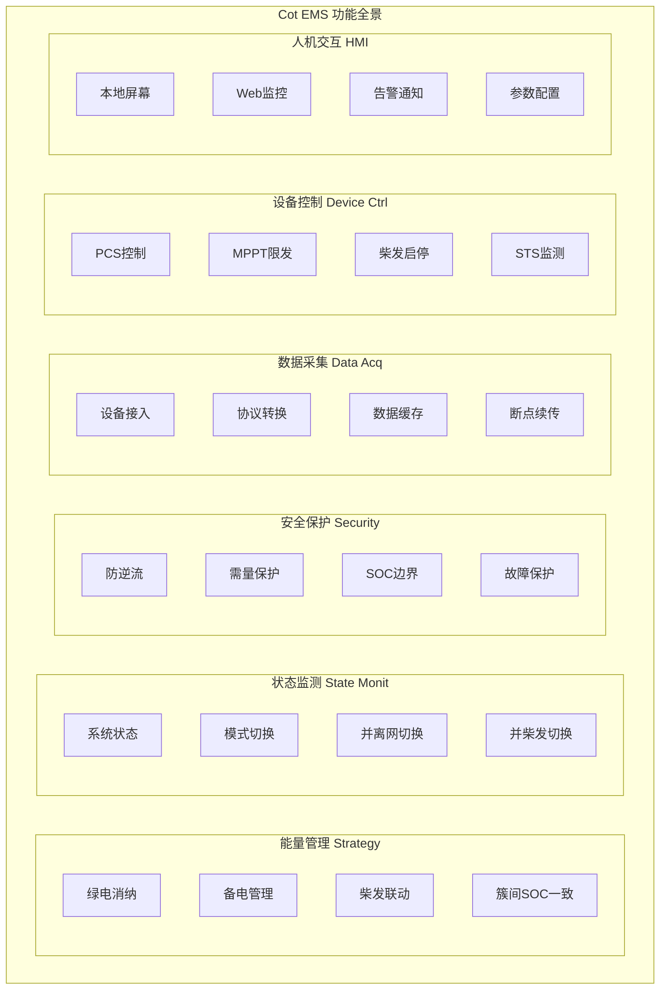
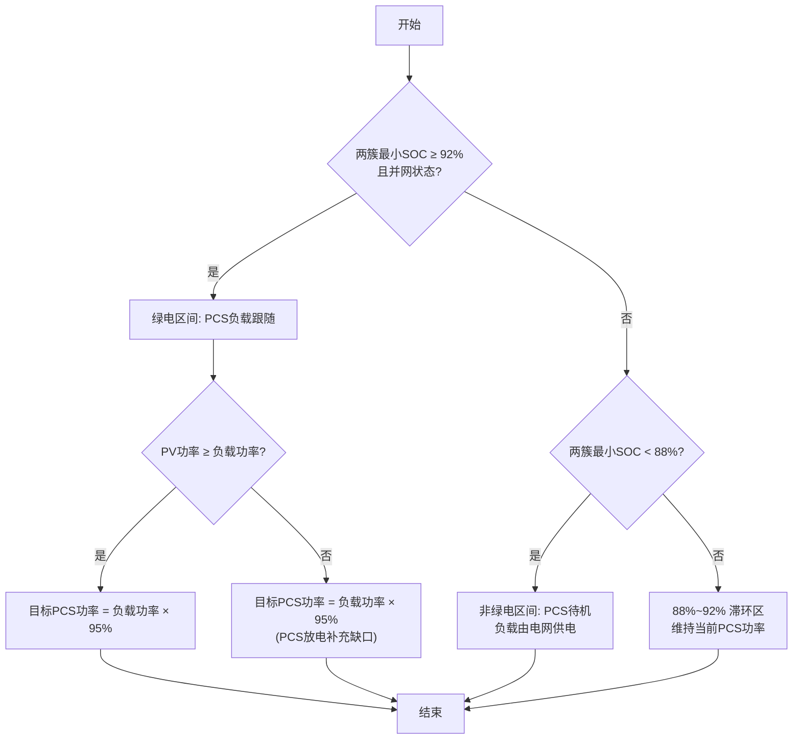
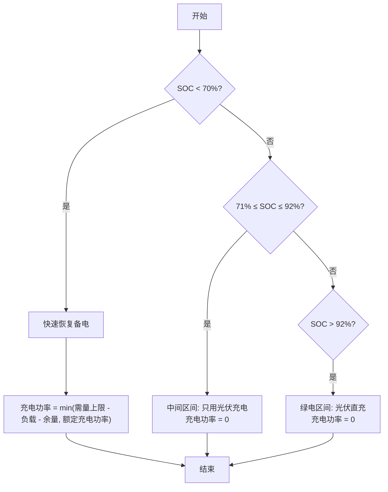
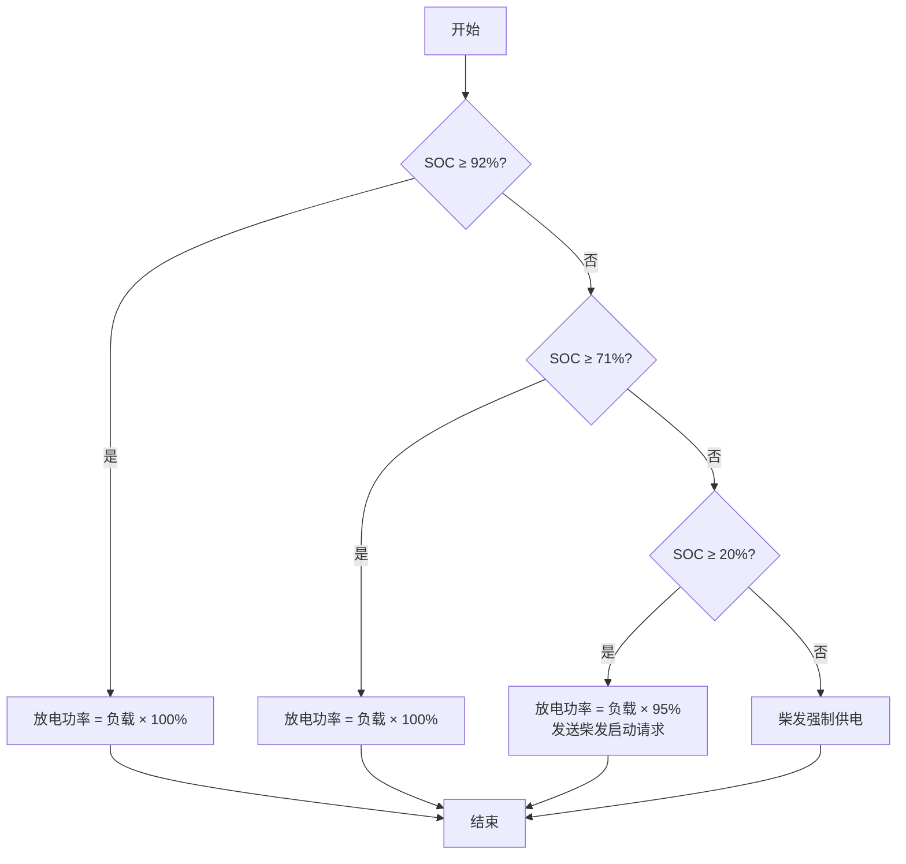
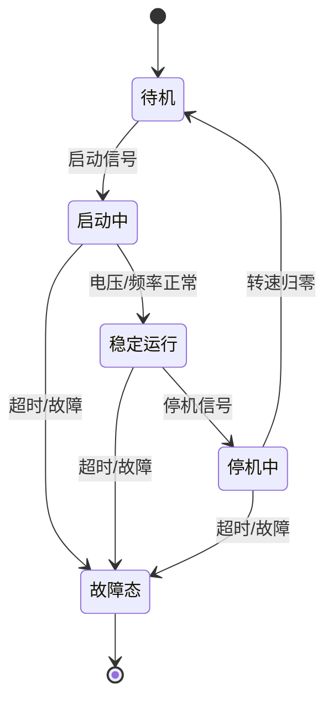

# 05-Functional-Spec.md - 功能规格说明书

> **文档版本**: 2.0  
> **最后更新**: 2026-04-13  
> **关联文档**: [00-Context.md](./00-Context.md), [01-PRD.md](./01-PRD.md), [02-Domain-Model.md](./02-Domain-Model.md), [04-State-Machine.md](./04-State-Machine.md), [06-Technical-Design.md](./06-Technical-Design.md)

---

## 版本变更记录

| 版本 | 日期 | 变更内容 |
|------|------|---------|
| 2.1 | 2026-05-09 | **修正**: 3.2.1 C2条件 — 通信故障仅纳入关键设备（PCS/BAM/STS/电表），液冷机/除湿机/变压器温控仪通信故障走L3告警通道，不触发状态机跳转 |
| 2.0 | 2026-04-13 | **重构**: 基于00~04文档重新生成功能规格，明确功能边界与流程 |
| 1.0 | 2026-04-10 | 初始版本 - 基于初步需求分析 |

---

## 1. 文档目的

本文档定义 **Cot EMS** 系统的功能规格，描述：
- **系统应该做什么**（功能需求）
- **功能边界与约束**（什么不做、限制条件）
- **功能流程与处理逻辑**（输入→处理→输出）
- **接口契约**（与其他系统的交互约定）

**不涉及具体代码实现**，实现细节参见 [06-Technical-Design.md](./06-Technical-Design.md)。

---

## 2. 系统功能全景

### 2.1 功能域划分



### 2.2 功能矩阵

| 功能域 | 子功能 | 优先级 | 实时性要求 | 关联PRD章节 |
|--------|--------|--------|------------|-------------|
| 能量管理 | 绿电消纳策略 | Must | Soft (4s) | 3.1 |
| 能量管理 | 备电恢复策略 | Must | Soft (4s) | 3.2 |
| 能量管理 | 柴发启停控制 | Must | Firm (5s) | 3.2 |
| 能量管理 | 簇间SOC一致 | Should | Soft (30s) | - |
| 状态监测 | 系统状态 | Must | Hard (100ms) | 4.2 |
| 状态监测 | 并离网切换 | Must | Hard (500ms) | 3.2 |
| 状态监测 | 并柴发切换 | Must | Hard (500ms) | 3.2 |
| 安全保护 | 防逆流保护 | Must | Hard (200ms) | 3.1 |
| 安全保护 | 需量保护 | Must | Hard (1s) | 4.2.4 |
| 安全保护 | SOC边界保护 | Must | Hard (100ms) | 4.2.4 |
| 数据采集 | 多协议接入 | Must | Firm (混合) | 4.1 |
| 数据采集 | 断点续传 | Must | Best Effort | 4.1.3 |
| 设备控制 | PCS功率控制 | Must | Hard (100ms) | 4.2.4 |
| 设备控制 | MPPT限功率 | Must | Soft (4s) | 3.1 |
| 人机交互 | 本地监控 | Must | Best Effort | 4.3 |
| 人机交互 | 远程监控 | Must | Best Effort | 3.3 |

---

## 3. 功能详细规格

### 3.1 能量管理功能域

#### 3.1.1 绿电消纳策略 (FR-EM-001)

**功能描述**: 最大化利用光伏发电，减少从电网购电

**输入**: 
| 数据项 | 来源 | 周期 | 说明 |
|--------|------|------|------|
| 两簇SOC | BAM1/BAM2 | 3s | 用于判断是否进入绿电区间 |
| 光伏总功率 | MPPT 1~7 | 2s | 当前PV发电功率 |
| 负载功率 | 负载电表 | 1s | 交流侧负载需求 |
| 并网状态 | STS | 100ms | 是否在并网模式 |

**处理逻辑**:



**输出**:
| 数据项 | 类型 | 说明 |
|--------|------|------|
| 簇1目标PCS功率 | float32 | 目标有功功率设定值 [kW] |
| 簇2目标PCS功率 | float32 | 目标有功功率设定值 [kW] |
| 策略区间标识 | uint8 | 0=绿电, 1=备电恢复, 2=柴发预警, 3=强制柴发 |

**约束与边界**:
- 防逆流余量 ≥ 5kW（关口表功率判断）
- PCS功率调节周期 ≤ 4s
- SOC上限 95%（超过停止充电）

#### 3.1.2 备电恢复策略 (FR-EM-002)

**功能描述**: 市电恢复后，通过充电恢复储能备电能力

**四层SOC阈值管理**:

| 区间 | SOC范围 | 行为 | 柴发状态 |
|------|---------|------|----------|
| Zone 4 (绿电) | ≥92% | PCS放电供负载，光伏直充 | 停机 |
| Zone 3 (备电关闭) | 71%~92% | PCS待机，光伏直充 | 停机 |
| Zone 2 (备电恢复) | 20%~70% | 市电充电（需量约束） | 待机 |
| Zone 1 (强制柴发) | <20% | 柴发强制供电/充电 | 必须运行 |

**并网状态下的充电策略**:



**离网状态下的放电策略**:



#### 3.1.3 柴发联动控制 (FR-EM-003)

**启动条件** (OR关系):
- SOC ≤ 20%（强制启动） 且 离网状态 且 用户配置允许
- 远程手动启动

**停机条件** (OR关系):
- SOC ≥ 80% 且 柴发已稳定运行
- 市电恢复 且 ATS切换至市电侧
- 远程手动停机
- 柴发故障

**状态机**:



**约束**:
- 启动超时: 180s(用于判断启动超时)
- 停机超时: 120s(用于判断停机超时)
- 启动冷却时间: 5min（防止频繁启停）

#### 3.1.4 簇间SOC一致 (FR-EM-004)

**状态**: 暂不做。

**说明**: 最多只在用市电充电且受到需量限制的情况下，尽量保持两簇的簇间SOC值一致。

---

### 3.2 状态监测功能域

#### 3.2.1 系统状态机 (FR-SC-001)

**状态定义**:

| 状态ID | 状态名称 | 说明 | PCS模式 | EMS功率控制 |
|--------|----------|------|---------|-------------|
| 0x00 | SysStandby | 系统待机 | 待机 | 否 |
| 0x01 | SysOffGrid | 离网运行 | VF模式 | 否（PCS自主） |
| 0x02 | SysCnetGrid | 并市电运行 | PQ模式 | 是 |
| 0x03 | SysCnetGent | 并柴发运行 | PQ模式 | 是 |
| 0xFF | SysFault | 故障态 | 待机 | 否 |

**状态转换条件** (C1~C6):

| 条件 | 描述 | 判定逻辑 |
|------|------|----------|
| C1 | 开机就绪 | 关键设备通信正常 + 无故障 + PCS配置完成 |
| C2 | 故障触发 | 关键设备通信故障 或 故障字非零 |
| C3 | 并网条件达成 | EMS判断STS合闸状态为闭合，且ATS的并网IO为高电平 |
| C4 | 并柴发条件达成 | EMS判断STS合闸状态为闭合，且ATS的常用源IO为低电平、备用源IO为高电平 |
| C5 | 离网条件触发 | EMS检测到STS合闸状态为断开 或 手动切换 |
| C6 | 返回待机条件 | 系统完全停机 + 无故障 |

> **关键设备**：PCS、BAM、STS、关口表、储能表、负载表、柴发表。液冷机、除湿机、变压器温控仪通信故障为L3级告警，不触发C2。

**防抖机制**: 条件需持续满足3个扫描周期(300ms)才触发状态切换

#### 3.2.2 并离网切换 (FR-SC-002)

**并网→离网 (Grid Fail)**:
1. EMS检测到STS合闸状态为断开
2. PCS与STS通信同步STS合闸状态为断开后，切换至VF模式
3. 负载由PCS不间断供电

**离网→并网 (Grid Return)**:
1. EMS检测到Grid电压恢复正常
2. EMS检测到ATS将市电侧IO置高
3. EMS检测到STS合闸状态为闭合
4. PCS切换至PQ模式，恢复并网运行

**时间约束**:
- STS切换完成: 并网切离网≤20ms、离网切并网≤180ms
- 总切换时间: ≤500ms
- 负载电压跌落: <10%

#### 3.2.3 并柴发切换 (FR-SC-003)

**离网→并柴发**:
1. 柴发启动完成，电压/频率稳定
2. ATS切换至柴发侧
3. EMS检测到STS合闸状态为闭合
4. PCS切换至PQ模式，并入柴发电压源

**并柴发→离网**:
1. 市电恢复或柴发停机
2. ATS切换至市电侧或分闸
3. EMS检测到STS合闸状态为断开
4. PCS回到VF离网模式

**约束**:
- 柴发为非并网型，仅作为电压源
- PCS在并柴发模式下仍为PQ模式，但功率参考柴发能力

---

### 3.3 安全保护功能域

#### 3.3.1 防逆流保护 (FR-SP-001)

**功能**: 周期持续计算防逆流约束，输出防逆流限制值。

**计算逻辑**:
```
防逆流限制值 = max(0, 负载功率 - 防逆流余量)
```
其中防逆流余量默认值为 **5kW**。

**响应时间**: ≤200ms

#### 3.3.2 需量保护 (FR-SP-002)

**功能**: 周期持续计算需量约束，输出需量限制值。

**计算逻辑**:
```
需量限制值 = max(0, 需量上限 - 负载功率)
```
其中需量上限默认值为 **500kW**。

**响应时间**: ≤1s

#### 3.3.3 SOC边界保护 (FR-SP-003)

**上限保护** (SOC ≥ 95%):
- 停止PCS充电
- 触发PV限发
- 告警通知

**下限保护** (SOC ≤ 5%):
- 停止PCS放电
- 强制柴发启动（如未运行）
- 告警通知

**响应时间**: ≤100ms

#### 3.3.4 功率变化率限制 (FR-SP-004)

**约束**: PCS功率变化率 ≤ 50kW/s

**实现**: 每100ms周期，功率调整量 ≤ 5kW

---

### 3.4 数据采集功能域

#### 3.4.1 设备数据接入 (FR-DA-001)

**接入设备清单**:

| 设备类型 | 数量 | 通信协议 | 物理接口 | 采集周期 |
|----------|------|----------|----------|----------|
| PCS | 5台 | Modbus RTU | RS485-4 | 3s |
| DC柜(BMS) | 4柜 (3级: BAM→ESBCM→BMM) | Modbus TCP | 以太网LAN1/2 | 3s |
| MPPT | 7路 | Modbus RTU | RS485-7 | 4s |
| STS | 2台 | Modbus RTU | RS485-3 | 100ms |
| 液冷机 | 4台 | Modbus RTU | RS485-5 | 5s |
| 除湿机 | 4台 | Modbus RTU | RS485-6 | 5s |
| 电表 | 4块 | Modbus RTU/DLT645 | RS485-1/2 | 1s |
| 柴发 | 1台 | 硬线DI/DO | DI/DO | 100ms |
| 变压器温控 | 1台 | Modbus RTU | RS485-8 | 5s |

**数据内容**:
- 遥测: 电压、电流、功率、SOC、温度、频率
- 遥信: 开关状态、告警状态、运行模式
- 遥脉: 累计电量（如有）

#### 3.4.2 断点续传 (FR-DA-002)

**触发条件**: 北向通信中断（4G/5G掉线）

**行为**:
1. 检测通信中断（超时3个上报周期）
2. 本地SSD缓存数据（1min间隔）
3. 存储容量: ≥3天数据（256GB SSD）
4. 通信恢复后自动补传

**缓存策略**:
- 正常数据: 1min间隔存储
- 告警数据: 变化时立即存储
- 循环覆盖: 存储满后覆盖最早数据

---

### 3.5 设备控制功能域

#### 3.5.1 PCS功率控制 (FR-DC-001)

**控制模式**:

| 模式 | 说明 | 功率来源 |
|------|------|----------|
| 自动模式 | EMS根据策略计算自动下发 | 策略引擎 |
| 手动模式 | 用户通过HMI/Web手动设定 | HMI输入 |
| 紧急模式 | 安全约束强制干预 | 安全引擎 |

**优先级** (高到低):
1. 紧急模式（故障保护）
2. 手动模式（用户干预）
3. 自动模式（正常运行）

**约束**:
- 功率设定范围: -PCS额定功率 ~ +PCS额定功率
- 变化率限制: 50kW/s

#### 3.5.2 MPPT限功率 (FR-DC-002)

**触发条件**:
- SOC ≥ 90% 且 充电功率接近饱和
- 防逆流触发且PCS已达最大充电

**限功率计算**:

```
允许充电余量 = (SOC上限 - 当前SOC) / (SOC上限 - 90%) × 额定充电功率
PV限功率 = max(0, 允许充电余量 + PCS放电功率 / 效率)
```

#### 3.5.3 柴发启停 (FR-DC-003)

**启动流程**:
1. EMS发出启动信号（DO-1闭合）
2. 等待柴发启动（监测转速/电压）
3. 启动超时30s判定失败
4. 启动成功后稳定运行

**停机流程**:
1. EMS发出停机信号（DO-1断开）
2. 等待柴发转速归零
3. 停机超时120s告警

**状态监测**:
- DI输入: 柴发运行状态、断路器状态
- 通信: 柴发电压、频率、功率（如有）

---

### 3.6 人机交互功能域

#### 3.6.1 本地监控 (FR-HMI-001)

**显示内容**:
- 系统状态（运行模式、告警列表）
- 功率流向图（PV→电池/负载/电网）
- 设备状态（在线/离线、关键参数）
- SOC趋势图

**操作功能**:
- 模式切换（自动/手动）
- 手动功率设定
- 柴发启停
- 参数查看

#### 3.6.2 远程监控 (FR-HMI-002)

**数据上报** (MQTT):
- 实时数据: 30s间隔
- 变化数据: 变化时立即上报
- 告警数据: 产生/恢复时立即上报

**指令接收**:
- 模式切换
- 手动功率设定
- 柴发启停
- 参数配置

**响应时间**: <1s

---

## 4. 功能接口契约

### 4.1 南向接口 (设备层)

#### 4.1.1 Modbus RTU (RS485)

**通信参数**:
- 波特率: 9600/19200bps（设备依赖）
- 数据位: 8
- 停止位: 1
- 校验: 无/偶校验（设备依赖）
- 超时: 500ms
- 重试: 3次

**寄存器映射**: 参见 [02-Domain-Model.md](./02-Domain-Model.md) 设备协议章节

#### 4.1.2 Modbus TCP (以太网)

**通信参数**:
- BAM1: 192.168.1.10:502
- BAM2: 192.168.1.11:502
- 超时: 1s
- 重试: 3次

#### 4.1.3 硬线DI/DO

**DI输入** (16路):
| 通道 | 功能 | 电平 |
|------|------|------|
| DI-1 | 急停信号 | 常闭 |
| DI-2 | 浪涌保护器故障 | 常开 |
| DI-3 | 消防信号 | 常开 |
| DI-4 | 门禁状态 | 常开 |
| DI-5 | ATS市电侧 | 有源 |
| DI-6 | ATS柴发侧 | 有源 |
| DI-7 | 柴发运行状态 | 有源 |
| DI-8 | 柴发断路器状态 | 有源 |

**DO输出** (8路):
| 通道 | 功能 | 电平 |
|------|------|------|
| DO-1 | 柴发启停控制 | 干接点 |
| DO-2 | 运行指示灯 | 干接点 |
| DO-3 | 故障指示灯 | 干接点 |
| DO-4 | 分励脱扣 | 干接点 |

### 4.2 北向接口 (云平台)

**协议**: MQTT over TLS
**Broker**: 甲方私有云
**Topic结构**:
- `cot/{site_id}/telemetry` - 实时遥测
- `cot/{site_id}/alarms` - 告警
- `cot/{site_id}/commands` - 控制指令
- `cot/{site_id}/config` - 配置参数

**数据格式**: JSON

### 4.3 东西向接口 (内部模块)

参见 [06-Technical-Design.md](./06-Technical-Design.md) 第2章接口定义

---

## 5. 功能约束与假设

### 5.1 技术约束

| 约束项 | 说明 | 影响 |
|--------|------|------|
| 柴发冷启动 | 柴发无黑启动能力，启动需要时间 | 储能必须支持至少5min独立供电 |
| STS不可控 | STS由PCS自动控制，EMS只能监测 | 并离网切换依赖PCS自主判断 |
| MPPT不可控 | MPPT功率由EMS通过RS485设定，响应延迟 | 功率调节存在滞后 |
| PCS并机 | 簇内PCS并机运行，统一功率设定 | 无法单独控制单台PCS功率 |

### 5.2 性能约束

| 指标 | 要求 | 说明 |
|------|------|------|
| 状态机扫描周期 | 100ms | 固定周期 |
| 策略计算周期 | 100ms | 与状态机同步 |
| 防逆流响应 | ≤200ms | 硬实时要求 |
| 并离网切换 | ≤300ms | 含STS切换时间 |
| 柴发启动响应 | ≤1s | 从指令到信号发出 |
| 数据刷新延迟 | <5s | 4G网络正常时 |

### 5.3 功能边界（明确不做）

| 功能 | 不做原因 | 替代方案 |
|------|----------|----------|
| 峰谷套利 | 甲方明确无此需求 | N/A |
| 黑启动 | 柴发无此能力 | 储能独立支撑 |
| 谐波治理 | 无此硬件能力 | N/A |
| 负载分级切除 | 未配置智能断路器 | 人工切除 |
| MPC预测控制 | 当前版本基于规则引擎 | 预留扩展接口 |

---

## 6. 故障处理

### 6.1 故障分级

| 级别 | 名称 | 响应动作 | 示例 |
|------|------|----------|------|
| L1 | 致命故障 | 系统进入Fault态，PCS停机 | 直流过压、绝缘故障 |
| L2 | 严重故障 | 触发模式切换或功率限制 | 通信中断、PCS故障 |
| L3 | 一般告警 | 告警通知，维持运行 | 温度偏高、SOC接近边界 |
| L4 | 提示信息 | 记录日志 | 参数变更、模式切换 |

### 6.2 故障恢复

| 故障类型 | 自动恢复 | 人工恢复 | 说明 |
|----------|----------|----------|------|
| 通信故障 | ✓ | - | 通信恢复后自动恢复 |
| 设备故障 | ✗ | ✓ | 需人工确认后复位 |
| 保护动作 | ✗ | ✓ | 需人工检查系统状态 |

---

## 7. 附录

### 7.1 术语表

参见 [00-Context.md](./00-Context.md) 第4章

### 7.2 配置参数汇总

| 参数名 | 默认值 | 范围 | 说明 |
|--------|--------|------|------|
| green_threshold | 90.0 | 80~95 | 绿电阈值 [%] |
| green_hysteresis | 2.0 | 1~5 | 绿电滞环 [%] |
| backup_threshold | 70.0 | 50~80 | 备电阈值 [%] |
| backup_hysteresis | 1.0 | 0.5~2 | 备电滞环 [%] |
| gen_start_soc | 20.0 | 10~30 | 柴发启动SOC [%] |
| gen_stop_soc | 80.0 | 70~90 | 柴发停机SOC [%] |
| anti_reverse_margin | 5.0 | 1~10 | 防逆流余量 [kW] |
| demand_limit | 500.0 | 100~1000 | 需量上限 [kW] |
| ramp_rate_limit | 50.0 | 10~100 | 功率变化率 [kW/s] |

### 7.3 参考文档

- [01-PRD.md](./01-PRD.md): 产品需求文档
- [02-Domain-Model.md](./02-Domain-Model.md): 领域模型
- [04-State-Machine.md](./04-State-Machine.md): 状态机定义
- [06-Technical-Design.md](./06-Technical-Design.md): 技术设计（实现细节）
](./06-Technical-Design.md): 技术设计（实现细节）
��现细节）
