# 11-结构化分析方法 - Cot EMS 结构化分析与建模

> **文档版本**: 1.1  
> **最后更新**: 2026-04-28  
> **关联文档**: [01-PRD.md](./01-PRD.md), [05-Functional-Spec.md](./05-Functional-Spec.md), [02-Domain-Model.md](./02-Domain-Model.md), [04-State-Machine.md](./04-State-Machine.md)

---

## 目录

1. [DFD 方法论说明](#1-dfd-方法论说明)
2. [上下文图 (Context Diagram)](#2-上下文图-context-diagram)
3. [顶层 DFD (Level 1)](#3-顶层-dfd-level-1)
4. [详细 DFD (Level 2)](#4-详细-dfd-level-2)
   - 4.1 [数据采集子系统 (P1)](#41-数据采集子系统-p1)
   - 4.2 [状态监测与切换子系统 (P2)](#42-状态监测与切换子系统-p2)
   - 4.3 [能量管理策略子系统 (P3)](#43-能量管理策略子系统-p3)
   - 4.4 [安全保护子系统 (P4)](#44-安全保护子系统-p4)
   - 4.5 [设备控制子系统 (P5)](#45-设备控制子系统-p5)
   - 4.6 [告警与事件管理子系统 (P6)](#46-告警与事件管理子系统-p6)
   - 4.7 [人机交互子系统 (P7)](#47-人机交互子系统-p7)
   - 4.8 [云端通信子系统 (P8)](#48-云端通信子系统-p8)
5. [数据字典](#5-数据字典)
6. [数据流汇总表](#6-数据流汇总表)

---

## 1. DFD 方法论说明

本文档采用 **Gane-Sarson 符号体系** 绘制数据流图，遵循分层分解原则：

| 符号 | 含义 | 图示 |
|------|------|------|
| 外部实体 (Entity) | 系统边界外的数据源或终点 | 矩形 |
| 进程 (Process) | 对数据进行的变换或操作 | 圆角矩形/圆形 |
| 数据存储 (Data Store) | 数据的静态存储 | 开口矩形/双横线 |
| 数据流 (Data Flow) | 数据在实体、进程、存储间的流动 | 带箭头的线 |

**分层结构**:
- **Level 0 (上下文图)**: 系统与外部实体的交互边界
- **Level 1 (顶层)**: 系统分解为 8 大子系统
- **Level 2 (详细)**: 每个子系统分解为具体功能进程

---

## 2. 上下文图 (Context Diagram)

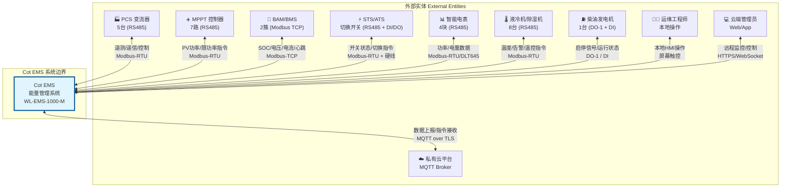

**外部实体说明**:

| 编号 | 实体名称 | 类型 | 接口 | 关联FR |
|------|----------|------|------|--------|
| E1 | PCS变流器 | 设备 | RS485-1/2, Modbus-RTU | FR-001, FR-004, FR-019 |
| E2 | MPPT控制器 | 设备 | RS485-5/6, Modbus-RTU | FR-001, FR-020 |
| E3 | BAM/BMS | 设备 | LAN1/2, Modbus-TCP | FR-001, FR-010 |
| E4 | STS/ATS | 设备 | RS485-3 + DI/DO | FR-001, FR-007 |
| E5 | 智能电表 | 设备 | RS485-4, Modbus-RTU/DLT645 | FR-001, FR-008, FR-009 |
| E6 | 液冷机/除湿机 | 设备 | RS485-7, Modbus-RTU | FR-001 |
| E7 | 柴油发电机 | 设备 | DO-1 + DI | FR-007 |
| E8 | 运维工程师 | 用户 | 本地触摸屏 | FR-014, FR-016 |
| E9 | 云端管理员 | 用户 | Web/App | FR-015, FR-016 |
| E10 | 私有云平台 | 系统 | MQTT over TLS | FR-003, FR-015 |

---

## 3. 顶层 DFD (Level 1)

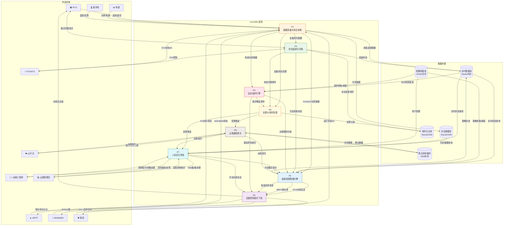

**进程说明**:

| 进程 | 名称 | 核心功能 | 关联FR | 实时性 |
|------|------|----------|--------|--------|
| P1 | 数据采集与协议转换 | 多协议接入、数据解析、缓存 | FR-001, FR-003 | Firm |
| P2 | 状态监测与切换 | 状态机扫描、并离网切换、并柴发切换 | FR-002, FR-006, FR-007 | Hard |
| P3 | 能量管理策略引擎 | 绿电消纳、备电恢复、SOC均衡、手动模式 | FR-004, FR-005, FR-006, FR-010 | Hard/Soft |
| P4 | 安全保护引擎 | 防逆流、需量保护、SOC边界、功率变化率 | FR-008, FR-009 | Hard |
| P5 | 设备控制指令下发 | PCS/MPPT功率控制、柴发启停、BAM心跳 | FR-019, FR-020 | Hard |
| P6 | 告警与事件管理 | 告警分级、通知、事件记录、故障处理 | FR-011~013, FR-021 | Firm |
| P7 | 人机交互界面 | 本地HMI、Web/App、权限管理 | FR-014~016 | Best Effort |
| P8 | 云端通信网关 | MQTT通信、断点续传、远程指令转发 | FR-003, FR-015 | Best Effort |

---

## 4. 详细 DFD (Level 2)

### 4.1 数据采集子系统 (P1)

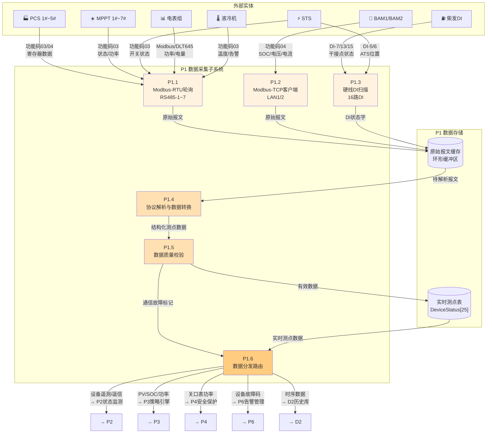

**P1 子进程说明**:

| 子进程 | 名称 | 输入 | 处理 | 输出 | 周期 |
|--------|------|------|------|------|------|
| P1.1 | Modbus-RTU轮询 | RS485设备报文 | 串口轮询、超时重试 | 原始寄存器数据 | 1~5s |
| P1.2 | Modbus-TCP客户端 | BAM以太网报文 | TCP连接、心跳维持 | 结构化BMS数据 | 1~3s |
| P1.3 | 硬线DI扫描 | 16路DI输入 | 电平检测、消抖 | DI状态字 | 100ms |
| P1.4 | 协议解析转换 | 原始报文 | 倍率换算、类型转换 | 工程值数据 | 实时 |
| P1.5 | 数据质量校验 | 工程值 | 越界检测、跳变过滤 | 有效/无效标记 | 实时 |
| P1.6 | 数据分发路由 | 测点数据 | 按主题路由 | 分发至各消费进程 | 实时 |

---

### 4.2 状态监测与切换子系统 (P2)

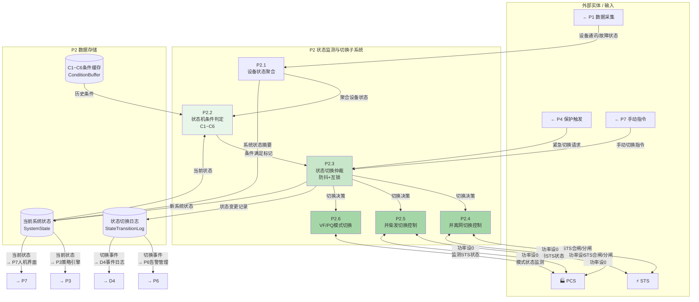

**P2 子进程说明**:

| 子进程 | 名称 | 功能 | 时间约束 | 关联FR |
|--------|------|------|----------|--------|
| P2.1 | 设备状态聚合 | 汇总所有设备在线/故障状态 | 100ms | FR-002 |
| P2.2 | 条件判定 | 计算C1~C6条件是否满足 | 100ms | FR-006 |
| P2.3 | 切换仲裁 | 防抖(300ms)、优先级仲裁 | 100ms | FR-006 |
| P2.4 | 并离网切换 | 市电↔离网切换控制 | ≤500ms | FR-006 |
| P2.5 | 并柴发切换 | 柴发↔离网切换控制 | ≤500ms | FR-007 |
| P2.6 | PCS模式监测 | 监测PCS当前PQ/VF运行模式（设备自主切换） | ≤20ms | FR-006 |

---

### 4.3 能量管理策略子系统 (P3)

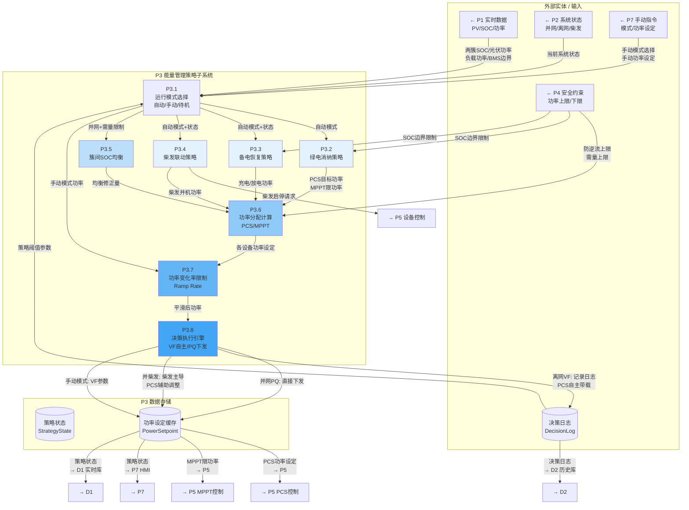

**P3 子进程说明**:

| 子进程 | 名称 | 输入数据流 | 处理逻辑 | 输出数据流 | 周期 | 关联FR |
|--------|------|------------|----------|------------|------|--------|
| P3.1 | 模式选择 | SOC/状态/手动指令 | 自动/手动/待机模式切换 | 模式标识 | 100ms | FR-004 |
| P3.2 | 绿电消纳 | SOC≥92%, 并网状态, PV功率 | 负载跟随, PCS=负载×95% | PCS目标功率 | 1~4s | FR-005 |
| P3.3 | 备电恢复 | SOC<70%, 并网/离网状态 | 市电充电(需量约束)/光伏充电 | 充电/放电功率 | 1~4s | FR-006 |
| P3.4 | 柴发联动 | SOC≤20%, 离网状态 | DO-1启停, 超时检测 | 启停请求 | 5s | FR-007 |
| P3.5 | SOC均衡 | 两簇SOC差, 需量限制 | SOC高者少充, 低者多充 | 均衡修正量 | 30s | FR-010 |
| P3.6 | 功率分配 | 总需求功率, 设备边界 | 簇内均分, 百分比计算 | 各设备功率 | 100ms | FR-019/020 |
| P3.7 | 变化率限制 | 目标功率 | 50kW/s斜率限制 | 平滑功率 | 100ms | FR-SP-004 |
| P3.8 | 决策执行引擎 | 约束后功率, 系统状态, 模式 | 分场景决策: VF自主/PQ下发/柴发调整 | 最终功率+模式命令 | 100ms | FR-004/005/006/007 |

**关键数据流说明**:

| 数据流 | 内容 | 来源 | 去向 | 频率 |
|--------|------|------|------|------|
| F3.1 | 两簇SOC | P1 | P3.1/P3.2 | 3s |
| F3.2 | 光伏总功率 | P1 | P3.2/P3.3 | 2s |
| F3.3 | 负载功率 | P1 | P3.2/P3.3 | 1s |
| F3.4 | 系统状态 | P2 | P3.1 | 100ms |
| F3.5 | 防逆流上限 | P4 | P3.6 | 200ms |
| F3.6 | 需量上限 | P4 | P3.3/P3.5 | 1s |
| F3.7 | PCS功率设定 | P3.7 | P5 | 100ms |
| F3.8 | MPPT限功率 | P3.6 | P5 | 4s |
| F3.9 | 柴发启停请求 | P3.4 | P5 | 事件 |

---

### 4.4 安全保护子系统 (P4)

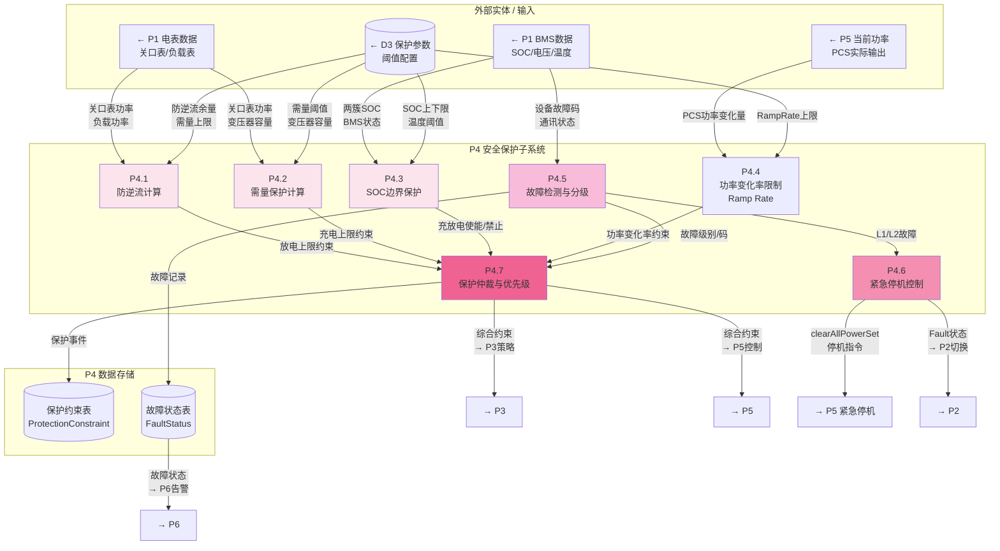

**P4 子进程说明**:

| 子进程 | 名称 | 计算公式/逻辑 | 响应时间 | 关联FR |
|--------|------|-------------|----------|--------|
| P4.1 | 防逆流计算 | 放电上限 = max(0, 负载功率 - 5kW余量) | ≤200ms | FR-008 |
| P4.2 | 需量保护 | 充电上限 = max(0, 500kW - 负载功率) | ≤1s | FR-009 |
| P4.3 | SOC边界 | SOC≥95%禁充, ≤5%禁放, ≤20%启柴发 | ≤100ms | FR-SP-003 |
| P4.4 | 变化率限制 | 每100ms功率调整≤5kW (50kW/s) | 100ms | FR-SP-004 |
| P4.5 | 故障检测 | 通信超时/故障码/越限检测 | 100ms | FR-021 |
| P4.6 | 紧急停机 | clearAllPowerSet(), 进入Fault | 实时 | FR-021 |
| P4.7 | 保护仲裁 | 多约束取最严格值, L1/L2优先 | 100ms | - |

---

### 4.5 设备控制子系统 (P5)

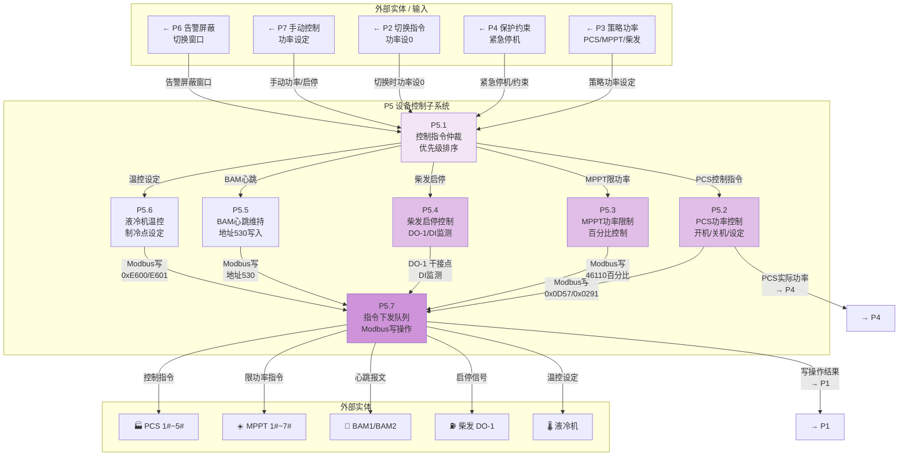

**P5 子进程说明**:

| 子进程 | 名称 | 控制对象 | 指令内容 | 周期 | 关联FR |
|--------|------|----------|----------|------|--------|
| P5.1 | 指令仲裁 | 所有控制指令 | 优先级: 紧急>手动>策略 | 100ms | - |
| P5.2 | PCS控制 | PCS 1#~5# | 功率设定(0x0D57), 开关机(0x0291), 复位(0x1400) | 100ms | FR-019 |
| P5.3 | MPPT控制 | MPPT 1#~7# | 功率百分比(46110), 开关机(46001), 故障清除(46003) | 4s | FR-020 |
| P5.4 | 柴发控制 | 柴发 | DO-1启停, DI-7/13/15监测 | 事件 | FR-007 |
| P5.5 | BAM心跳 | BAM1/BAM2 | 地址530定期写入 | 5~10s | FR-001 |
| P5.6 | 液冷机控制 | 液冷机1#~4# | 制冷点/加热点(0xE600/E601), 运行模式(0x0401) | 5s | FR-001 |
| P5.7 | 指令下发 | Modbus写队列 | 超时重试, 写确认 | 实时 | - |

**控制优先级** (从高到低):

```
1. P4.6 紧急停机 (L1/L2故障) → clearAllPowerSet()
2. P2   状态切换 → 功率设0
3. P4.1 防逆流   → 放电上限限制
4. P4.2 需量保护 → 充电上限限制
5. P4.3 SOC边界  → 充放电使能/禁止
6. P7   手动模式 → 用户设定功率
7. P3   自动策略 → 策略计算功率
```

---

### 4.6 告警与事件管理子系统 (P6)

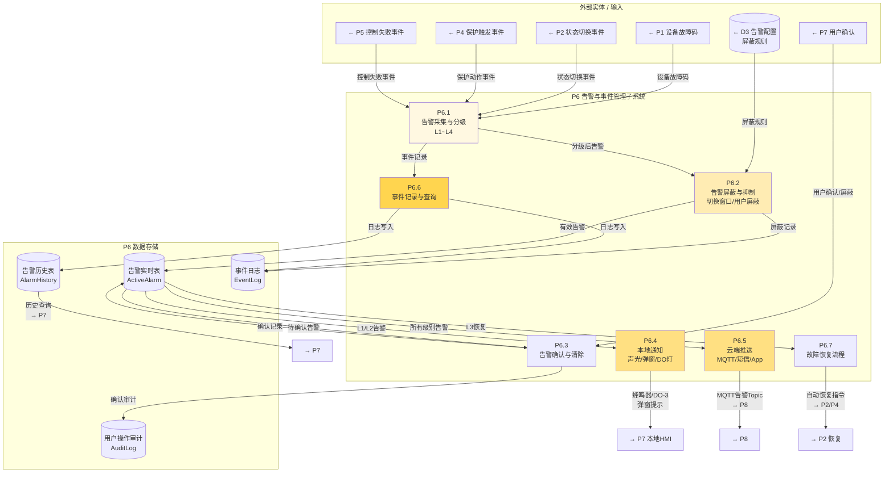

**P6 子进程说明**:

| 子进程 | 名称 | 功能 | 输入 | 输出 | 关联FR |
|--------|------|------|------|------|--------|
| P6.1 | 告警采集分级 | 故障码映射L1~L4 | 设备故障/保护事件 | 分级告警 | FR-011/021 |
| P6.2 | 告警屏蔽 | 切换窗口500ms屏蔽STS告警 | 原始告警+规则 | 有效告警 | FR-012 |
| P6.3 | 告警确认 | 用户确认/自动清除 | 告警+用户操作 | 确认状态 | FR-012 |
| P6.4 | 本地通知 | 蜂鸣器/DO-3故障灯/弹窗 | L1/L2告警 | 本地告警 | FR-012 |
| P6.5 | 云端推送 | MQTT实时推送 | 所有告警 | 云端告警 | FR-012 |
| P6.6 | 事件记录 | 写入SQLite/SSD | 所有事件 | 历史记录 | FR-013 |
| P6.7 | 故障恢复 | L3自动恢复, L1/L2人工恢复 | 故障清除信号 | 恢复指令 | FR-021 |

---

### 4.7 人机交互子系统 (P7)

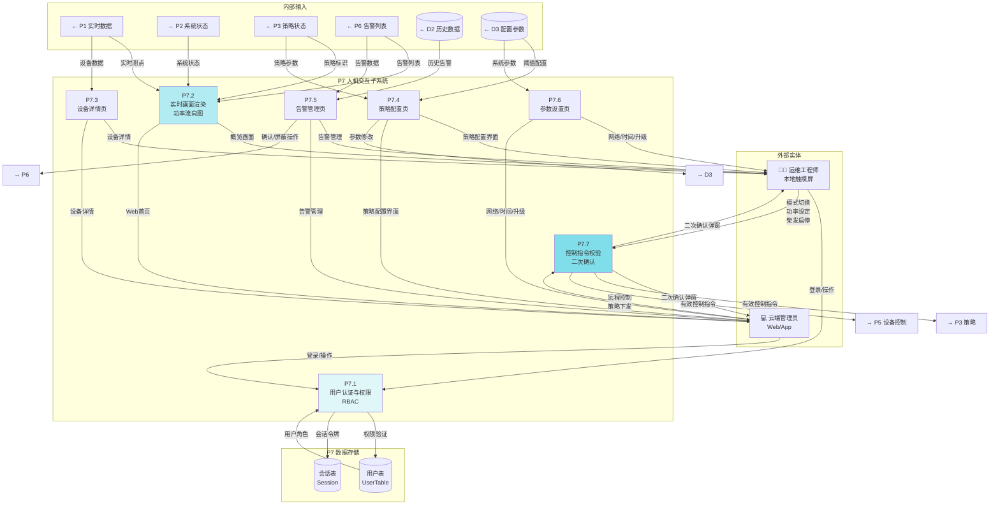

**P7 子进程说明**:

| 子进程 | 名称 | 功能 | 权限要求 | 关联FR |
|--------|------|------|----------|--------|
| P7.1 | 用户认证 | 登录、RBAC权限校验 | 所有用户 | FR-016 |
| P7.2 | 实时画面 | 功率流向图、SOC趋势、模式显示 | 观察员+ | FR-014 |
| P7.3 | 设备详情 | PCS/MPPT/BAM参数、启停控制 | 操作员+ | FR-014 |
| P7.4 | 策略配置 | 阈值设置、模式选择 | 操作员+ | FR-014/015 |
| P7.5 | 告警管理 | 告警列表、确认、屏蔽、历史查询 | 操作员+ | FR-014/015 |
| P7.6 | 参数设置 | 网络、时间、升级、备份 | 管理员 | FR-014/017 |
| P7.7 | 控制校验 | 二次确认、权限校验、审计记录 | 按操作分级 | FR-016 |

---

### 4.8 云端通信子系统 (P8)

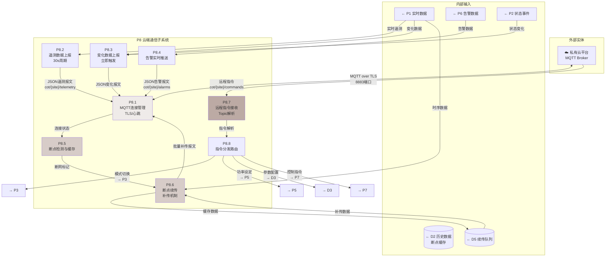

**P8 子进程说明**:

| 子进程 | 名称 | 功能 | Topic | 周期 | 关联FR |
|--------|------|------|-------|------|--------|
| P8.1 | MQTT连接 | TLS连接、心跳维持 | - | 持续 | FR-003 |
| P8.2 | 遥测上报 | 周期性全量遥测 | `cot/{site}/telemetry` | 30s | FR-015 |
| P8.3 | 变化上报 | 数据变化即时推送 | `cot/{site}/telemetry` | 事件 | FR-015 |
| P8.4 | 告警推送 | 告警产生/恢复推送 | `cot/{site}/alarms` | 事件 | FR-012 |
| P8.5 | 断点检测 | 检测MQTT断开 | - | 持续 | FR-003 |
| P8.6 | 断点续传 | SSD缓存、恢复后补传 | `cot/{site}/telemetry` | Best Effort | FR-003 |
| P8.7 | 指令接收 | 订阅远程指令Topic | `cot/{site}/commands` | 持续 | FR-015 |
| P8.8 | 指令分发 | 解析指令、路由至目标进程 | - | 实时 | FR-015 |

---

## 5. 数据字典

### 5.1 数据流定义

| 数据流编号 | 名称 | 组成 | 来源 | 去向 | 频率 |
|-----------|------|------|------|------|------|
| F1.1 | 原始遥测报文 | Modbus功能码+寄存器地址+原始字节 | E1~E7 | P1.1~P1.3 | 1~5s |
| F1.2 | 结构化测点数据 | DeviceID+测点名+工程值+单位+时间戳 | P1.4 | P1.6 | 实时 |
| F1.3 | 实时测点表 | DeviceStatus[25]数组 | P1.6 | D1 | 实时 |
| F2.1 | 系统状态 | SystemState结构体 | P2.3 | D2.1 | 100ms |
| F2.2 | 状态切换事件 | (旧状态, 新状态, 触发条件, 时间戳) | P2.3 | D4 | 事件 |
| F3.1 | PCS功率设定 | (PCS_ID, 有功功率, 无功功率) | P3.7 | P5.2 | 100ms |
| F3.2 | MPPT限功率 | (MPPT_ID, 功率百分比%) | P3.6 | P5.3 | 4s |
| F3.3 | 柴发启停请求 | (启停标识, 超时阈值) | P3.4 | P5.4 | 事件 |
| F4.1 | 防逆流上限 | max(0, 负载功率 - 5kW) [kW] | P4.1 | P3.6 | 200ms |
| F4.2 | 需量上限 | max(0, 500kW - 负载功率) [kW] | P4.2 | P3.6 | 1s |
| F4.3 | 紧急停机指令 | clearAllPowerSet() + 故障码 | P4.6 | P5.1 | 实时 |
| F5.1 | Modbus写指令 | (设备地址, 寄存器, 写入值, 超时) | P5.7 | E1~E7 | 实时 |
| F6.1 | 告警记录 | (告警ID, 级别, 故障码, 设备, 时间, 状态) | P6.1 | D6.1 | 事件 |
| F6.2 | 本地通知 | (告警ID, 级别, 声光/弹窗/DO灯) | P6.4 | E8 | 实时 |
| F6.3 | 云端告警推送 | JSON: {alarm_id, level, code, device, ts} | P6.5 | E10 | 事件 |
| F7.1 | 控制指令 | (指令类型, 参数, 用户, 时间戳) | E8/E9 | P7.7 | 事件 |
| F8.1 | MQTT遥测报文 | JSON: {telemetry: {...}, ts} | P8.2 | E10 | 30s |
| F8.2 | MQTT告警报文 | JSON: {alarm: {...}, ts} | P8.4 | E10 | 事件 |
| F8.3 | 远程指令 | JSON: {cmd, params, req_id} | E10 | P8.7 | 事件 |

### 5.2 数据存储定义

| 存储编号 | 名称 | 组成 | 访问方式 | 容量 | 保留期 |
|---------|------|------|----------|------|--------|
| D1 | 实时数据库 | 所有设备最新测点值 | 内存读写 | 256MB | 持续更新 |
| D2 | 历史数据库 | 时序数据(1min间隔) | 读写 | 256GB SSD | ≥3天循环 |
| D3 | 配置参数库 | 策略阈值/保护参数/用户配置 | 读写 | 10MB | 永久 |
| D4 | 事件日志库 | 状态切换/控制操作/参数修改 | 追加写 | 256GB SSD | ≥6个月 |
| D5 | 断点续传缓存 | MQTT断网期间的遥测数据 | 队列读写 | 256GB SSD | 循环覆盖 |
| D6.1 | 告警实时表 | 当前未确认告警 | 读写 | 1MB | 确认后删除 |
| D6.2 | 告警历史表 | 所有告警记录 | 追加写 | 50GB | ≥6个月 |
| D7.1 | 用户表 | 用户名/密码哈希/角色/权限 | 读写 | 1MB | 永久 |

---

## 6. 数据流汇总表

### 6.1 按功能域汇总

| 功能域 | 输入数据流 | 处理进程 | 输出数据流 | 关联存储 |
|--------|-----------|----------|-----------|----------|
| 数据采集 | E1~E7设备报文 | P1.1~P1.6 | P2~P6/D1/D2 | D1, D2 |
| 状态监测 | P1设备状态/P4保护/P7手动 | P2.1~P2.6 | P3/P5/P6/D1/D4 | D2.1, D2.2 |
| 能量管理 | P1实时/P2状态/P4约束/P7手动 | P3.1~P3.7 | P5/D1/D3 | D3.1, D3.2 |
| 安全保护 | P1电表/BMS/P5功率/D3参数 | P4.1~P4.7 | P2/P3/P5/P6/D4 | D4.1, D4.2 |
| 设备控制 | P3策略/P4约束/P2切换/P7手动 | P5.1~P5.7 | E1~E7/P1/P4 | - |
| 告警事件 | P1故障/P2切换/P4保护/P5失败 | P6.1~P6.7 | P7/P8/D4/D6 | D6.1~D6.4 |
| 人机交互 | P1~P6数据/D2历史/D3配置 | P7.1~P7.7 | P3/P5/P6/D3 | D7.1, D7.2 |
| 云端通信 | P1遥测/P6告警/P2状态/D5缓存 | P8.1~P8.8 | E10/P3/P5/P7 | D5 |

### 6.2 关键数据流时序图

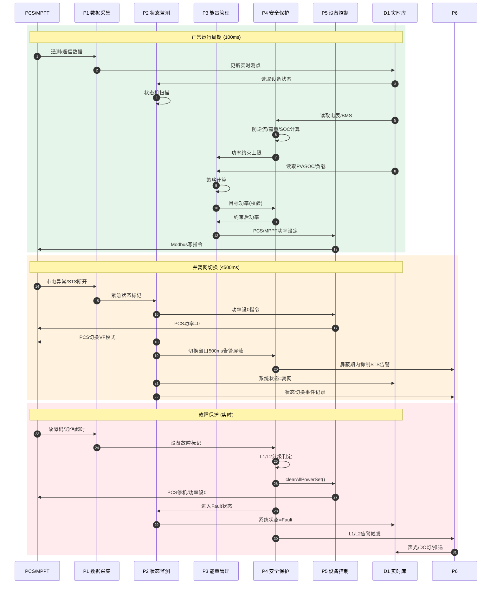

---

## 7. 附录

### 7.1 DFD 与功能需求映射表

| FR编号 | 功能名称 | 主要进程 | 参与进程 | 数据流 |
|--------|----------|----------|----------|--------|
| FR-001 | 设备数据接入 | P1 | P5(心跳) | F1.1, F1.2 |
| FR-002 | 实时数据展示 | P7.2 | P1, P2 | F7.2实时画面 |
| FR-003 | 断点续传 | P8.5, P8.6 | P1, P8.1 | F8.1, D5 |
| FR-004 | 手动模式 | P3.1 | P7.7, P5 | F7.1手动指令 |
| FR-005 | 绿电消纳策略 | P3.2 | P1, P3.6, P5 | F3.1, F3.2 |
| FR-006 | 备电策略 | P3.3 | P2, P4, P5 | F2.1, F3.3 |
| FR-007 | 柴发联动策略 | P3.4 | P2, P5 | F3.9柴发请求 |
| FR-008 | 防逆流保护 | P4.1 | P3.6, P4.7 | F4.1 |
| FR-009 | 需量保护 | P4.2 | P3.3, P4.7 | F4.2 |
| FR-010 | SOC均衡 | P3.5 | P1, P3.6 | F3.1 SOC差 |
| FR-011 | 告警分级 | P6.1 | P1, P4, P5 | F6.1 |
| FR-012 | 告警处理流程 | P6.2~P6.5 | P2, P7 | F6.2, F6.3 |
| FR-013 | 事件记录 | P6.6 | P2, P7, P8 | D4, D6.2 |
| FR-014 | 本地屏幕 | P7.1~P7.7 | 全部 | F7.x |
| FR-015 | Web/App | P7.1~P7.7, P8 | 全部 | F8.x |
| FR-016 | 用户权限 | P7.1 | P7.7 | D7.1 |
| FR-017 | 系统升级 | P7.6 | P8 | F8.3远程指令 |
| FR-018 | 系统关机 | P7.7 | P2, P5 | 待定 |
| FR-019 | PCS簇控制 | P5.2 | P3.6, P2 | F3.1 PCS功率 |
| FR-020 | MPPT簇控制 | P5.3 | P3.6, P1 | F3.2 MPPT限功 |
| FR-021 | 故障内容定义 | P4.5, P6.1 | P1, P2, P4 | D4.2故障表 |

### 7.2 DFD 与状态机映射

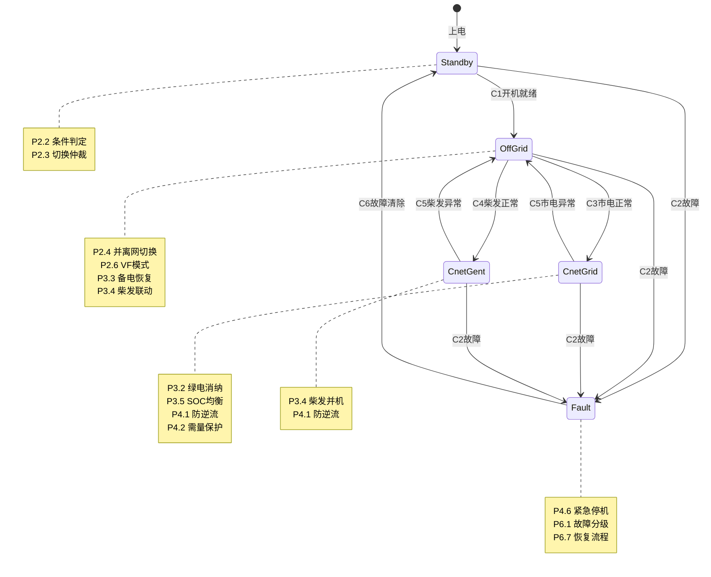

### 7.3 修订记录

| 版本 | 日期 | 变更内容 |
|------|------|----------|
| 1.0 | 2026-04-25 | 初始版本：完成Context/Level1/Level2全部分层DFD，覆盖FR-001~FR-021全部功能需求 |
| 1.1 | 2026-04-28 | **改名**：文件从`11-Data-Flow-Diagram.md`重命名为`11-结构化分析方法.md`，内容扩展为完整的结构化分析方法（DFD + 判定表/判定树） |
| 1.2 | 2026-04-28 | **补充**：P3能量管理策略子系统增加P3.8决策执行引擎（DecisionEngine），对齐04-State-Machine.md v1.10架构澄清 — 分场景执行层：离网VF自主/PQ直接下发/柴发主导调整 |
| 1.3 | 2026-04-28 | **修正**：并离网切换描述 — 删除EMS主动切换PCS模式(PQ↔VF)的表述，改为"功率设0 + 监测STS状态"，PCS模式切换由设备自主完成（来自04-State-Machine.md第6章）

---

*本文档定义了Cot EMS系统的数据流视图，实现细节参见 [06-Technical-Design.md](./06-Technical-Design.md)*

---

## 7.4 附录：判定表与判定树（结构化决策分析）

> **说明**：本附录采用 **判定表（Decision Table）** 和 **判定树（Decision Tree）** 形式，将 DFD 中 P2（状态监测）、P3（能量管理）、P4（安全保护）的核心决策逻辑以结构化方式重新表达。这是红宝书 2.3 结构化需求分析方法中 **"加工小说明"** 的经典表达形式。

---

### 7.4.1 方法论说明

| 工具 | 适用场景 | 符号说明 |
|------|----------|----------|
| **判定表** | 多条件组合、离散决策 | `Y`=条件成立, `N`=条件不成立, `-`=无关, `X`=执行该动作 |
| **判定树** | 嵌套分支、层级决策 | 树形分支，每个节点是一个条件判断 |

**判定表四象限结构**：
```
┌─────────────────┬──────────────────────────────────┐
│   条件桩        │   规则1  规则2  规则3  ...        │
│ (条件陈述)      │   Y/N/-   Y/N/-   Y/N/-           │
├─────────────────┼──────────────────────────────────┤
│   动作桩        │                                    │
│ (动作陈述)      │   X/-     X/-     X/-             │
└─────────────────┴──────────────────────────────────┘
```

---

### 7.4.2 P3.1 运行模式选择 — 判定树

**功能**：根据系统状态和人工干预，选择能量管理运行模式。

```
                           ┌─────────────────┐
                           │   系统当前状态   │
                           └────────┬────────┘
                                    │
              ┌─────────────────────┼─────────────────────┐
              │                     │                     │
              ▼                     ▼                     ▼
        ┌──────────┐          ┌──────────┐          ┌──────────┐
        │ = Fault  │          │ = 手动模式│          │ = 自动模式│
        └────┬─────┘          └────┬─────┘          └────┬─────┘
             │                     │                     │
             ▼                     ▼                     ▼
      ┌──────────────┐      ┌──────────────┐      ┌──────────────┐
      │ 禁止自动恢复 │      │ 执行用户手动 │      │ 进入自动策略 │
      │ 需人工确认后 │      │ 设定的功率值 │      │ 分支(见下文) │
      │ 方可从Fault  │      │ 和运行模式   │      │              │
      │ 返回Standby  │      │              │      │              │
      └──────────────┘      └──────────────┘      └──────────────┘
```

**判定表：P3.1 模式选择顶层决策**

| 条件桩 | 规则1 | 规则2 | 规则3 |
|--------|-------|-------|-------|
| 系统状态 = Fault | Y | N | N |
| 用户选择手动模式 | - | Y | N |
| 用户选择自动模式 | - | N | Y |
|--------|-------|-------|-------|
| 动作：禁止自动恢复，等待人工 | X | - | - |
| 动作：执行手动功率设定 | - | X | - |
| 动作：进入自动策略分支 | - | - | X |

---

### 7.4.3 P3.2 绿电消纳策略（并网状态）— 判定表

**前提**：系统处于自动模式，且当前状态 = 并市电（CnetGrid）。

**判定表：并网 SOC 区间策略**

| 条件桩 | 规则1 | 规则2 | 规则3 |
|--------|-------|-------|-------|
| 并网状态 | Y | Y | Y |
| SOC ≥ 92% | Y | N | N |
| 70% ≤ SOC < 92% | N | Y | N |
| SOC < 70% | N | N | Y |
|--------|-------|-------|-------|
| 动作：绿电消纳（PCS负载跟随） | X | - | - |
| 动作：PCS待机，光伏直充 | - | X | - |
| 动作：备电恢复（市电充电） | - | - | X |

**各规则详细逻辑**：

| 规则 | 名称 | PCS功率目标 | 光伏行为 | 约束 |
|------|------|------------|----------|------|
| 规则1 | 绿电消纳 | `负载功率 × 95%` | 直流直充 | 防逆流余量 ≥ 5kW |
| 规则2 | 中间区间 | `0`（待机） | 直流直充 | 无 |
| 规则3 | 备电恢复 | `-(充电需求 × 95%)` | 辅助充电 | 需量上限约束 |

---

### 7.4.4 P3.3 + P3.4 离网放电 + 柴发联动策略 — 判定表

**前提**：系统处于自动模式，且当前状态 = 离网（OffGrid）。

**判定表：离网 SOC 区间策略**

| 条件桩 | 规则1 | 规则2 | 规则3 |
|--------|-------|-------|-------|
| 离网状态 | Y | Y | Y |
| SOC ≥ 71% | Y | N | N |
| 20% ≤ SOC < 71% | N | Y | N |
| SOC < 20% | N | N | Y |
|--------|-------|-------|-------|
| 动作：离网放电 100% 供负载 | X | - | - |
| 动作：离网放电 95% + 请求柴发启动 | - | X | - |
| 动作：柴发强制供电（DO-1闭合） | - | - | X |

**柴发联动 — 判定树**：

```
                           ┌─────────────────┐
                           │  柴发启动请求？  │
                           └────────┬────────┘
                                    │
                     ┌──────────────┴──────────────┐
                     │ 是（SOC ≤ 20% 或远程指令）   │ 否（停机请求）
                     ▼                              ▼
            ┌─────────────────┐            ┌─────────────────┐
            │  柴发运行状态？  │            │  柴发运行状态？  │
            └────────┬────────┘            └────────┬────────┘
                     │                              │
          ┌──────────┼──────────┐        ┌────────┴────────┐
          │ 已运行   │ 未运行    │        │ 已运行          │ 未运行
          ▼          ▼          ▼        ▼                 ▼
       ┌──────┐  ┌──────────┐ ┌──┐   ┌──────────┐      ┌──────┐
       │维持  │  │DO-1闭合  │ │持│   │DO-1断开  │      │无动作│
       │运行  │  │启动信号  │ │续│   │停机信号  │      │      │
       └──────┘  └──────────┘ │监│   └──────────┘      └──────┘
                               │测│
                               │180s│
                               │超时│
                               └──┘
```

**柴发联动 — 判定表**

| 条件桩 | 规则1 | 规则2 | 规则3 | 规则4 |
|--------|-------|-------|-------|-------|
| 启动请求 | Y | Y | N | N |
| 停机请求 | N | N | Y | Y |
| 柴发已运行 | Y | N | Y | N |
|--------|-------|-------|-------|-------|
| 动作：维持运行，监测电压/频率 | X | - | - | - |
| 动作：DO-1闭合，启动计时180s | - | X | - | - |
| 动作：DO-1断开，停机计时120s | - | - | X | - |
| 动作：无操作 | - | - | - | X |

---

### 7.4.5 P2.2 状态机条件判定 — 判定树 + 判定表

**判定树：从 OffGrid 状态出发的切换决策**

```
                           ┌─────────────────┐
                           │ 当前状态=OffGrid │
                           └────────┬────────┘
                                    │
                                    ▼
                           ┌─────────────────┐
                           │   C2故障发生？   │
                           └────────┬────────┘
                                    │
                    ┌───────────────┴───────────────┐
                    │ 是                              │ 否
                    ▼                                 ▼
             ┌─────────────┐              ┌─────────────────┐
             │ 进入Fault态  │              │   C3市电正常？   │
             │ clearAllPow │              └────────┬────────┘
             │ erSet()     │                       │
             └─────────────┘            ┌──────────┴──────────┐
                                        │ 是（电压/频率/相序） │ 否
                                        ▼                      ▼
                                 ┌─────────────┐      ┌─────────────────┐
                                 │ 切并市电    │      │   C4柴发正常？   │
                                 │ PCS功率设0  │      └────────┬────────┘
                                 │ 同步后并网  │               │
                                 └─────────────┘    ┌─────────┴─────────┐
                                                    │ 是                │ 否
                                                    ▼                   ▼
                                             ┌─────────────┐    ┌─────────────┐
                                             │ 切并柴发    │    │ 维持离网    │
                                             │ PCS功率设0  │    │ 继续监测    │
                                             │ 同步后并机  │    │             │
                                             └─────────────┘    └─────────────┘
```

**判定表：从 OffGrid 状态切换（C2/C3/C4 互斥优先级）**

| 条件桩 | 规则1 | 规则2 | 规则3 | 规则4 |
|--------|-------|-------|-------|-------|
| C2: 故障发生（通讯中断/设备故障） | Y | N | N | N |
| C3: 市电正常（ATS市电=1, STS=1, 电压正常） | - | Y | N | N |
| C4: 柴发正常（ATS备用=1, STS=1, 电压正常） | - | N | Y | N |
| C5: 维持离网（无市电无柴发） | - | N | N | Y |
|--------|-------|-------|-------|-------|
| 动作：进入Fault，紧急停机 | X | - | - | - |
| 动作：切换至 SysCnetGrid | - | X | - | - |
| 动作：切换至 SysCnetGent | - | - | X | - |
| 动作：维持 SysOffGrid | - | - | - | X |

**判定表：从 Standby 状态出发**

| 条件桩 | 规则1 | 规则2 | 规则3 |
|--------|-------|-------|-------|
| C1: 开机就绪（通讯正常/无故障/PCS开机/电压正常） | Y | N | N |
| C2: 故障发生 | N | Y | N |
| 人工关机指令 | N | N | Y |
|--------|-------|-------|-------|
| 动作：切换至 SysOffGrid | X | - | - |
| 动作：进入 SysFault | - | X | - |
| 动作：执行关机流程 | - | - | X |

**判定表：从 CnetGrid/CnetGent 状态出发（并离网切换）**

| 条件桩 | 规则1 | 规则2 | 规则3 |
|--------|-------|-------|-------|
| C2: 故障发生 | Y | N | N |
| C5: 市电/柴发异常（STS断开/电压跌落） | N | Y | N |
| C3/C4: 维持并网/并柴发 | N | N | Y |
|--------|-------|-------|-------|
| 动作：进入 SysFault | X | - | - |
| 动作：切换至 SysOffGrid | - | X | - |
| 动作：维持当前并网状态 | - | - | X |

---

### 7.4.6 P4.7 安全保护仲裁 — 判定表

**功能**：多个安全约束同时存在时，按优先级取最严格限制。

**判定表：单一保护触发时的动作**

| 条件桩 | 规则1 | 规则2 | 规则3 | 规则4 | 规则5 |
|--------|-------|-------|-------|-------|-------|
| L1/L2故障发生 | Y | N | N | N | N |
| 防逆流触发（关口表功率>余量） | N | Y | N | N | N |
| 需量超限（关口表>变压器80%） | N | N | Y | N | N |
| SOC ≥ 95%（上限保护） | N | N | N | Y | N |
| SOC ≤ 5%（下限保护） | N | N | N | N | Y |
|--------|-------|-------|-------|-------|-------|
| 动作：clearAllPowerSet() + 进Fault | X | - | - | - | - |
| 动作：限制PCS放电功率上限 | - | X | - | - | - |
| 动作：限制PCS充电功率上限 | - | - | X | - | - |
| 动作：禁止PCS充电（功率下限=0） | - | - | - | X | - |
| 动作：禁止PCS放电（功率上限=0） | - | - | - | - | X |

**多约束并行时的仲裁规则（判定树）**：

```
                           ┌─────────────────┐
                           │   多重约束并存   │
                           └────────┬────────┘
                                    │
                     ┌──────────────┴──────────────┐
                     │ 有 L1/L2 故障？              │ 无
                     ▼                              ▼
              ┌─────────────┐              ┌─────────────────┐
              │ 紧急停机    │              │ 取各约束交集    │
              │ 最高优先级  │              │                 │
              └─────────────┘              │ 放电功率 ≤ MIN( │
                                           │   防逆流上限,   │
                                           │   PCS额定,      │
                                           │   BMS放电边界)  │
                                           │ 充电功率 ≤ MIN( │
                                           │   需量上限,     │
                                           │   PCS额定,      │
                                           │   BMS充电边界)  │
                                           │ 若SOC≥95%:     │
                                           │   充电禁止      │
                                           │ 若SOC≤5%:      │
                                           │   放电禁止      │
                                           └─────────────────┘
```

---

### 7.4.7 判定表与 DFD 进程的对应关系

| 判定表/树编号 | DFD 进程 | 关联 FR | 决策类型 |
|--------------|----------|---------|----------|
| 7.4.2 | P3.1 模式选择 | FR-004 | 顶层模式选择 |
| 7.4.3 | P3.2 绿电消纳 | FR-005 | SOC阈值决策 |
| 7.4.4 | P3.3 + P3.4 | FR-006, FR-007 | SOC区间 + 柴发联动 |
| 7.4.5 | P2.2 条件判定 | FR-006 | 状态机切换条件 |
| 7.4.6 | P4.7 保护仲裁 | FR-008, FR-009 | 多约束优先级 |

**判定表的优势场景**：
- **完备性检查**：判定表可以强制检查所有条件组合是否都有对应的动作（避免遗漏分支）
- **优先级显性化**：如 P4.7 中 L1/L2 故障的 `Y` 列其他条件标记为 `-`（无关），明确表示故障优先级最高
- **测试用例生成**：每个规则列就是一个测试场景，可直接转化为单元测试用例

**判定树的优势场景**：
- **直观展示嵌套逻辑**：如 P2.2 中 C2→C3→C4 的顺序判断，树形结构比表格更直观
- **优先级隐含在结构里**：靠上的分支优先判断，符合人脑阅读习惯

---

### 7.4.8 附录修订记录

| 版本 | 日期 | 变更内容 |
|------|------|----------|
| 1.1 | 2026-04-27 | 新增 7.4 附录：判定表/判定树，覆盖 P2/P3/P4 核心决策逻辑 |
