# 12-面向对象建模方法 - Cot EMS 系统分析

> **文档版本**: 1.1
> **最后更新**: 2026-04-28
> **关联文档**: [01-PRD.md](./01-PRD.md), [02-Domain-Model.md](./02-Domain-Model.md), [04-State-Machine.md](./04-State-Machine.md), [11-结构化分析方法.md](./11-结构化分析方法.md)
> **需求来源**: 基于 00-Context.md ~ 05-Functional-Spec.md 完整需求文档编写

---

## 目录

1. [面向对象方法论说明](#1-面向对象方法论说明)
   - 1.1 核心思想
   - 1.2 UML 建模工具选择
   - 1.3 面向对象建模的"三要素"
2. [用例图 (Use Case Diagram)](#2-用例图-use-case-diagram)
   - 2.1 用例总览图
   - 2.2 北向参与者用例图
   - 2.3 南向参与者用例图
   - 2.4 用例关系图
   - 2.5 参与者完整说明表
   - 2.6 用例详细说明
   - 2.7 与结构化分析DFD映射
3. [类图 (Class Diagram)](#3-类图-class-diagram)
   - 3.1 层次化结构总览（6层）
     - L1 系统总控层
     - L2 设备抽象层
     - L3 簇-设备拓扑层
     - L4 业务引擎层
     - L5 数据管理层
     - L6 人机交互与云端通信层
     - L7 跨层关系总图
   - 3.2 层次设计说明
   - 3.3 关键类职责说明
   - 3.4 设备实例数量与通信接口汇总
   - 3.5 与结构化分析映射
4. [时序图 (Sequence Diagram)](#4-时序图-sequence-diagram)
   - 4.1 并网正常运行时序
   - 4.2 并离网切换时序
   - 4.3 故障保护时序
   - 4.4 与结构化分析对比
5. [状态图 (State Diagram)](#5-状态图-state-diagram)
   - 5.1 顶层状态图
   - 5.2 待机状态子图 (Standby)
   - 5.3 并网运行子图 (CnetGrid)
   - 5.4 离网运行子图 (OffGrid)
   - 5.5 并柴发运行子图 (CnetGent)
   - 5.6 故障状态子图 (Fault)
   - 5.7 状态机形式化定义
   - 5.8 与结构化分析映射
6. [活动图 (Activity Diagram)](#6-活动图-activity-diagram)
   - 6.1 绿电消纳策略活动图
   - 6.2 并离网切换活动图
   - 6.3 并柴发切换活动图
   - 6.4 与结构化分析对比
7. [对象协作关系](#7-对象协作关系)
   - 7.1 核心对象协作网络
   - 7.2 消息总线 vs 直接调用
8. [与结构化分析方法对比](#8-与结构化分析方法对比)
   - 8.1 两种方法的映射关系
   - 8.2 详细映射对照表
   - 8.3 两种方法的优势互补
   - 8.4 从结构化到面向对象的转换原则
9. [附录](#9-附录)
   - 9.1 UML符号速查表
   - 9.2 面向对象设计原则在Cot EMS中的体现
   - 9.3 修订记录

---

## 1. 面向对象方法论说明

### 1.1 核心思想

面向对象分析（OOA）以**对象**为核心，将系统视为相互作用的对象集合，每个对象封装了数据（属性）和行为（方法）。与结构化分析关注"数据流"不同，面向对象分析关注"对象交互"。

| 维度 | 结构化分析 (SA) | 面向对象分析 (OOA) |
|------|----------------|-------------------|
| **核心单元** | 加工/进程 (Process) | 对象 (Object) |
| **数据与行为** | 分离（数据流 vs 加工） | 封装在一起（属性+方法） |
| **系统视图** | 分层数据流图 | 对象协作网络 |
| **复用性** | 低（过程与数据分离） | 高（类可继承、多态） |
| **需求变更** | 牵一发而动全身 | 影响范围可控（封装性） |
| **主要工具** | DFD、DD、判定表/树 | UML用例图、类图、时序图、状态图、活动图 |

### 1.2 UML 建模工具选择

根据红宝书（系统分析师教程）定义，面向对象建模采用以下UML图：

| UML图 | 建模目标 | 本文档章节 | 核心元素 |
|-------|---------|-----------|---------|
| **用例图** | 需求捕获，用户视角 | 第2章 | Actor, UseCase, Association |
| **类图** | 静态结构，系统骨架 | 第3章 | Class, Attribute, Method, Relation |
| **时序图** | 动态交互，时间顺序 | 第4章 | Object, Lifeline, Message, Activation |
| **状态图** | 状态行为，生命周期 | 第5章 | State, Transition, Event, Guard |
| **活动图** | 业务流程，并发控制 | 第6章 | Activity, Fork/Join, Swimlane |

### 1.3 面向对象建模的"三要素"

```
┌─────────────────────────────────────────────────────────────┐
│                    面向对象建模三要素                        │
├─────────────────────────────────────────────────────────────┤
│                                                             │
│   ┌───────────────┐    ┌───────────────┐    ┌────────────┐ │
│   │   封装 (Encap)│    │  继承 (Inherit)│   │ 多态 (Poly)│ │
│   │   数据+行为   │    │  一般→特殊    │   │ 同名不同实 │ │
│   │   隐藏内部    │    │  复用扩展     │   │ 动态绑定   │ │
│   └───────────────┘    └───────────────┘    └────────────┘ │
│                                                             │
│   类图体现封装│继承    时序图体现多态    状态图体现行为封装 │
│                                                             │
└─────────────────────────────────────────────────────────────┘
```

---

## 2. 用例图 (Use Case Diagram)

用例图从**外部实体视角**描述系统功能，按**北向（用户/系统）**和**南向（设备）**分层展示。

### 2.1 用例总览图

总览图展示所有用例的分组，不画详细连线，用于快速了解系统功能范围：

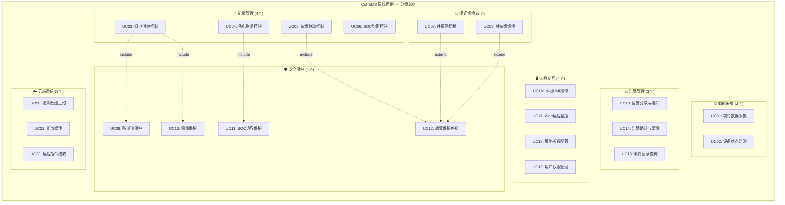

**用例统计**：共22个用例，分7个功能域

---

### 2.2 北向参与者用例图

北向参与者是**用户和系统**，通过HMI/Web/云平台与EMS交互：

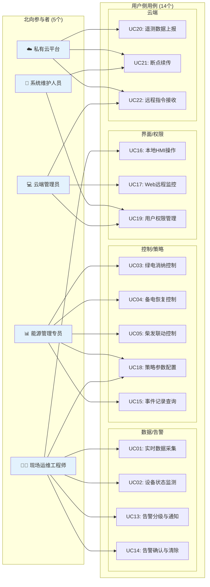

**北向参与者说明**：

| 参与者 | 职责 | 接入方式 | 关联用例数 |
|--------|------|---------|-----------|
| 现场运维工程师 | 日常监控、本地操作 | 本地触摸屏 | 6 |
| 云端管理员 | 远程监控、用户管理 | Web/HTTPS | 3 |
| 能源管理专员 | 策略配置、能耗分析 | Web/HTTPS | 5 |
| 系统维护人员 | 系统配置、数据管理 | Web/SSH | 2 |
| 私有云平台 | 数据汇聚、指令下发 | MQTT/TLS | 3 |

---

### 2.3 南向参与者用例图

南向参与者是**设备**，EMS通过通信协议与它们交互：

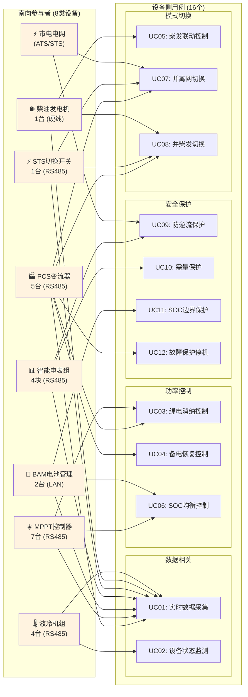

**南向设备说明**：

| 设备 | 实例数 | 通信接口 | 主要职责 | 关联用例 |
|------|--------|---------|---------|---------|
| PCS变流器 | 5台 | RS485-1/2 | 功率执行、模式切换 | UC01/03/04/07/08/12 |
| MPPT控制器 | 7台 | RS485-5/6 | 光伏控制、功率限制 | UC01/03/06 |
| BAM电池管理 | 2台 | LAN1/2 | SOC监测、保护 | UC01/06/11 |
| 智能电表组 | 4块 | RS485-4 | 功率/方向测量 | UC01/09/10 |
| STS切换开关 | 1台 | RS485-3/DI | 并网/离网/柴发切换 | UC01/07/08 |
| 柴油发电机 | 1台 | DO-1/DI | 应急备电 | UC01/05/08 |
| 液冷机组 | 4台 | RS485-7 | 温控、状态监测 | UC01/02 |
| 市电电网 | - | ATS/STS | 供电来源 | UC07/09 |

---

### 2.4 用例关系图

用例之间的 **include**（必须包含）和 **extend**（可选扩展）关系：

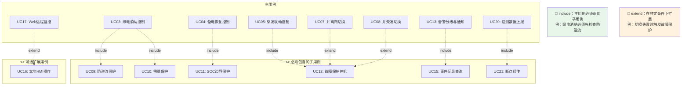

**关系说明**：
- **include**：主用例执行时**必须**调用子用例，子用例是主用例的必要步骤
- **extend**：在特定条件下**可选**触发，扩展用例不是必须的

---

### 2.5 参与者完整说明表

| 类别 | 参与者 | 类型 | 通信接口 | 关联用例 |
|------|--------|------|---------|---------|
| **北向** | 现场运维工程师 | 人 | 本地触摸屏 | UC01, UC02, UC16, UC13, UC14, UC18 |
| **北向** | 云端管理员 | 人 | Web/App/HTTPS | UC17, UC19, UC22 |
| **北向** | 能源管理专员 | 人 | Web/App/HTTPS | UC03, UC04, UC05, UC18, UC15 |
| **北向** | 系统维护人员 | 人 | Web/App/SSH | UC19, UC21 |
| **北向** | 私有云平台 | 系统 | MQTT over TLS | UC20, UC21, UC22 |
| **南向** | PCS变流器 | 设备 | RS485-1/2, Modbus-RTU | UC01(遥测), UC03/04(功率), UC07/08(模式切换), UC12(停机) |
| **南向** | MPPT控制器 | 设备 | RS485-5/6, Modbus-RTU | UC01(遥测), UC03(限功率), UC06(均衡) |
| **南向** | BAM电池管理 | 设备 | LAN1/2, Modbus-TCP | UC01(遥测), UC06(SOC), UC11(边界) |
| **南向** | 智能电表组 | 设备 | RS485-4, Modbus/DLT645 | UC01(遥测), UC09(防逆流), UC10(需量) |
| **南向** | STS切换开关 | 设备 | RS485-3, Modbus-RTU | UC01(遥测), UC07/08(切换) |
| **南向** | 柴油发电机 | 设备 | DO-1/DI, 硬线 | UC01(遥测), UC05(启停), UC08(并机) |
| **南向** | 液冷机组 | 设备 | RS485-7, Modbus-RTU | UC01(遥测), UC02(状态监测) |
| **南向** | 市电电网 | 系统 | ATS/STS | UC07(并网), UC09(防逆流) |

---

### 2.6 用例详细说明

| 用例ID | 用例名称 | 北向参与者 | 南向参与者 | 前置条件 | 基本流程 | 后置条件 |
|--------|---------|-----------|-----------|---------|---------|---------|
| UC01 | 实时数据采集 | 运维工程师 | PCS/MPPT/BAM/电表/STS/柴发/液冷机 | 设备上电 | 1. 轮询Modbus设备 2. 解析协议 3. 存储测点 | 实时数据库更新 |
| UC03 | 绿电消纳控制 | 能源专员 | PCS, MPPT, 电表 | 并网+SOC≥92% | 1. 读取负载功率(电表) 2. 计算PCS目标 3. 防逆流约束(电表) 4. 下发PCS功率+MPPT限功 | PCS跟随负载 |
| UC05 | 柴发联动控制 | 能源专员 | 柴发, PCS | 离网+SOC≤20% | 1. 检测SOC(BAM) 2. DO-1闭合启柴发 3. 监测DI状态 4. 柴发并机后PCS控制 | 柴发供电 |
| UC07 | 并离网切换 | 运维工程师/市电 | PCS, STS | 状态满足C3/C5 | 1. 检测STS/ATS状态 2. PCS功率设0 3. 等待STS自动分闸/合闸 4. PCS自动检测STS状态切换PQ/VF模式 | 系统状态变更 |
| UC09 | 防逆流保护 | 系统 | 电表, PCS | 并网运行 | 1. 读取关口表功率(电表) 2. 计算放电上限 3. 约束PCS功率 | 无逆流风险 |
| UC12 | 故障保护停机 | 系统 | PCS, BAM | 故障发生 | 1. 读取设备故障码(PCS/BAM) 2. L1~L2分级 3. clearAllPowerSet(PCS) | 系统进入Fault |
| UC16 | 本地HMI操作 | 运维工程师 | PCS, MPPT, 柴发 | 登录认证 | 1. 用户认证 2. 权限校验 3. 操作执行(PCS/柴发) 4. 二次确认 | 操作审计 |

### 2.7 用例与结构化分析DFD映射

| 用例 | 对应的DFD进程 | 参与者的变化 |
|------|-------------|-------------|
| UC01 | P1 数据采集 | DFD外部实体(E1~E7) → 用例图南向Actor |
| UC03~UC06 | P3 能量管理 | 用例按场景拆分，DFD按功能聚合；设备变为Actor |
| UC07~UC08 | P2 状态切换 | PCS/STS/柴发从外部实体变为南向Actor |
| UC09~UC12 | P4 安全保护 | 电表/BAM/PCS从外部实体变为南向Actor |
| UC13~UC15 | P6 告警管理 | 用例按用户操作拆分 |
| UC16~UC19 | P7 人机交互 | 用例按角色拆分 |
| UC20~UC22 | P8 云端通信 | 云平台从外部实体变为北向Actor |

---

## 3. 类图 (Class Diagram)

### 3.1 类图 — 层次化结构总览

类图按 **6个层次** 独立展示，每层内部聚焦同一抽象级别，层与层之间用关系图串联。这样比"一锅烩"更容易理解。

---

#### 3.1.1 第一层：系统总控层（CotEMS + Cluster + StateMachine）

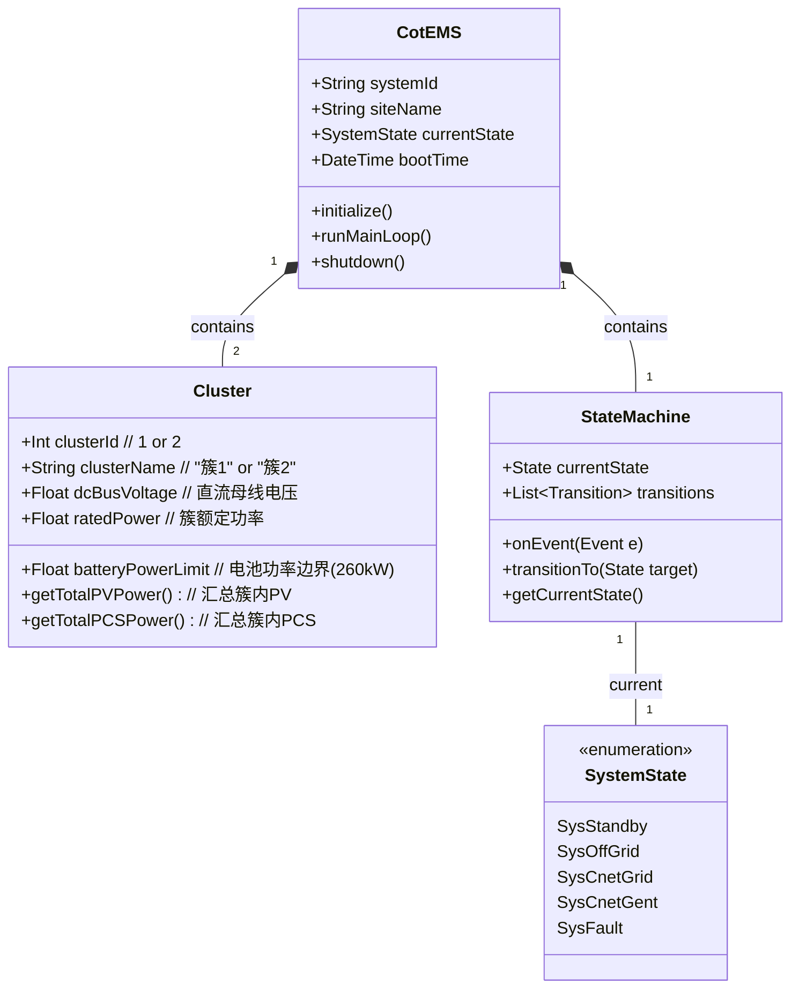

**这层关注什么？**
- **CotEMS**：系统唯一入口，全局总控
- **Cluster**：两簇结构（簇1=PCS1~3+MPPT1~4；簇2=PCS4~5+MPPT5~7），每簇独立直流母线
- **StateMachine**：状态机，管理5种系统状态的生命周期
- **SystemState**：枚举，列出所有合法状态值

**为什么用组合（◆）？**
- CotEMS关了，Cluster和StateMachine也就没了 → 同生同灭 → 组合

---

#### 3.1.2 第二层：设备抽象层（Device 基类 + 7种具体设备）

```mermaid
classDiagram
    class Device {
        <<abstract>>
        +String deviceId        // 设备编号
        +String deviceName      // 设备名称
        +DeviceType type        // 设备类型枚举
        +DeviceStatus status    // 在线/离线/故障
        +CommInterface comm     // 通信接口配置
        +DateTime lastHeartbeat // 最后心跳时间
        +connect()
        +disconnect()
        +readRegisters()*       // 抽象方法
        +writeRegister()*       // 抽象方法
        +getStatus()
    }
    
    class PCS {
        +Int pcsId              // 1~5
        +Float acPower          // 交流侧功率(正=放电)
        +Float dcPower          // 直流侧功率
        +PCSMode mode           // PQ模式 or VF模式
        +Float ratedPower       // 125kW
        +switchMode(PCSMode mode)
        +setPowerSetpoint(Float power)
        +clearFault()
    }
    
    class MPPT {
        +Int mpptId             // 1~7
        +Float pvPower          // 光伏实际功率
        +Float pvVoltage        // 光伏电压
        +Float limitPercent     // 限功率百分比
        +Float maxPower         // 100kW
        +setLimitPercent(Float percent)
    }
    
    class BAM {
        +Int bamId              // 1 or 2
        +Float soc              // 0~100%
        +Float voltage          // 总电压
        +Float current          // 总电流
        +Float temperature      // 温度
        +Int cycleCount         // 循环次数
        +heartbeat()            // 地址530心跳
    }
    
    class SmartMeter {
        +Int meterId            // 1~4
        +MeterRole role         // 关口/储能/负载/柴发
        +Float activePower      // 有功功率
        +Float voltage          // 电压
        +Float frequency        // 频率
        +getPowerDirection()    // 正向/反向
    }
    
    class DieselGenerator {
        +Boolean isRunning      // 是否运行
        +Float outputPower      // 输出功率
        +Float outputVoltage    // 输出电压
        +Boolean do1Signal      // DO-1启停干接点
        +Boolean di13Breaker    // DI-13断路器
        +Boolean di15Conduct   // DI-15导通
        +start()                // 闭合DO-1
        +stop()                 // 断开DO-1
    }
    
    class STS {
        +Boolean isClosed       // 合闸状态
        +Boolean gridSideActive // ATS市电侧
        +Boolean dieselSideActive // ATS备用侧
        +Boolean di5Position   // DI-5硬线位置
        +Boolean di6Position   // DI-6硬线位置
        +getPosition()
        +monitorTransition()
    }
    
    class CoolingUnit {
        +Int unitId             // 1~4
        +Float internalTemp     // 内部温度
        +Float setPoint         // 设定温度
        +CoolingMode mode       // 制冷/加热
        +setTemperature(Float temp)
    }
    
    %% 继承关系：所有具体设备都继承 Device
    PCS --|> Device : extends
    MPPT --|> Device : extends
    BAM --|> Device : extends
    SmartMeter --|> Device : extends
    DieselGenerator --|> Device : extends
    CoolingUnit --|> Device : extends
    
    note for Device "抽象基类：定义所有设备的\n通用属性和行为\n*表示抽象方法"
    note for PCS "5台（簇1:3台/簇2:2台）\nRS485-1/2, Modbus-RTU"
    note for MPPT "7台（簇1:4台/簇2:3台）\nRS485-5/6, Modbus-RTU"
    note for BAM "2台（簇1:LAN1/簇2:LAN2）\nModbus-TCP"
    note for SmartMeter "4块（关口/储能/负载/柴发）\nRS485-4, Modbus/DLT645"
    note for DieselGenerator "1台\nDO-1 + DI-13/15, 硬线"
    note for STS "1台\nRS485-3 + DI-5/6, Modbus-RTU"
    note for CoolingUnit "4台\nRS485-7, Modbus-RTU"
```

**这层关注什么？**
- **Device**：抽象基类，所有南向设备的"模板"
- 7种具体设备，标注了 **实际数量和通信接口**（与02-Domain-Model.md对齐）
- 继承关系用 **空心三角▷** 表示（`is-a`关系）

**关键设计决策：**
- STS没有继承Device？因为STS在系统里是**独立逻辑组件**（切换开关），它的控制方式和通信接口与其他设备不同。但在某些实现中也可以让它继承Device。这里为了保持清晰，STS作为独立类。

---

#### 3.1.3 第三层：簇-设备组合关系（Cluster 怎么组织设备）

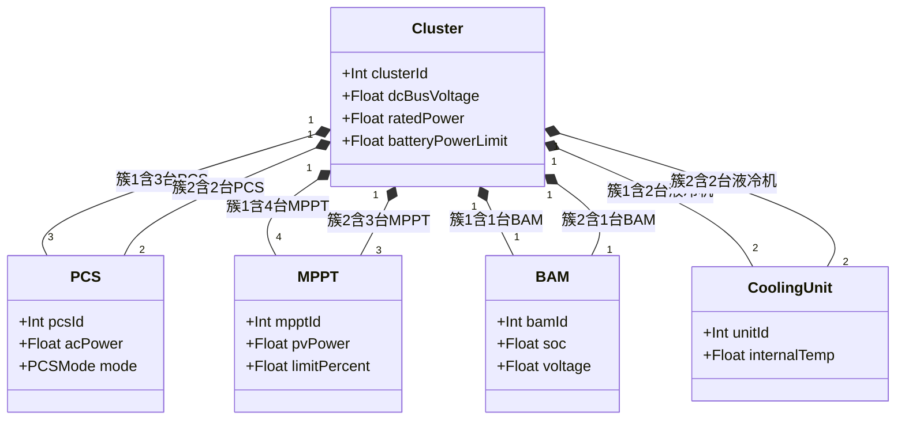

**这层单独拎出来的原因：**
- 簇与设备的**数量关系**是Cot项目最核心的拓扑约束
- 02-Domain-Model.md里专门有一节讲这个：簇1电池功率限制260kW（低于PCS的375kW），簇2电池功率260kW（高于PCS的250kW）
- 用组合◆表示：设备属于哪个簇，是出厂配置决定的，不会变

---

#### 3.1.4 第四层：业务引擎层（策略 + 保护 + 告警 + 状态）

```mermaid
classDiagram
    %% ======== 策略引擎 ========
    class StrategyEngine {
        <<abstract>>
        +StrategyState state
        +Float targetPower
        +PowerConstraint constraint
        +evaluate()*             // 抽象：策略计算
        +applyConstraint(Constraint c)
        +getResult()
    }
    
    class GreenConsumptionStrategy {
        +Float loadPower        // 来自电表
        +Float pvPower          // 来自MPPT
        +Float soc              // 来自BAM
        +Float efficiencyFactor // 95%
        +evaluate()
    }
    
    class BackupRecoveryStrategy {
        +Float soc
        +SystemState systemState
        +Float demandLimit
        +evaluate()
    }
    
    class DieselSyncStrategy {
        +Float soc
        +Boolean dieselRunning
        +Float dieselCapacity
        +evaluate()
    }
    
    class SOCBalanceStrategy {
        +Float cluster1SOC
        +Float cluster2SOC
        +Float socDiff
        +Float correctionFactor
        +evaluate()
    }
    
    class PowerConstraint {
        +Float dischargeLimit   // 防逆流上限
        +Float chargeLimit      // 需量上限
        +Float rampRateLimit   // 50kW/s
        +Float antiReverseLimit // 5kW余量
        +Float demandLimit     // 变压器容量-负载
        +combine(PowerConstraint other)
    }
    
    class DecisionEngine {
        +Float constrainedPCS  // 来自SecurityEngine的约束功率
        +SystemState systemState
        +OperationMode mode    // 手动/自动
        +PCSMode pcsMode       // PQ/VF
        +Float finalPCS        // 最终下发功率
        +Boolean isAutoRun      // 是否自主运行
        +DecisionLog logEntry
        +executeDecision()
        +logOnly(Float targetPCS)   // 离网VF: 仅记录
        +directDispatch(Float power) // 并网PQ: 直接下发
        +adjustForDiesel(Float power) // 并柴发: 柴发主导调整
        +manualVFConfig(Float vRef, Float fRef) // 手动: VF参数
    }
    
    class DecisionLog {
        +DateTime timestamp
        +SystemState state
        +Float targetPCS
        +Float finalPCS
        +String reason          // "VF自主" / "PQ下发" / "柴发主导" / "手动配置"
    }
    
    %% ======== 保护引擎 ========
    class ProtectionEngine {
        +List~ProtectionRule~ rules
        +ProtectionLevel level
        +scan()
        +evaluateRules()
        +triggerEmergencyStop()
        +getConstraint()
    }
    
    class ProtectionRule {
        <<abstract>>
        +String ruleId
        +RuleType type
        +Float threshold
        +Boolean isActive
        +check(DataPoint data)*
    }
    
    class AntiReverseRule {
        +Float marginKW          // 5kW余量
        +check(DataPoint data)
    }
    
    class DemandLimitRule {
        +Float transformerCapacity // 500kW
        +Float usagePercent       // 80%
        +check(DataPoint data)
    }
    
    class SOCBoundaryRule {
        +Float upperLimit       // 95%
        +Float lowerLimit       // 5%
        +Float criticalLimit    // 20%
        +check(DataPoint data)
    }
    
    %% ======== 告警管理 ========
    class AlarmManager {
        +List~Alarm~ activeAlarms
        +List~AlarmConfig~ configs
        +raiseAlarm(Alarm a)
        +acknowledgeAlarm(String alarmId)
        +clearAlarm(String alarmId)
        +suppressAlarms(Duration window)
    }
    
    class Alarm {
        +String alarmId
        +AlarmLevel level       // L1~L4
        +String faultCode
        +String deviceId
        +DateTime raisedTime
        +AlarmStatus status
        +acknowledge()
        +clear()
    }
    
    class AlarmConfig {
        +String faultCode
        +AlarmLevel defaultLevel
        +Duration suppressWindow
    }
    
    %% ======== 关系 ========
    StrategyEngine <|-- GreenConsumptionStrategy : extends
    StrategyEngine <|-- BackupRecoveryStrategy : extends
    StrategyEngine <|-- DieselSyncStrategy : extends
    StrategyEngine <|-- SOCBalanceStrategy : extends
    
    ProtectionRule <|-- AntiReverseRule : extends
    ProtectionRule <|-- DemandLimitRule : extends
    ProtectionRule <|-- SOCBoundaryRule : extends
    
    StrategyEngine "1" --> "1" PowerConstraint : applies
    StrategyEngine "1" --> "1" ProtectionEngine : checks
    ProtectionEngine "1" o-- "*" ProtectionRule : contains
    
    %% DecisionEngine关系
    ProtectionEngine "1" --> "1" DecisionEngine : feeds
    DecisionEngine "1" --> "1" DecisionLog : records
    DecisionEngine "1" --> "1" PowerConstraint : applies
    
    AlarmManager "1" o-- "*" Alarm : manages
    AlarmManager "1" o-- "*" AlarmConfig : configures
    
    note for StrategyEngine "策略模式：\n不同场景用不同策略"
    note for ProtectionEngine "保护优先级：\nL1/L2故障 > 防逆流 > 需量 > SOC"
    note for DecisionEngine "分场景执行：\nVF自主 / PQ下发 / 柴发主导"
    note for AlarmManager "切换窗口500ms内\n自动抑制STS告警"
```

**这层关注什么？**
- **策略引擎**：4种策略继承同一个基类 → 策略模式（Strategy Pattern）
  - 绿电消纳：并网+高SOC时，PCS跟随负载
  - 备电恢复：SOC低时，市电/光伏充电
  - 柴发联动：离网+SOC极低时，DO-1启柴发
  - SOC均衡：两簇SOC差大时，修正功率分配
- **保护引擎**：3种保护规则继承同一个基类 → 模板方法模式
  - 防逆流：关口表功率不能为负（余量5kW）
  - 需量保护：变压器容量×80% - 负载功率
  - SOC边界：95%禁充、5%禁放、20%启柴发
- **告警管理**：分级（L1~L4）、确认、屏蔽

---

#### 3.1.5 第五层：数据管理层（数据库 + 存储）

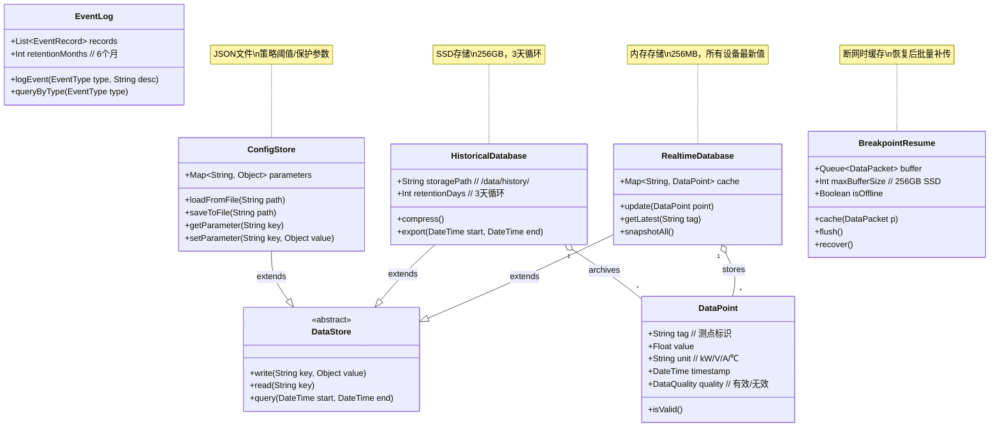

**这层关注什么？**
- 所有存储类继承 **DataStore** 抽象基类 → 统一读写接口
- 4种存储各有特点：实时库（内存）、历史库（SSD）、配置库（JSON）、事件日志（SSD）
- **BreakpointResume**（断点续传）是云端通信特有的缓存队列

---

#### 3.1.6 第六层：人机交互与云端通信层

```mermaid
classDiagram
    %% ======== 人机交互 ========
    class UserInterface {
        <<abstract>>
        +render()
        +handleInput()
        +refresh()
    }
    
    class LocalHMI {
        +Screen currentScreen
        +TouchInput touch
        +showOverview()         // 功率流向图
        +showDeviceDetail(Device d)
        +showAlarmList()
        +confirmAction(String action) // 二次确认弹窗
    }
    
    class WebInterface {
        +Session session
        +WebSocket connection
        +renderDashboard()
        +renderHistoryChart()
        +handleRemoteCommand()
    }
    
    class User {
        +String userId
        +String username
        +UserRole role          // 观察员/操作员/管理员
        +List~Permission~ permissions
        +authenticate(String password)
        +hasPermission(String action)
    }
    
    %% ======== 云端通信 ========
    class CloudGateway {
        +MQTTClient mqttClient
        +String siteId           // cot/{site}
        +Boolean isConnected
        +connect()
        +disconnect()
        +publishTelemetry()
        +publishAlarm(Alarm a)
        +subscribeCommands()
        +handleCommand(Command c)
    }
    
    class MQTTClient {
        +String brokerUrl
        +Int port               // 8883(TLS)
        +String clientId
        +TLSConfig tls
        +connect()
        +publish(String topic, String payload)
        +subscribe(String topic)
    }
    
    %% 继承
    UserInterface <|-- LocalHMI : extends
    UserInterface <|-- WebInterface : extends
    
    %% 关系
    LocalHMI "1" --> "*" Device : displays
    WebInterface "1" --> "*" Device : displays
    UserInterface "1" --> "*" User : authenticates
    
    CloudGateway "1" --> "1" MQTTClient : uses
    CloudGateway "1" o-- "1" BreakpointResume : manages
    
    note for LocalHMI "本地触摸屏\n7寸/10寸，实时画面"
    note for WebInterface "远程Web/App\nHTTPS/WebSocket"
    note for CloudGateway "MQTT over TLS\nTopic: cot/{site}/telemetry"
```

**这层关注什么？**
- **用户界面**：抽象基类 → 两种实现（本地HMI / Web），桥接模式（Bridge Pattern）
- **用户权限**：RBAC（角色访问控制），3种角色（观察员/操作员/管理员）
- **云端网关**：MQTT通信、断点续传、远程指令
- CloudGateway **依赖** MQTTClient（虚线）→ 临时使用，不强绑定

---

#### 3.1.7 跨层关系总图（层与层之间怎么连）

前面6层是"纵向切面"，每一层内部看细节。现在给一个"横向鸟瞰"，看层与层之间的主要关联：

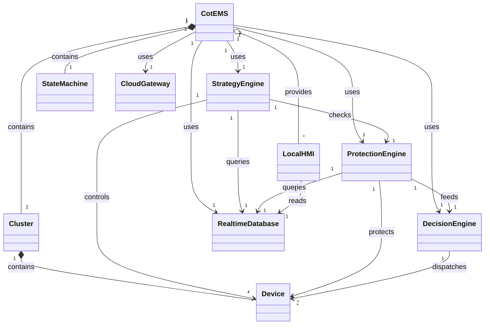

**这张图的价值：**
- 不展示类内部细节，只看 **"谁和谁有关系"**
- 箭头上的文字说明关系的业务含义（`uses`、`contains`、`queries`、`controls`）
- 核心发现：**CotEMS是全局枢纽**，所有横向交互都经过它；**StrategyEngine和ProtectionEngine是业务核心**，一个负责"主动控制"，一个负责"被动保护"


### 3.2 层次设计说明

| 层次 | 名称 | 核心职责 | 包含的类 | 设计模式 |
|------|------|---------|---------|---------|
| **L1** | 系统总控层 | 全局调度、生命周期管理 | CotEMS, Cluster, StateMachine | 单例/组合 |
| **L2** | 设备抽象层 | 南向设备建模、协议封装 | Device(抽象), PCS, MPPT, BAM, SmartMeter, DieselGenerator, STS, CoolingUnit | 模板方法 |
| **L3** | 簇-设备拓扑 | 两簇架构的具体数量关系 | Cluster→PCS(3/2), MPPT(4/3), BAM(1/1), CoolingUnit(2/2) | 组合 |
| **L4** | 业务引擎层 | 能量管理、安全保护、告警 | StrategyEngine(抽象), 4种策略, ProtectionEngine, 3种规则, AlarmManager | 策略/模板方法 |
| **L5** | 数据管理层 | 存储、查询、缓存、续传 | DataStore(抽象), RealtimeDB, HistoryDB, ConfigStore, EventLog, BreakpointResume | 仓库 |
| **L6** | 人机交互与云端 | UI、用户、通信 | UserInterface(抽象), LocalHMI, WebInterface, User, CloudGateway, MQTTClient | 桥接 |

**为什么拆6层而不是一锅烩？**
1. **关注点分离**：看设备时不用关心UI，看策略时不用关心数据库
2. **对齐需求文档**：02-Domain-Model.md第2.2节就是按设备类型分节的，类图应该对齐
3. **便于验证**：每层可以独立审查——比如检查"设备层是否覆盖了全部7种南向设备"

### 3.3 关键类职责说明（单一职责原则SRP）

| 类 | 职责 | 所属层次 | 设计模式 |
|----|------|---------|---------|
| **Device** | 抽象所有设备的通用读写行为 | L2 | 模板方法 |
| **PCS** | 封装5台PCS的功率控制+模式切换 | L2 | 继承 |
| **Cluster** | 组织两簇的设备拓扑+功率汇总 | L1/L3 | 组合 |
| **StrategyEngine** | 抽象所有策略的通用计算流程 | L4 | 策略模式 |
| **ProtectionRule** | 抽象所有保护规则的通用检查 | L4 | 模板方法 |
| **DecisionEngine** | 分场景执行决策（VF自主/PQ下发/柴发调整） | L4 | 策略模式 |
| **StateMachine** | 管理状态转换的通用逻辑 | L1 | 状态模式 |
| **UserInterface** | 抽象所有UI的通用操作 | L6 | 桥接模式 |
| **DataStore** | 抽象所有存储的通用接口 | L5 | 仓库模式 |

### 3.4 设备实例数量与通信接口汇总

与02-Domain-Model.md设备拓扑对齐：

| 设备类型 | 类名 | 实例数 | 通信接口 | 协议 | 所属簇 |
|---------|------|--------|---------|------|--------|
| PCS变流器 | PCS | 5台（簇1:3/簇2:2） | RS485-1/2 | Modbus-RTU | 簇1/簇2 |
| MPPT控制器 | MPPT | 7台（簇1:4/簇2:3） | RS485-5/6 | Modbus-RTU | 簇1/簇2 |
| BAM电池管理 | BAM | 2台（簇1:1/簇2:1） | LAN1/2 | Modbus-TCP | 簇1/簇2 |
| 智能电表 | SmartMeter | 4块（关口/储能/负载/柴发） | RS485-4 | Modbus/DLT645 | 全局 |
| 柴油发电机 | DieselGenerator | 1台 | DO-1/DI-13/15 | 硬线干接点 | 全局 |
| STS切换开关 | STS | 1台 | RS485-3/DI-5/6 | Modbus-RTU+硬线 | 全局 |
| 液冷机组 | CoolingUnit | 4台（簇1:2/簇2:2） | RS485-7 | Modbus-RTU | 簇1/簇2 |

**总计**：1个EMS + 2个簇 + 23台设备实例（5+7+2+4+1+1+4）

### 3.5 类图与结构化分析映射

| 结构化分析 (DFD) | 面向对象 (类图) | 映射规则 |
|-----------------|----------------|---------|
| 外部实体 E1~E7 | 具体设备类 PCS/MPPT/BAM... | 外部实体→类的实例 |
| 进程 P1~P8 | 引擎类 StrategyEngine/ProtectionEngine... | 加工逻辑→类的方法 |
| 数据存储 D1~D5 | 数据库类 RealtimeDatabase/HistoricalDatabase... | 数据存储→类的属性 |
| 数据流 F1.1~F8.3 | 对象间消息传递 | 数据流→方法调用 |
| 判定表 P2.2/P3/P4.7 | 状态转移守卫条件/策略evaluate() | 决策逻辑→方法内部逻辑 |

---
---

## 4. 时序图 (Sequence Diagram)

### 4.1 并网正常运行时序

时序图展示对象之间按**时间顺序**的交互，强调消息传递的先后次序。

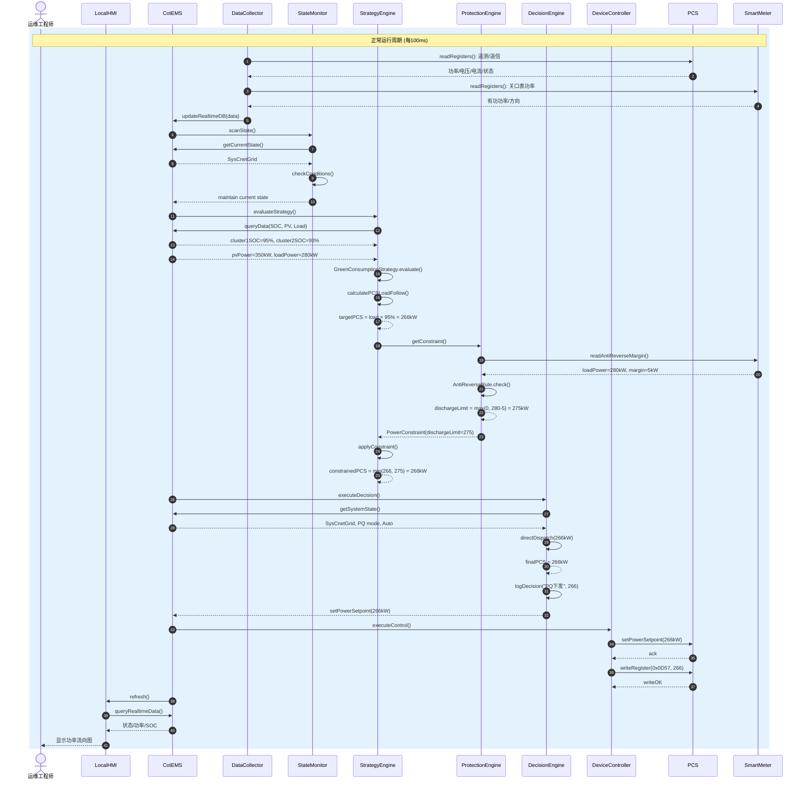

### 4.2 并离网切换时序

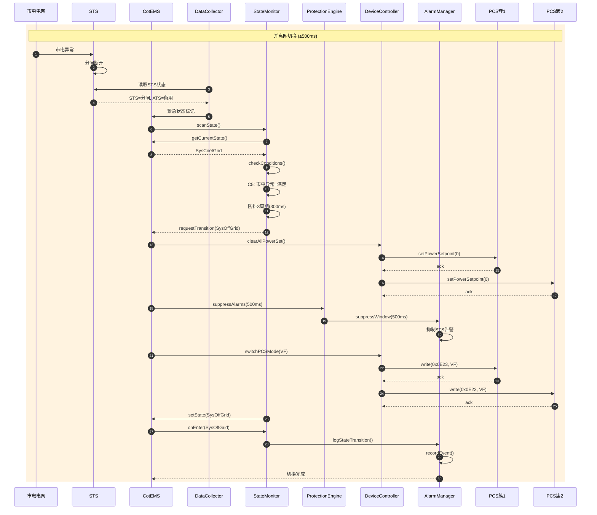

### 4.3 故障保护时序

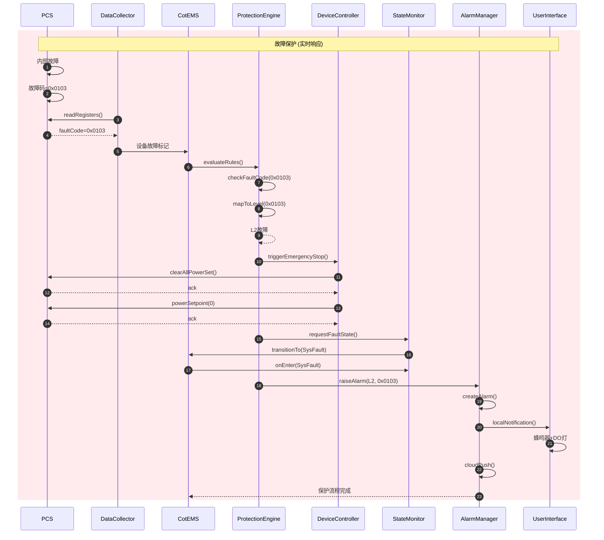

### 4.4 时序图与结构化分析对比

| 特性 | DFD（结构化） | 时序图（面向对象） |
|------|------------|-----------------|
| **关注点** | 数据变换和存储 | 对象交互和消息 |
| **时间** | 隐式（周期标注） | 显式（自上而下） |
| **并发** | 难以表达 | 可通过parallel表达 |
| **回传** | 数据流双向 | 返回消息明确 |
| **生命线** | 无 | 明确对象存活周期 |

---

## 5. 状态图 (State Diagram)

状态图描述EMS系统在其生命周期中的**状态序列**及**状态转移条件**。

### 5.1 顶层状态图

顶层状态图只展示 **5个宏观状态** 之间的转移关系，不展开内部细节：

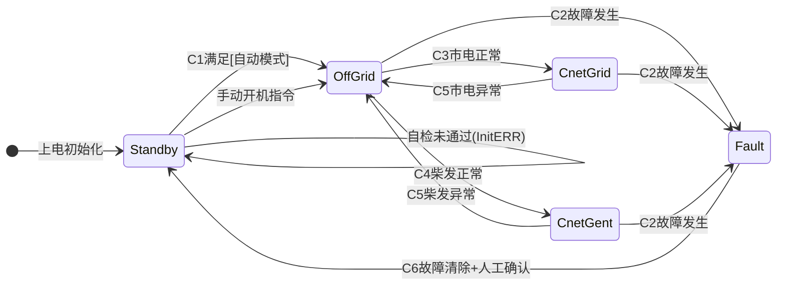

**5个宏观状态说明**：

| 状态 | 名称 | PCS模式 | 核心行为 | 进入条件 |
|------|------|---------|---------|---------|
| **Standby** | 系统待机 | 待机 | 自检、等待开机 | 上电初始化 |
| **OffGrid** | 离网运行 | VF（电压源） | 柴发/光伏/电池供电 | C1满足或手动开机 |
| **CnetGrid** | 并网运行 | PQ（电流源） | 跟随负载、充放电 | C3市电正常 |
| **CnetGent** | 并柴发运行 | VF（电压源） | 柴发做主源 | C4柴发正常 |
| **Fault** | 故障停机 | 待机 | 保护停机、等待人工 | C2故障发生 |

**转移条件说明**（来自04-State-Machine.md）：
- **C1**: 系统自检通过 + 无故障 + 自动模式
- **C2**: 保护引擎检测到L1/L2级故障
- **C3**: 市电电压/频率在允许范围 + STS检测市电
- **C4**: 柴发启动完成 + 电压/频率稳定
- **C5**: 市电/柴发异常（电压越限或STS断开）
- **C6**: 故障清除 + 人工确认复位

---

### 5.2 待机状态子图 (Standby)

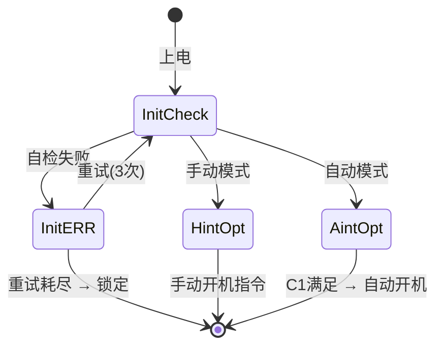

**待机子状态说明**：
- **InitCheck**：上电自检，检查硬件、通信、配置
- **InitERR**：自检失败，记录错误，允许重试3次
- **HintOpt**：手动模式等待，需人工点击开机
- **AintOpt**：自动模式等待，检测C1条件自动开机

---

### 5.3 并网运行子图 (CnetGrid)

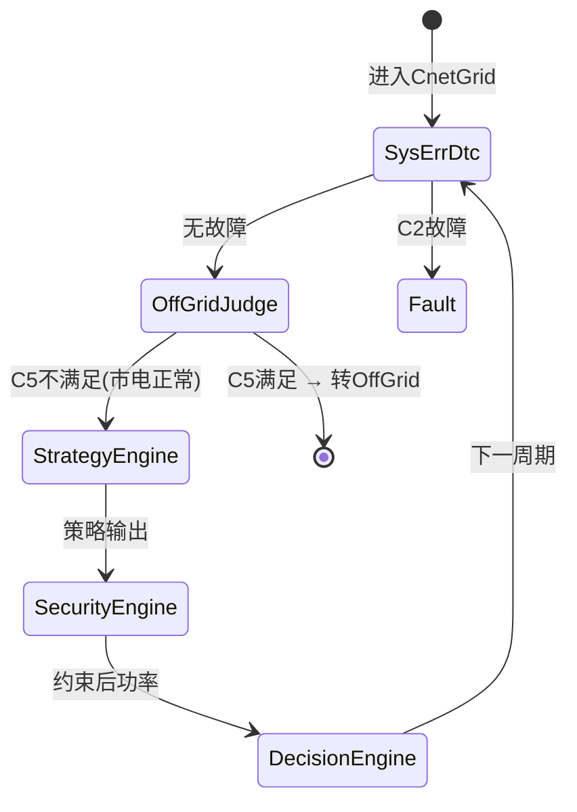

**并网子状态说明**：
- **SysErrDtc**：故障检测周期（每100ms）
- **OffGridJudge**：判断市电是否异常（C5条件）
- **StrategyEngine**：策略计算（绿电消纳/备电恢复）
- **SecurityEngine**：保护约束（防逆流/需量/SOC）
- **DecisionEngine**：功率决策下发

**与04-State-Machine.md的对应**：
- 对应 `5.2.3 CnetGrid 状态动作循环`
- PCS模式 = PQ（电流源模式），跟随市电电压/频率

---

### 5.4 离网运行子图 (OffGrid)

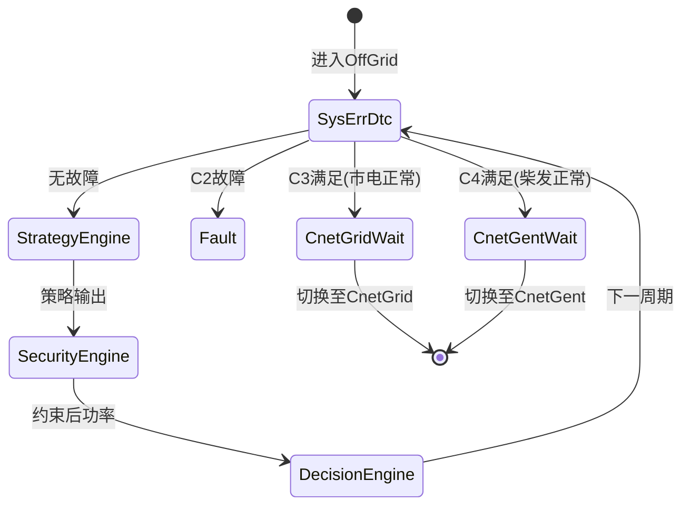

**离网子状态说明**：
- 与并网类似，但PCS模式 = **VF（电压源模式）**
- 额外检测C3（市电恢复）和C4（柴发可用），满足则自动切换
- 无市电时，由电池/光伏供电，或由柴发作为备用电源

---

### 5.5 并柴发运行子图 (CnetGent)


**并柴发子状态说明**：
- PCS模式 = **VF（电压源模式）**，柴发作为电压源
- 柴发功率优先满足负载，多余给电池充电
- SOC恢复后（>30%），可切回OffGrid，柴发停机

---

### 5.6 故障状态子图 (Fault)

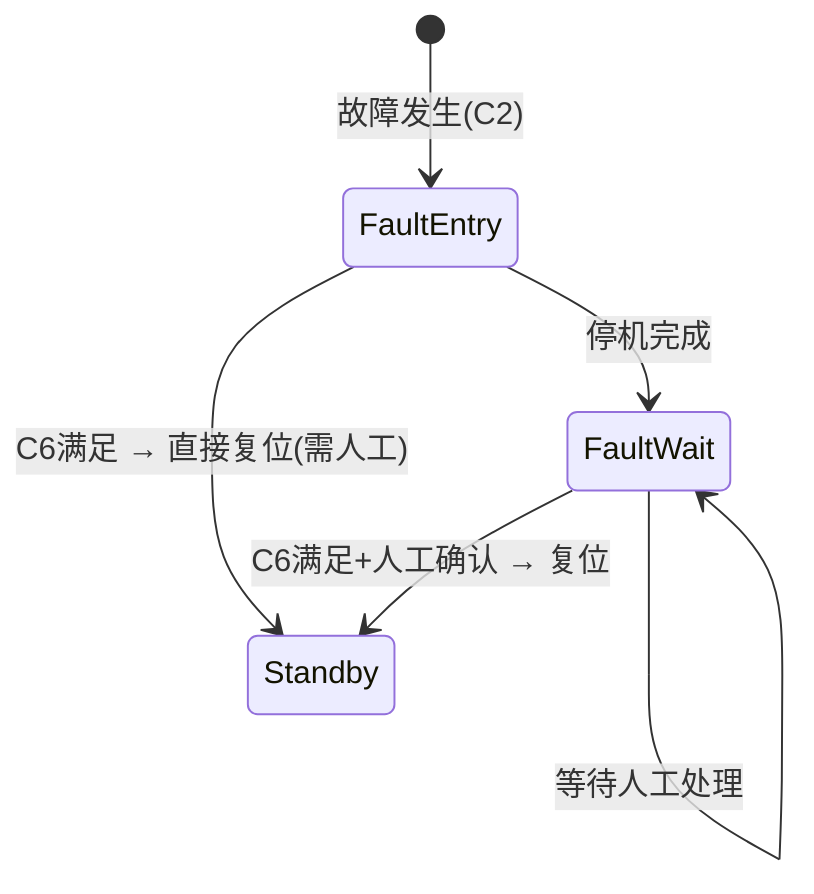

**故障子状态说明**：
- **FaultEntry**：执行clearAllPowerSet()，所有PCS功率设0，柴发停机
- **FaultWait**：锁定状态，禁止自动恢复，必须人工确认
- 部分故障（如通信中断恢复后）可自动复位，无需人工

---

### 5.7 状态机形式化定义（面向对象视角）

状态机在面向对象中可视为一个**StateMachine对象**：

```mermaid
classDiagram
    class StateMachine {
        +State currentState
        +List~Transition~ transitions
        +onEvent(Event e)
        +transitionTo(State target)
        +getCurrentState()
    }

    class State {
        +String stateId
        +String stateName
        +PCSMode pcsMode
        +onEnter()
        +onExecute()
        +onExit()
    }

    class Transition {
        +State source
        +State target
        +Event trigger
        +GuardCondition guard
        +Action action
        +canFire()
        +fire()
    }

    class GuardCondition {
        +String conditionId
        +Boolean evaluate(DataContext ctx)
    }

    class Event {
        +String eventId
        +EventType type
        +DataContext payload
    }

    StateMachine "1" --> "*" State : has
    StateMachine "1" --> "*" Transition : has
    Transition "1" --> "1" State : source
    Transition "1" --> "1" State : target
    Transition "1" --> "1" GuardCondition : guardedBy
    Transition "1" --> "1" Event : triggeredBy
```

**面向对象实现要点**：
- **State** 是抽象基类，每个宏观状态是一个子类（StandbyState、OffGridState...）
- **Transition** 封装转移条件（guard）和转移动作（action）
- **Event** 是触发转移的外部事件（如"市电恢复"、"故障发生"）
- **GuardCondition** 是布尔表达式，决定是否允许转移

---

### 5.8 状态图与结构化分析映射

| 状态图元素 | DFD对应 | 说明 |
|-----------|---------|------|
| **状态** | 数据存储D2.1 (SystemState) | 状态图将隐式状态显式化 |
| **转移条件** | P2.2 条件判定 | 状态图的事件+守卫 = 判定条件 |
| **进入/退出动作** | P2.4~P2.6 切换控制 | 状态图将动作绑定到状态 |
| **子状态** | Level 2 DFD分解 | 状态嵌套 = 子系统分解 |
| **状态机对象** | P2 状态监测与切换进程 | 面向对象将进程封装为对象 |

---

## 6. 活动图 (Activity Diagram)

活动图描述业务流程或操作的**工作流**，支持泳道（按对象分区）和并发（Fork/Join）。

### 6.1 绿电消纳策略活动图

```mermaid
flowchart TD
    subgraph Swimlane_EMS["🖥️ EMS主控"]
        A1(["开始: 策略周期"])
        A2["读取实时数据<br/>SOC/PV/Load"]
        A3{"系统状态?"}
        A4["计算PCS目标功率<br/>Load × 95%"]
        A5["应用防逆流约束<br/>上限=Load-5kW"]
        A6["应用需量约束<br/>上限=500kW-Load"]
        A7["应用Ramp Rate<br/>50kW/s"]
        A8["功率分配<br/>Cluster1/Cluster2"]
        A_DEC["决策执行引擎<br/>并网PQ: 直接下发"]
        A9["下发PCS功率设定"]
        A10(["结束"])

        A_ERR["记录异常"]
    end

    subgraph Swimlane_PCS["⚡ PCS设备"]
        P1["接收功率设定"]
        P2{"功率是否<br/>在允许范围?"}
        P3["执行功率调节"]
        P4["返回实际功率"]
        P_ERR["拒绝执行<br/>返回错误码"]
    end

    subgraph Swimlane_Meter["📊 电表"]
        M1["读取关口表功率"]
        M2["返回功率/方向"]
    end

    A1 --> A2
    A2 --> A3

    A3 -->|"并网"| A4
    A3 -->|"离网"| A_ERR
    A3 -->|"故障"| A_ERR

    A4 --> A5
    A5 --> M1
    M1 --> M2
    M2 --> A5

    A5 --> A6
    A6 --> A7
    A7 --> A8
    A8 --> A_DEC
    A_DEC --> A9

    A9 --> P1
    P1 --> P2

    P2 -->|"允许"| P3
    P2 -->|"越限"| P_ERR

    P3 --> P4
    P4 --> A10
    P_ERR --> A10
    A_ERR --> A10
```

**流程说明**：
1. EMS读取实时数据（SOC、PV、Load）
2. 判断系统状态：只有**并网**状态才执行绿电消纳
3. 计算PCS目标功率 = 负载功率 × 95%
4. 应用三层约束：防逆流（上限=Load-5kW）→ 需量（上限=500kW-Load）→ Ramp Rate（50kW/s）
5. 功率分配：Cluster1/Cluster2按SOC均衡策略分配
6. **决策执行引擎**：并网PQ模式直接下发，离网VF模式仅记录不下发
7. 下发PCS，PCS校验后执行

---

### 6.2 并离网切换活动图

```mermaid
flowchart TD
    subgraph Swimlane_Monitor["🔍 状态监测"]
        M_START(["检测到C3/C5"])
        M1{"条件满足<br/>3周期?"}
        M2["发送切换请求"]
        M3["等待执行确认"]
        M_END(["切换完成"])
        M_WAIT["继续监测"]
    end

    subgraph Swimlane_Control["🎮 设备控制"]
        C_START(["接收切换请求"])
        C1["所有PCS功率设0"]
        C2{"STS/ATS状态?"}
        C3["分闸/合闸操作"]
        C4["等待STS自动分闸/合闸"]
        C5["PCS自动检测STS状态切换模式"]
        C6["恢复功率控制"]
        C_END(["控制完成"])
    end

    subgraph Swimlane_Protect["🛡️ 保护系统"]
        P_START(["切换开始"])
        P1["开启告警屏蔽<br/>500ms"]
        P2["监测STS异常"]
        P3{"屏蔽期内<br/>告警?"}
        P4["抑制告警"]
        P5["正常处理告警"]
        P_END(["保护恢复"])
    end

    %% 主流程
    M_START --> M1
    M1 -->|"满足"| M2
    M1 -->|"不满足"| M_WAIT
    M_WAIT --> M1

    M2 --> C_START
    M2 --> P_START

    %% 控制流
    C_START --> C1
    C1 --> C2
    C2 -->|"需要操作"| C3
    C2 -->|"已到位"| C4
    C3 --> C4
    C4 --> C5
    C5 --> C6
    C6 --> C_END

    %% 保护流
    P_START --> P1
    P1 --> P2
    P2 --> P3
    P3 -->|"屏蔽期内"| P4
    P3 -->|"屏蔽期外"| P5
    P4 --> P_END
    P5 --> P_END

    %% 同步点
    C_END --> M3
    P_END --> M3
    M3 --> M_END
```

**流程说明**：
1. **监测阶段**：连续3个周期检测到切换条件（C3市电恢复 或 C5市电异常）
2. **控制阶段**：功率设0 → STS自动分闸/合闸 → PCS自动检测STS状态切换模式 → 恢复功率
3. **保护阶段**：500ms告警屏蔽窗口，防止切换瞬态误报
4. **同步点**：控制和保护都完成后，确认切换成功

**与04-State-Machine.md对应**：
- 对应 `5.3.2 并网→离网切换动作序列` 和 `5.3.4 离网→并网切换动作序列`
- STS切换时间：机械切换约100~200ms

---

### 6.3 并柴发切换活动图

```mermaid
flowchart TD
    subgraph Swimlane_EMS["🖥️ EMS主控"]
        E_START(["检测到C4/C5"])
        E1{"条件满足<br/>3周期?"}
        E2{"柴发状态?"}
        E3["DO-1闭合<br/>启动柴发"]
        E4["监测启动过程<br/>DI-13/15"]
        E5{"启动成功?"}
        E6["PCS自动切换VF模式"]
        E7["恢复功率控制"]
        E_END(["并柴发完成"])
        E_WAIT["继续监测"]
        E_ERR["记录故障"]
    end

    subgraph Swimlane_Diesel["⛽ 柴油发电机"]
        D_START(["接收启动信号"])
        D1["发动机启动"]
        D2{"电压/频率<br/>稳定?"}
        D3["闭合输出断路器"]
        D4["DI-15导通信号"]
        D_END(["柴发就绪"])
        D_ERR["启动失败<br/>报警"]
    end

    subgraph Swimlane_PCS["⚡ PCS设备"]
        P_START(["接收模式切换"])
        P1["功率设0"]
        P2["切换VF模式"]
        P3["检测电压同步"]
        P4{"同步成功?"}
        P5["合闸并网"]
        P_END(["PCS就绪"])
        P_ERR["同步失败"]
    end

    E_START --> E1
    E1 -->|"满足"| E2
    E1 -->|"不满足"| E_WAIT
    E_WAIT --> E1

    E2 -->|"未启动"| E3
    E2 -->|"已运行"| E6

    E3 --> D_START
    D_START --> D1
    D1 --> D2
    D2 -->|"稳定"| D3
    D2 -->|"不稳定"| D_ERR
    D3 --> D4
    D4 --> D_END
    D_END --> E4

    E4 --> E5
    E5 -->|"成功"| E6
    E5 -->|"超时"| E_ERR

    E6 --> P_START
    P_START --> P1
    P1 --> P2
    P2 --> P3
    P3 --> P4
    P4 -->|"成功"| P5
    P4 -->|"失败"| P_ERR
    P5 --> P_END
    P_END --> E7
    E7 --> E_END
```

**流程说明**：
1. **柴发启动**：EMS通过DO-1闭合启动柴发，监测DI-13（断路器）和DI-15（导通）
2. **启动超时**：180秒内未完成启动 → 切换失败，记录故障
3. **电压同步**：柴发输出电压/频率稳定后，PCS检测同步条件
4. **PCS自动切换**：PCS检测STS合闸后自动切PQ，检测分闸后自动切VF
5. **功率恢复**：PCS逐步恢复功率输出，避免冲击

**与04-State-Machine.md对应**：
- 对应 `5.3.6 离网→并柴发切换` 和 `5.3.8 并柴发→离网切换`
- 柴发启动超时：180s（来自01-PRD.md）

---

### 6.4 活动图与结构化分析对比

| 特性 | DFD（结构化） | 活动图（面向对象） |
|------|------------|-----------------|
| **流程描述** | 数据流动 | 控制流动 |
| **泳道** | 无 | 支持（按对象/角色分区） |
| **并发** | 难以表达 | Fork/Join明确支持 |
| **决策** | 隐式（加工逻辑） | 显式菱形决策节点 |
| **起点/终点** | 无 | 明确的活动开始/结束 |
| **对象视角** | 数据为中心 | 对象为中心（泳道 = 对象） |

**核心区别**：
- **DFD**：回答"数据从哪来、到哪去、经过什么处理"
- **活动图**：回答"对象A做什么、对象B做什么、它们如何协作"
            D_GEN["DieselGenerator<br/>柴油发电机"]
            D_STS["STS<br/>切换开关"]
        end

        subgraph Engines["引擎对象层"]
            E_Strategy["StrategyEngine<br/>策略引擎"]
            E_Green["GreenConsumption<br/>绿电策略"]
            E_Backup["BackupRecovery<br/>备电策略"]
            E_Diesel["DieselSync<br/>柴发策略"]
            E_Balance["SOCBalance<br/>均衡策略"]

            E_Protect["ProtectionEngine<br/>保护引擎"]
            E_Anti["AntiReverse<br/>防逆流"]
            E_Demand["DemandLimit<br/>需量保护"]
            E_SOC["SOCBoundary<br/>SOC边界"]
        end

        subgraph Data["数据对象层"]
            DB_Rt["RealtimeDatabase<br/>实时库"]
            DB_His["HistoricalDatabase<br/>历史库"]
            DB_Cfg["ConfigStore<br/>配置库"]
        end

        subgraph UI["界面对象层"]
            HMI["LocalHMI<br/>本地界面"]
            Web["WebInterface<br/>Web界面"]
        end

        subgraph Cloud["云端对象层"]
            MQTT["MQTTClient<br/>通信客户端"]
            BP["BreakpointResume<br/>断点续传"]
        end
    end

    %% 协作关系
    EMS --- D_PCS
    EMS --- D_MPPT
    EMS --- D_BAM
    EMS --- D_METER
    EMS --- D_GEN
    EMS --- D_STS

    EMS --- E_Strategy
    E_Strategy --- E_Green
    E_Strategy --- E_Backup
    E_Strategy --- E_Diesel
    E_Strategy --- E_Balance

    EMS --- E_Protect
    E_Protect --- E_Anti
    E_Protect --- E_Demand
    E_Protect --- E_SOC

    EMS --- DB_Rt
    EMS --- DB_His
    EMS --- DB_Cfg

    EMS --- HMI
    EMS --- Web

    EMS --- MQTT
    MQTT --- BP

    %% 数据流
    D_PCS -.->|"遥测"| DB_Rt
    D_MPPT -.->|"遥测"| DB_Rt
    D_Meter -.->|"遥测"| DB_Rt

    DB_Rt -.->|"查询"| E_Strategy
    DB_Rt -.->|"查询"| E_Protect

    E_Strategy -.->|"约束请求"| E_Protect
    E_Protect -.->|"约束结果"| E_Strategy

    E_Strategy -.->|"功率设定"| D_PCS
    E_Strategy -.->|"限功率"| D_MPPT
    E_Strategy -.->|"启停"| D_GEN

    E_Protect -.->|"紧急停机"| D_PCS
    E_Protect -.->|"告警"| HMI

    HMI -.->|"控制指令"| EMS
    Web -.->|"远程指令"| EMS

    DB_Rt -.->|"上报"| MQTT
    MQTT -.->|"补传"| BP
```

### 7.2 消息总线 vs 直接调用

| 交互方式 | 适用场景 | 在Cot EMS中的体现 |
|---------|---------|-----------------|
| **直接调用** | 强耦合、实时性高 | P5设备控制直接下发Modbus |
| **消息总线** | 松耦合、一对多 | P1数据采集后分发至各引擎 |
| **事件驱动** | 异步响应 | 告警事件触发UI刷新和云端推送 |
| **观察者模式** | 状态变更通知 | 实时数据库变更→UI自动刷新 |

---

## 8. 与结构化分析方法对比

### 8.1 两种方法的映射关系

```mermaid
flowchart LR
    subgraph SA["结构化分析 (SA)"]
        SA_DFD["DFD 数据流图<br/>进程/数据流/存储"]
        SA_DD["数据字典<br/>数据定义"]
        SA_DT["判定表/树<br/>决策逻辑"]
    end

    subgraph OOA["面向对象分析 (OOA)"]
        OOA_UC["用例图<br/>Actor/UseCase"]
        OOA_CLASS["类图<br/>Class/Attribute/Method"]
        OOA_SEQ["时序图<br/>对象交互"]
        OOA_STATE["状态图<br/>状态/转移"]
        OOA_ACT["活动图<br/>工作流"]
    end

    SA_DFD -->|"进程→用例"| OOA_UC
    SA_DFD -->|"数据存储→类属性"| OOA_CLASS
    SA_DFD -->|"数据流→消息"| OOA_SEQ
    SA_DT -->|"决策→状态转移"| OOA_STATE
    SA_DD -->|"数据定义→类属性"| OOA_CLASS

    style SA fill:#fff3e0
    style OOA fill:#e3f2fd
```

### 8.2 详细映射对照表

| 结构化分析 | 面向对象分析 | 映射说明 |
|-----------|-----------|---------|
| **外部实体 (E1~E10)** | **Actor** | 设备/用户/系统作为参与者 |
| **进程 (P1~P8)** | **类的方法** | 加工逻辑封装为类的方法 |
| **数据存储 (D1~D5)** | **类的属性** | 数据存储封装为对象的属性 |
| **数据流 (F1.1~F8.3)** | **消息传递** | 数据流变为对象间消息 |
| **判定表 (P2.2/P3/P4.7)** | **状态转移/守卫条件** | 决策逻辑变为状态图转移条件 |
| **数据字典** | **类属性类型定义** | 数据定义直接映射为类属性 |

### 8.3 两种方法的优势互补

| 场景 | 推荐方法 | 原因 |
|------|---------|------|
| **需求捕获初期** | 用例图 + DFD上下文图 | 用户视角 + 系统边界 |
| **系统架构设计** | 类图 | 封装、继承、多态支持复用 |
| **实时控制逻辑** | 状态图 + 时序图 | 精确的时间顺序和状态转移 |
| **复杂决策逻辑** | 判定表 + 活动图 | 完备性检查 + 流程可视化 |
| **数据库设计** | 类图 + E-R图 | 对象持久化映射 |
| **代码生成** | 类图 | 直接映射为面向对象代码 |

### 8.4 从结构化到面向对象的转换原则

```
┌─────────────────────────────────────────────────────────────┐
│              结构化 → 面向对象 转换原则                        │
├─────────────────────────────────────────────────────────────┤
│                                                             │
│  1. 识别名词 → 候选类                                        │
│     DFD外部实体 + 数据存储中的名词 = 候选对象                │
│                                                             │
│  2. 识别动词 → 候选方法                                      │
│     DFD进程名 + 处理逻辑 = 类的方法                          │
│                                                             │
│  3. 识别关系 → 类之间的关系                                  │
│     DFD数据流 = 关联/依赖                                    │
│     DFD分层分解 = 继承/组合                                  │
│                                                             │
│  4. 识别状态 → 状态机                                        │
│     DFD中的条件判断 = 状态转移条件                           │
│                                                             │
│  5. 识别数据 → 属性                                          │
│     数据字典中的数据项 = 类的属性                            │
│                                                             │
└─────────────────────────────────────────────────────────────┘
```

---

## 9. 附录

### 9.1 UML符号速查表

| 图类型 | 核心符号 | 说明 |
|--------|---------|------|
| **用例图** | Actor(人形), UseCase(椭圆), Association(线) | 参与者与用例关联 |
| **类图** | Class(矩形三栏), 继承(空心三角), 关联(实线) | 类结构与关系 |
| **时序图** | Object(矩形), Lifeline(虚线), Message(箭头) | 对象交互时序 |
| **状态图** | State(圆角矩形), Transition(箭头), Event(标注) | 状态生命周期 |
| **活动图** | Activity(圆角矩形), Decision(菱形), Fork(粗横线) | 业务流程 |

### 9.2 面向对象设计原则在Cot EMS中的体现

| 原则 | 缩写 | 在Cot EMS中的体现 |
|------|------|-----------------|
| **单一职责** | SRP | Device/Strategy/Protection各自独立 |
| **开闭原则** | OCP | 新增设备类型继承Device基类 |
| **里氏替换** | LSP | PCS/MPPT可替换Device使用 |
| **接口隔离** | ISP | DataStore抽象读写接口 |
| **依赖倒置** | DIP | 策略引擎依赖ProtectionEngine抽象 |

### 9.3 修订记录

| 版本 | 日期 | 变更内容 |
|------|------|----------|
| 1.0 | 2026-04-28 | 初始版本：完成用例图、类图、时序图、状态图、活动图全部分析，覆盖Cot EMS核心功能 |
| 1.1 | 2026-04-28 | **修正**：用例图补充全部南向设备Actor（PCS/MPPT/BAM/电表/STS/柴发/液冷机/市电），与00-Context.md/02-Domain-Model.md设备拓扑对齐；补充参与者说明表（2.2节）；用例说明增加南向参与者列；类图增加Cluster簇概念，细化设备属性（DO/DI信号、电表类型） |
| 1.2 | 2026-04-28 | **重构**：所有UML图分层拆分——用例图拆为总览/北向/南向/关系4张；类图拆为6层（系统/设备/拓扑/引擎/数据/交互）；状态图拆为顶层+4个子状态图；活动图拆为绿电消纳/并离网切换/并柴发切换3张 |
| 1.3 | 2026-04-28 | **补充**：L4业务引擎层增加DecisionEngine和DecisionLog类，对齐04-State-Machine.md v1.10架构澄清；时序图并网正常运行加入DecisionEngine步骤；活动图绿电消纳加入决策执行节点；类职责说明表补充DecisionEngine |

---

*本文档定义了Cot EMS系统的面向对象视图，与结构化分析视图[11-结构化分析方法.md](./11-结构化分析方法.md)互为补充。实现细节参见 [06-Technical-Design.md](./06-Technical-Design.md)*