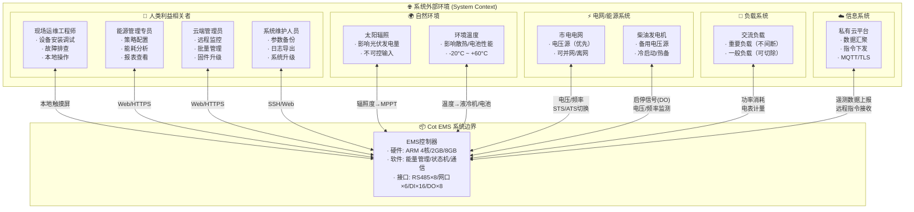
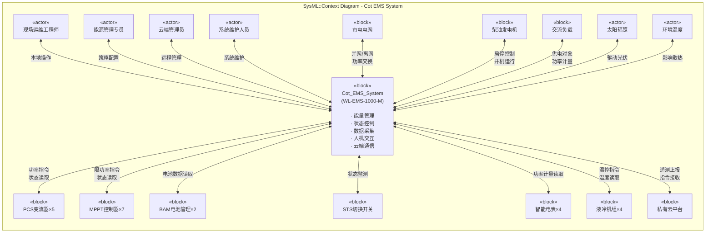

# S0-System-Context.md - 系统上下文

> **文档版本**: 1.0
> **最后更新**: 2026-04-29
> **关联文档**: [S1-System-Requirements.md](./S1-System-Requirements.md), [S2-System-Structure.md](./S2-System-Structure.md), [software/01-PRD.md](../software/01-PRD.md)
> **方法论**: SysML v1.6 需求图 + 模块定义图（上下文视角）

---

## 1. 系统使命 (Mission)

**Cot 光储柴微网能源管理系统** 是一套部署于缅甸地区的离并网混合供电系统，核心使命为：

> **在热带弱电网环境下，通过光伏、储能、柴发、市电的多源协同控制，实现重要负载的可靠供电，最大化绿电消纳，最小化化石能源依赖。**

### 1.1 关键效能指标 (MOE - Measures of Effectiveness)

| 指标 | 目标值 | 验证方式 |
|------|--------|---------|
| 供电可用率 | ≥ 99.5% | 运行日志统计年累计停电时间 |
| 绿电消纳率 | ≥ 85% | (光伏发电量 / 总负载用电量) × 100% |
| 并离网切换时间 | ≤ 500ms | 示波器测量负载电压跌落 |
| 系统响应周期 | ≤ 100ms | EMS控制周期 |
| 储能循环寿命 | ≥ 6000次 | BAM记录累计充放电数据 |

---

## 2. 利益相关者 (Stakeholders)

SysML 语境下，利益相关者是与系统交互的**外部实体**，不区分"人"或"设备"——只要是系统边界外的、与系统有信息/能量交换的，都是利益相关者。

### 2.1 利益相关者分类

### 2.2 利益相关者详细说明

| 代号 | 名称 | 类型 | 与系统交互内容 | 关键关注点 |
|------|------|------|---------------|-----------|
| **STK-01** | 现场运维工程师 | 人类 | 本地HMI操作、设备调试、故障排查 | 操作简便、响应及时 |
| **STK-02** | 能源管理专员 | 人类 | 策略参数配置、能耗报表分析 | 策略灵活、数据准确 |
| **STK-03** | 云端管理员 | 人类 | 远程监控、批量策略下发、固件升级 | 通信可靠、并发安全 |
| **STK-04** | 系统维护人员 | 人类 | 参数备份恢复、日志导出、系统升级 | 维护便捷、回退安全 |
| **STK-05** | 市电电网 | 物理系统 | 提供/切断电压源、功率计量 | 并网合规、防逆流 |
| **STK-06** | 柴油发电机 | 物理系统 | 备用电压源、启停控制、燃料状态 | 启动可靠、并机稳定 |
| **STK-07** | 交流负载 | 物理系统 | 消耗电能、接受供电 | 电压稳定、不间断 |
| **STK-08** | 太阳辐照 | 自然环境 | 驱动光伏发电 | 最大化利用 |
| **STK-09** | 环境温度 | 自然环境 | 影响设备散热和电池性能 | 热管理 |
| **STK-10** | 私有云平台 | 信息系统 | 数据汇聚、可视化、指令下发 | 数据安全、实时性 |

---

## 3. 系统边界定义

### 3.1 系统包含 (Inside System Boundary)

**Cot EMS 系统 = WL-EMS-1000-M 控制器 + 其内部软硬件**

| 组成部分 | 说明 |
|----------|------|
| **硬件** | ARM 4核主板、2GB LPDDR4、8GB EMMC + 256GB SSD、通信接口板 |
| **固件** | 嵌入式操作系统（Linux RT或RTOS）、设备驱动、通信协议栈 |
| **应用软件** | 能量管理策略引擎、状态机引擎、保护引擎、决策引擎、数据采集服务、HMI服务、云端通信服务 |
| **配置文件** | 系统参数、策略阈值、设备地址表、通信超时配置 |
| **本地HMI** | 7寸触摸屏（物理上属于控制器的一部分） |

### 3.2 系统不包含 (Outside System Boundary)

| 外部实体 | 边界说明 |
|----------|---------|
| **PCS×5** | EMS通过RS485读取/写入，但PCS的功率变换硬件不属于EMS |
| **MPPT×7** | EMS通过RS485限功率控制，但MPPT的DC/DC变换硬件不属于EMS |
| **BAM×2** | EMS通过TCP读取电池数据，但电池 Pack 和 BMS 硬件不属于EMS |
| **STS** | EMS监测STS状态，但STS的机械切换机构不属于EMS |
| **ATS** | EMS监测ATS位置，但ATS的机械切换机构不属于EMS |
| **柴发** | EMS通过DO启停、监测电压频率，但柴发机组不属于EMS |
| **电表×4** | EMS读取计量数据，但电表硬件不属于EMS |
| **液冷机×4** | EMS读取温度/控制启停，但液冷机硬件不属于EMS |
| **Web平台** | 远程访问软件，部署于云端服务器，不属于EMS控制器 |
| **云端平台** | 数据汇聚系统，部署于服务器集群，不属于EMS控制器 |

### 3.3 边界争议澄清

| 问题 | 结论 | 理由 |
|------|------|------|
| 本地HMI屏幕属于系统吗？ | **是** | 屏幕通过排线直连控制器主板，属于同一物理设备 |
| 远程Web平台属于系统吗？ | **否** | 部署于云端服务器，与EMS通过网络交互 |
| PCS的功率变换属于系统吗？ | **否** | PCS是独立设备，EMS只下发指令和读取状态 |
| 电池Pack属于系统吗？ | **否** | BAM管理电池，EMS只读取BAM数据 |

---

## 4. 系统外部接口

### 4.1 接口清单 (SysML 语境下的 "端口" 概念)

| 接口ID | 名称 | 类型 | 方向 | 外部实体 | 物理媒介 | 协议/信号 |
|--------|------|------|------|---------|---------|----------|
| **IF-01** | 设备通信总线 | 信号 | 双向 | PCS/MPPT/液冷机/电表 | RS485×8 | Modbus-RTU |
| **IF-02** | 电池管理通信 | 信号 | 双向 | BAM×2 | 以太网×2 | Modbus-TCP |
| **IF-03** | STS/电表通信 | 信号 | 双向 | STS/关口电表 | RS485/以太网 | Modbus-RTU/TCP |
| **IF-04** | 柴发控制 | 混合 | 输出+输入 | 柴油发电机 | DO×2 + DI×3 | 硬线信号 |
| **IF-05** | ATS监测 | 信号 | 输入 | ATS切换开关 | DI×2 | 硬线信号 |
| **IF-06** | 急停/保护输入 | 信号 | 输入 | 急停按钮/浪涌/消防 | DI×8 | 硬线信号 |
| **IF-07** | 本地人机交互 | 信号 | 双向 | HMI触摸屏 | 内部总线 | 自定义协议 |
| **IF-08** | 远程监控 | 信号 | 双向 | Web平台/云端 | WAN口 | MQTT/HTTPS |
| **IF-09** | 时间同步 | 信号 | 输入 | NTP服务器/GPS | 以太网 | NTP |
| **IF-10** | 电气能量接口 | 能量 | 间接 | PCS/负载/电网 | 交流母线 | 电压/频率/功率 |

### 4.2 接口类型说明

SysML 区分两种端口：
- **能量端口 (Energy Port)**: 传递物理能量（电、热、力）
- **信号端口 (Signal Port)**: 传递信息（数字信号、模拟信号、网络数据）

| 接口 | 端口类型 | 说明 |
|------|---------|------|
| IF-01 ~ IF-09 | **信号端口** | 数字通信，传递状态/指令/数据 |
| IF-10 | **能量端口** | 电气连接，EMS不直接连接交流母线，但通过PCS/电表间接感知能量流 |

**重要**: EMS控制器没有直接的能量端口连接交流母线——EMS通过 PCS（功率变换）和电表（功率计量）间接与能量域交互。这是理解系统边界的关键。

---

## 5. 上下文图 (SysML Context Diagram)

SysML 的上下文图本质上是一个**模块定义图（BDD）**，只画一个系统模块和外部利益相关者模块，不展示内部结构。

---

## 6. 从上下文到需求

S0 上下文图回答三个核心问题，直接导向 S1 系统需求：

| 问题 | S0 答案 | S1 对应 |
|------|---------|---------|
| **系统为谁服务？** | 5类人类利益相关者 + 3类物理系统 + 2类自然环境 | S1 第2章：利益相关者需求 |
| **系统与外部交换什么？** | 10个接口：8个信号 + 2个混合 | S1 第3章：系统接口需求 |
| **系统边界在哪里？** | EMS控制器软硬件为内，23台设备+环境为外 | S1 第4章：系统边界需求 |

---

## 7. 与现有文档的映射

| S0 内容 | 原[software/](../software/)对应 | 关系 |
|---------|-------------------------------|------|
| 利益相关者 | [software/01-PRD.md](../software/01-PRD.md) 第1.3节"目标用户画像" | S0是系统级，PRD是软件级；S0增加设备和环境 |
| 系统边界 | [software/00-Context.md](../software/00-Context.md) 第2节"硬件约束" | S0明确"包含/不包含"，00只列了硬件参数 |
| 外部接口 | [software/02-Domain-Model.md](../software/02-Domain-Model.md) 通信拓扑 | S0是接口抽象，02是协议实现细节 |
| 自然环境 | [software/00-Context.md](../software/00-Context.md) 工作温度 | S0增加太阳辐照作为输入 |
| 上下文图 | 无对应 | **新增** — 原体系没有系统上下文图 |

---

## 8. 修订记录

| 版本 | 日期 | 变更内容 |
|------|------|---------|
| 1.0 | 2026-04-29 | 初始创建 — 建立SysML系统工程层基础 |
