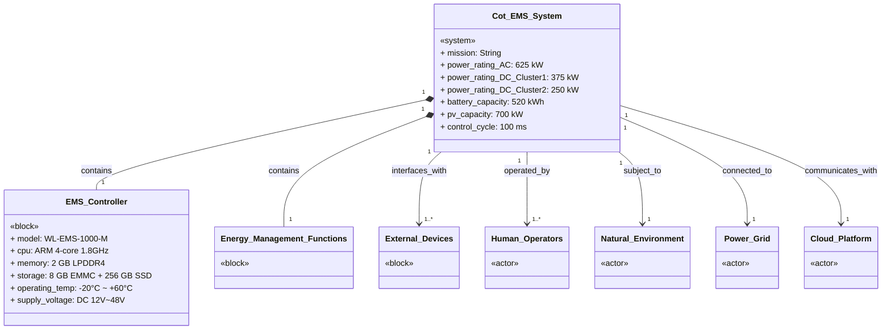
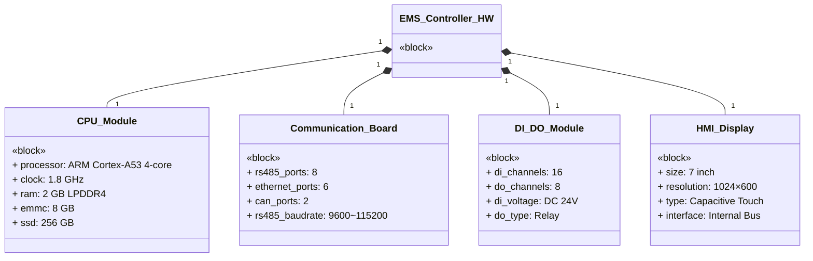
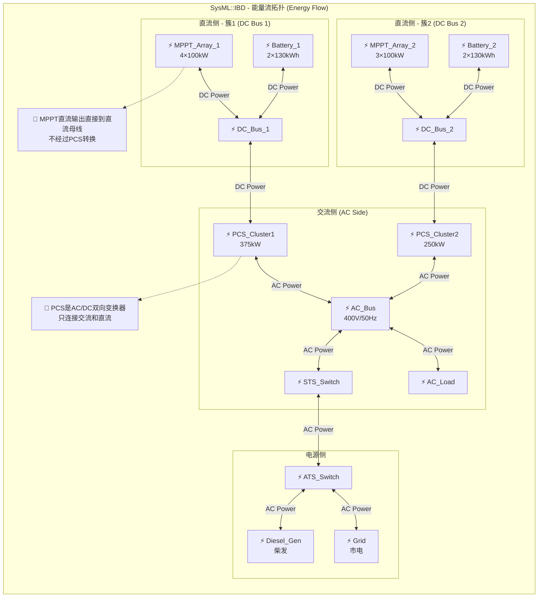

# S2-System-Structure.md - 系统结构定义

> **文档版本**: 1.0
> **最后更新**: 2026-04-29
> **关联文档**: [S0-System-Context.md](./S0-System-Context.md), [S1-System-Requirements.md](./S1-System-Requirements.md), [software/02-Domain-Model.md](../software/02-Domain-Model.md)
> **方法论**: SysML v1.6 模块定义图 (BDD) + 内部模块图 (IBD)

---

## 1. 结构概述

本文档使用 SysML 的 **模块定义图 (BDD)** 和 **内部模块图 (IBD)** 定义 Cot EMS 系统的静态结构。

### 1.1 SysML 结构核心概念

| 概念 | UML对应 | SysML特化 | Cot项目含义 |
|------|---------|----------|------------|
| **模块 (Block)** | 类 (Class) | 增加物理属性 | 系统、子系统、设备、组件 |
| **端口 (Port)** | 端口 (Port) | 分为标准端口 + 流端口 | 能量接口、信号接口 |
| **部件 (Part)** | 属性 (Attribute) | 模块实例 | 控制器内部的物理组件 |
| **连接器 (Connector)** | 关联 (Association) | 连接端口 | 通信总线、电气连接 |
| **值类型 (ValueType)** | 数据类型 | 带单位 | 功率(W)、电压(V)、温度(°C) |

### 1.2 结构层次

```
Cot_EMS_System (顶层系统模块)
├── EMS_Controller_HW (硬件子系统)
│   ├── CPU_Module
│   ├── Communication_Board
│   ├── DI_DO_Module
│   └── HMI_Display
├── EMS_Controller_SW (软件子系统)
│   ├── RTOS
│   ├── Device_Driver
│   └── EMS_Application
├── Energy_Management_Subsystem (功能子系统)
│   ├── Data_Acquisition
│   ├── State_Machine_Engine
│   ├── Strategy_Engine
│   ├── Protection_Engine
│   └── Decision_Engine
└── External_Interfaces (外部接口抽象)
    ├── PCS_Array (5台)
    ├── MPPT_Array (7台)
    ├── BAM_Array (2台)
    └── ...
```

---

## 2. 模块定义图 (BDD - Block Definition Diagram)

BDD 回答 "系统由哪些模块组成、模块之间是什么关系"。

### 2.1 顶层系统模块



### 2.2 EMS控制器硬件分解



### 2.3 外部设备模块

```mermaid
classDiagram
    direction TB

    class External_Device {
        «block»
        + device_id: String
        + communication_protocol: Protocol
        + rated_power: Power
    }

    class PCS {
        «block»
        + model: String
        + rated_power_AC: Power
        + rated_power_DC: Power
        + mode: PCSMode
        + efficiency: 0.95
        + comm_interface: RS485
        + comm_protocol: ModbusRTU
        + quantity: 5
    }

    class MPPT {
        «block»
        + model: String
        + rated_power_DC: Power
        + input_voltage_range: VoltageRange
        + output_voltage_range: VoltageRange
        + comm_interface: RS485
        + comm_protocol: ModbusRTU
        + quantity: 7
    }

    class BAM {
        «block»
        + model: String
        + battery_capacity: Energy
        + cell_count: int
        + comm_interface: Ethernet
        + comm_protocol: ModbusTCP
        + quantity: 2
    }

    class STS {
        «block»
        + rated_current: Current
        + switch_time: 100 ms
        + comm_interface: RS485
        + quantity: 1
    }

    class ATS {
        «block»
        + rated_current: Current
        + switching_logic: Mechanical
        + di_feedback: DI_Channel
        + quantity: 1
    }

    class Smart_Meter {
        «block»
        + meter_type: MeterType
        + comm_interface: RS485
        + comm_protocol: ModbusRTU
        + quantity: 4
    }

    class Diesel_Generator {
        «block»
        + rated_power: Power
        + start_type: Electric
        + start_signal: DO_Channel
        + status_feedback: DI_Channel
        + warm_up_time: 30 s
        + quantity: 1
    }

    class Liquid_Cooler {
        «block»
        + rated_power: Power
        + temperature_setpoint: Temperature
        + comm_interface: RS485
        + quantity: 4
    }

    class AC_Load {
        «block»
        + load_type: LoadType
        + rated_power: Power
        + priority: Priority
    }

    External_Device <|-- PCS
    External_Device <|-- MPPT
    External_Device <|-- BAM
    External_Device <|-- STS
    External_Device <|-- ATS
    External_Device <|-- Smart_Meter
    External_Device <|-- Diesel_Generator
    External_Device <|-- Liquid_Cooler
    External_Device <|-- AC_Load
```



### 2.4 功能子系统分解

```mermaid
classDiagram
    direction TB

    class EMS_Software {
        «block»
        + version: String
        + control_cycle: 100 ms
    }

    class Data_Acquisition {
        «block»
        + scan_cycle: 100 ms
        + protocol_support: [ModbusRTU, ModbusTCP]
        + max_devices: 23
    }

    class State_Machine_Engine {
        «block»
        + cycle: 100 ms
        + states: [Standby, OffGrid, CnetGrid, CnetGent, Fault]
        + debounce_cycles: 3
    }

    class Strategy_Engine {
        «block»
        + strategies: [Green, Backup, Diesel, Manual]
        + soc_thresholds: Configurable
        + power_coefficient: 0.95
    }

    class Protection_Engine {
        «block»
        + protections: [AntiReverse, Demand, SOC_Boundary, Fault]
        + response_time: 200 ms
    }

    class Decision_Engine {
        «block»
        + modes: [LogOnly, DirectDispatch, AdjustDiesel, ManualVF]
    }

    class HMI_Service {
        «block»
        + refresh_rate: 2 s
        + screen_size: 7 inch
    }

    class Cloud_Service {
        «block»
        + protocol: MQTT_TLS
        + telemetry_period: 30 s
        + cache_duration: 7 days
    }

    class Event_Logger {
        «block»
        + storage: 256 GB SSD
        + retention: 90 days
        + format: CSV_JSON
    }

    EMS_Software "1" *-- "1" Data_Acquisition
    EMS_Software "1" *-- "1" State_Machine_Engine
    EMS_Software "1" *-- "1" Strategy_Engine
    EMS_Software "1" *-- "1" Protection_Engine
    EMS_Software "1" *-- "1" Decision_Engine
    EMS_Software "1" *-- "1" HMI_Service
    EMS_Software "1" *-- "1" Cloud_Service
    EMS_Software "1" *-- "1" Event_Logger
```



---

## 3. 内部模块图 (IBD - Internal Block Diagram)

IBD 回答 "模块内部的部件如何通过端口和连接器相互连接"。

### 3.1 顶层系统 IBD

```mermaid
flowchart TB
    subgraph TOP["SysML::IBD - Cot_EMS_System (顶层)"]
        direction TB

        EMS["«block»\nEMS_Controller\n(WL-EMS-1000-M)"]

        DEV1["«block»\nPCS_Array\n×5"]
        DEV2["«block»\nMPPT_Array\n×7"]
        DEV3["«block»\nBAM_Array\n×2"]
        DEV4["«block»\nSTS"]
        DEV5["«block»\nATS"]
        DEV6["«block»\nSmart_Meter\n×4"]
        DEV7["«block»\nDiesel_Generator"]
        DEV8["«block»\nLiquid_Cooler\n×4"]
        DEV9["«block»\nAC_Load"]

        GRID["«actor»\nPower_Grid"]
        CLOUD["«actor»\nCloud_Platform"]
        HMI["«block»\nHMI_Display"]

        %% 定义端口（用子图模拟）
        subgraph EMS_PORTS["EMS 端口"]
            e_modbus["📟 Modbus_Port\nRS485×8 + TCP"]
            e_do["🔌 DO_Port\n×8"]
            e_di["🔌 DI_Port\n×16"]
            e_eth["🌐 Ethernet_Port\n×6"]
            e_hmi["🖥️ HMI_Port\nInternal"]
        end

        %% 设备端口
        subgraph DEV_PORTS["设备端口"]
            d_pcs["RS485"]
            d_mppt["RS485"]
            d_bam["Ethernet"]
            d_sts["RS485"]
            d_ats["DI反馈"]
            d_meter["RS485"]
            d_gen["DO启停+DI状态"]
            d_cool["RS485"]
        end

        %% 连接关系
        EMS e_modbus <--"Modbus-RTU"--> DEV1
        EMS e_modbus <--"Modbus-RTU"--> DEV2
        EMS e_eth <--"Modbus-TCP"--> DEV3
        EMS e_modbus <--"Modbus-RTU"--> DEV4
        EMS e_di <--"DI信号"--> DEV5
        EMS e_modbus <--"Modbus-RTU"--> DEV6
        EMS e_do <--"DO启停"--> DEV7
        EMS e_modbus <--"Modbus-RTU"--> DEV8

        %% 能量域连接（虚线表示间接）
        DEV1 <--"AC Bus"--> DEV9
        DEV9 <--"AC Bus"--> GRID
        DEV7 <--"AC Bus"--> DEV9
        DEV4 <--"切换"--> GRID
        DEV5 <--"切换"--> DEV7

        %% 人机交互
        EMS e_hmi <--"内部总线"--> HMI
        EMS e_eth <--"MQTT/HTTPS"--> CLOUD
    end
```

### 3.2 EMS控制器内部 IBD

```mermaid
flowchart TB
    subgraph INTERNAL["SysML::IBD - EMS_Controller (内部结构)"]
        direction TB

        CPU["«part»\nCPU_Module\n· ARM 4核 1.8GHz\n· 2GB RAM\n· 8GB EMMC\n· 256GB SSD"]
        COMM["«part»\nCommunication_Board\n· RS485×8\n· ETH×6\n· CAN×2"]
        DIDO["«part»\nDI_DO_Module\n· DI×16\n· DO×8"]
        HMI["«part»\nHMI_Display\n· 7寸触控屏"]
        POWER["«part»\nPower_Supply\n· DC12V~48V输入\n· DC24V/1A输出"]

        %% 内部连接
        CPU <--"PCIe/内部总线"--> COMM
        CPU <--"GPIO/内部总线"--> DIDO
        CPU <--"LVDS/内部总线"--> HMI
        POWER <--"DC供电"--> CPU
        POWER <--"DC供电"--> COMM
        POWER <--"DC供电"--> DIDO
        POWER <--"DC供电"--> HMI

        %% 外部端口（作为EMS的边界）
        subgraph EXT_PORTS["EMS外部端口"]
            p_rs485["🌐 RS485_Port ×8"]
            p_eth["🌐 Ethernet_Port ×6"]
            p_di["🔌 DI_Port ×16"]
            p_do["🔌 DO_Port ×8"]
            p_hmi["🖥️ HMI_Screen"]
            p_power["⚡ Power_Input\nDC12V~48V"]
        end

        COMM <--""--> p_rs485
        COMM <--""--> p_eth
        DIDO <--""--> p_di
        DIDO <--""--> p_do
        HMI <--""--> p_hmi
        POWER <--""--> p_power
    end
```

### 3.3 电气拓扑 IBD（能量流视角）

这是 SysML 区别于 UML 的关键——**能量端口 (Energy Port)** 的显式表达。



---

## 4. 端口详细定义

### 4.1 信号端口 (Signal Ports)

信号端口传递**数字信息**（状态、指令、配置）。

| 端口ID | 名称 | 所属模块 | 方向 | 协议 | 周期 | 数据内容 |
|--------|------|---------|------|------|------|---------|
| **SP-01** | PCS_Comm_Port | EMS_Controller | 双向 | Modbus-RTU | 100ms~2s | PCS状态、功率指令、故障码 |
| **SP-02** | MPPT_Comm_Port | EMS_Controller | 双向 | Modbus-RTU | 2s | MPPT状态、限功率指令 |
| **SP-03** | BAM_Comm_Port | EMS_Controller | 双向 | Modbus-TCP | 1s | SOC、电压、温度、均衡状态 |
| **SP-04** | STS_Comm_Port | EMS_Controller | 双向 | Modbus-RTU | 100ms | STS位置、切换状态 |
| **SP-05** | Meter_Comm_Port | EMS_Controller | 双向 | Modbus-RTU | 200ms | 功率、电压、频率、电能 |
| **SP-06** | Cooler_Comm_Port | EMS_Controller | 双向 | Modbus-RTU | 5s | 温度、启停指令 |
| **SP-07** | Gen_DO_Port | EMS_Controller | 输出 | 硬线DO | 事件 | 柴发启动/停机信号 |
| **SP-08** | Gen_DI_Port | EMS_Controller | 输入 | 硬线DI | 100ms | 柴发运行状态、故障 |
| **SP-09** | ATS_DI_Port | EMS_Controller | 输入 | 硬线DI | 100ms | ATS位置反馈 |
| **SP-10** | Emergency_DI_Port | EMS_Controller | 输入 | 硬线DI | 事件 | 急停、浪涌、消防、门禁 |
| **SP-11** | HMI_Port | EMS_Controller | 双向 | 内部总线 | 2s | 显示数据、触摸输入 |
| **SP-12** | Cloud_Port | EMS_Controller | 双向 | MQTT/HTTPS | 30s | 遥测数据、远程指令 |
| **SP-13** | TimeSync_Port | EMS_Controller | 输入 | NTP | 1h | 时间同步 |

### 4.2 能量端口 (Energy Ports)

能量端口传递**物理能量**。EMS控制器没有直接的能量端口——它通过 PCS 和电表间接与能量域交互。

| 端口ID | 名称 | 所属模块 | 能量类型 | 额定值 | 说明 |
|--------|------|---------|---------|--------|------|
| **EP-01** | AC_Bus_Port | AC_Bus | 电能 | 400V/50Hz/625kW | 交流母线 |
| **EP-02** | DC_Bus_1_Port | DC_Bus_1 | 电能 | 600~850V/375kW | 簇1直流母线 |
| **EP-03** | DC_Bus_2_Port | DC_Bus_2 | 电能 | 600~850V/250kW | 簇2直流母线 |
| **EP-04** | PV_Input_Port | MPPT_Array | 光能→电能 | 700kWp | 光伏输入 |
| **EP-05** | Battery_Port | Battery_Array | 化学能↔电能 | 520kWh | 电池储能 |
| **EP-06** | Diesel_Output_Port | Diesel_Generator | 化学能→电能 | 待定kW | 柴发输出 |
| **EP-07** | Grid_Port | Power_Grid | 电能 | 400V/50Hz | 市电接口 |
| **EP-08** | Load_Port | AC_Load | 电能 | 待定kW | 负载消耗 |

---

## 5. 值类型与单位 (ValueTypes)

SysML 要求所有物理量必须带单位。

| 值类型 | 单位 | 示例 | 用途 |
|--------|------|------|------|
| **Power** | kW | 375 kW | 功率额定值 |
| **Energy** | kWh | 520 kWh | 电池容量 |
| **Voltage** | V | 400 V | 电压等级 |
| **Current** | A | 500 A | 电流额定值 |
| **Frequency** | Hz | 50 Hz | 频率 |
| **Temperature** | °C | -20°C ~ +60°C | 温度范围 |
| **Time** | ms / s | 100 ms | 时间周期 |
| **Percentage** | % | 95% | SOC、效率 |
| **Resistance** | Ω | — | 接地电阻 |
| **DataRate** | bps | 9600 bps | 通信波特率 |

---

## 6. 模块属性汇总

### 6.1 EMS控制器模块属性

| 属性名 | 类型 | 值 | 说明 |
|--------|------|-----|------|
| model | String | WL-EMS-1000-M | 产品型号 |
| cpu_cores | Integer | 4 | CPU核心数 |
| cpu_clock | Frequency | 1.8 GHz | CPU主频 |
| ram_size | Memory | 2 GB | 内存容量 |
| emmc_size | Storage | 8 GB | 内置存储 |
| ssd_size | Storage | 256 GB | 固态硬盘 |
| rs485_count | Integer | 8 | RS485接口数 |
| eth_count | Integer | 6 | 以太网接口数 |
| di_count | Integer | 16 | 数字输入通道 |
| do_count | Integer | 8 | 数字输出通道 |
| operating_temp_min | Temperature | -20°C | 最低工作温度 |
| operating_temp_max | Temperature | +60°C | 最高工作温度 |
| supply_voltage_min | Voltage | 12 V | 最低供电电压 |
| supply_voltage_max | Voltage | 48 V | 最高供电电压 |
| control_cycle | Time | 100 ms | 控制周期 |

### 6.2 簇属性

| 属性 | 簇1 | 簇2 | 合计 |
|------|-----|-----|------|
| PCS数量 | 3台 | 2台 | 5台 |
| PCS额定功率 | 375 kW | 250 kW | 625 kW |
| MPPT数量 | 4台 | 3台 | 7台 |
| MPPT额定功率 | 400 kW | 300 kW | 700 kW |
| 电池数量 | 2柜 | 2柜 | 4柜 |
| 电池容量 | 260 kWh | 260 kWh | 520 kWh |
| BAM数量 | 1台 | 1台 | 2台 |

---

## 7. 与现有文档的映射

| S2 内容 | 原[software/](../software/)对应 | 关系说明 |
|---------|-------------------------------|---------|
| BDD 模块层次 | [software/03-Architecture.md](../software/03-Architecture.md) 分层架构 | S2用SysML块定义，03用软件分层；S2增加硬件模块 |
| IBD 端口连接 | [software/02-Domain-Model.md](../software/02-Domain-Model.md) ASCII拓扑 | S2是形式化端口-连接器定义，02是文字描述 |
| 能量端口 EP-01~08 | [software/02-Domain-Model.md](../software/02-Domain-Model.md) 功率方程 | S2将P_bat=P_pv-P_clu/η表达为端口能量流 |
| 信号端口 SP-01~13 | [software/02-Domain-Model.md](../software/02-Domain-Model.md) 通信拓扑 | S2形式化定义通信端口属性（协议/周期/方向） |
| 值类型与单位 | [software/00-Context.md](../software/00-Context.md) 硬件参数表 | S2将参数提升为带单位的值类型 |
| 设备数量表 | [software/02-Domain-Model.md](../software/02-Domain-Model.md) 设备清单 | S2以模块属性形式表达 |

---

## 8. 修订记录

| 版本 | 日期 | 变更内容 |
|------|------|---------|
| 1.0 | 2026-04-29 | 初始创建 — BDD系统层次图、IBD能量流图、端口定义、值类型 |
