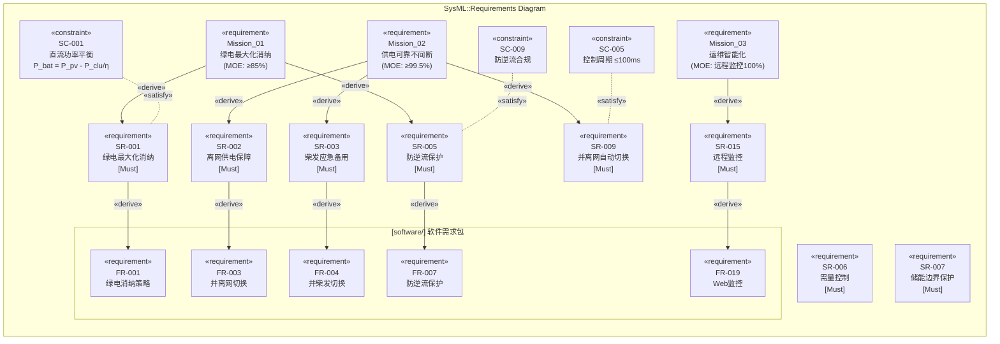
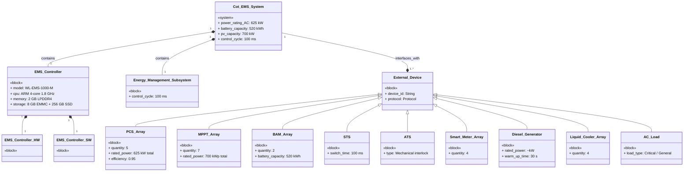
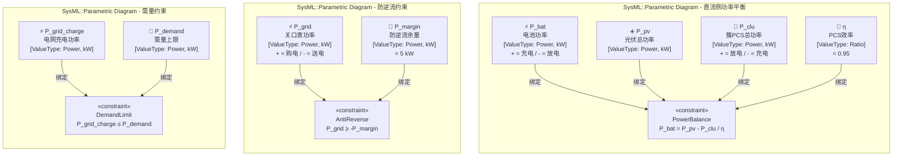
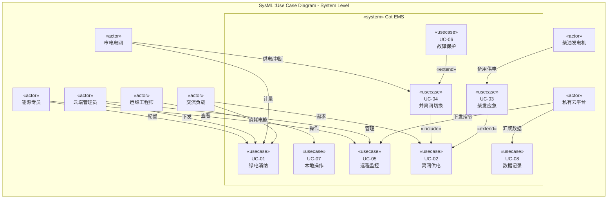
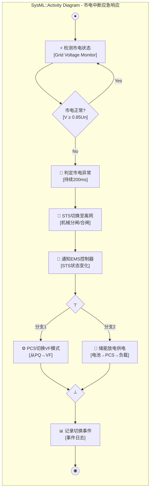
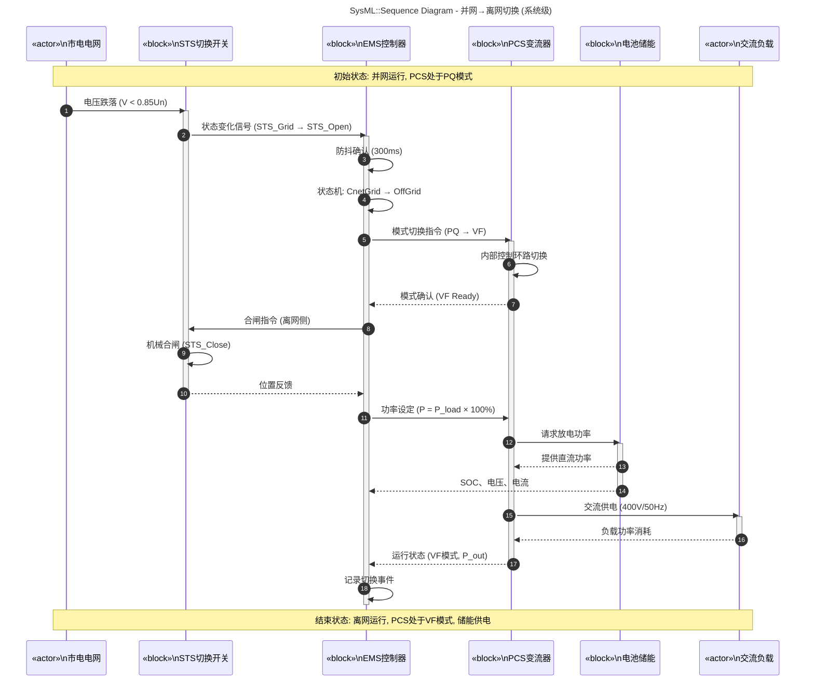
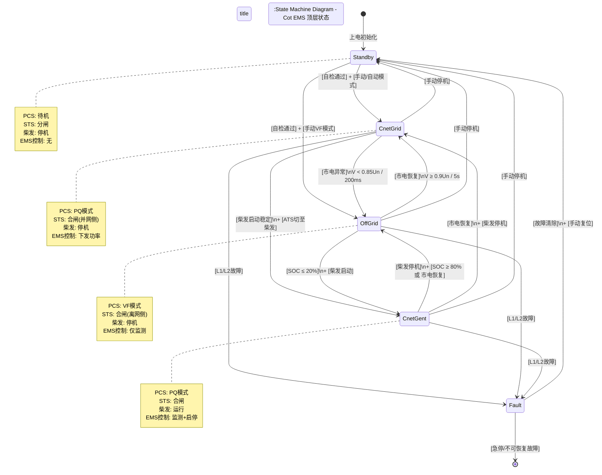

# S3-System-Views.md - Cot EMS 系统视图总集

> **文档版本**: 1.0
> **最后更新**: 2026-04-29
> **关联文档**: [S0-System-Context.md](./S0-System-Context.md), [S1-System-Requirements.md](./S1-System-Requirements.md), [S2-System-Structure.md](./S2-System-Structure.md)
> **方法论**: SysML v1.6 九种图分类（结构4 + 行为4）

---

## 目录

- [结构视图 (Structural Views)](#结构视图)
  - [1. 包图 (Package Diagram)](#1-包图)
  - [2. 需求图 (Requirements Diagram)](#2-需求图)
  - [3. 模块定义图 (Block Definition Diagram)](#3-模块定义图)
  - [4. 参数图 (Parametric Diagram)](#4-参数图)
- [行为视图 (Behavioral Views)](#行为视图)
  - [5. 用例图 (Use Case Diagram)](#5-用例图)
  - [6. 活动图 (Activity Diagram)](#6-活动图)
  - [7. 序列图 (Sequence Diagram)](#7-序列图)
  - [8. 状态机图 (State Machine Diagram)](#8-状态机图)

---

# 结构视图

结构视图回答 **"系统由什么组成、如何组织"**。SysML 的结构图描述系统的静态方面——模块、接口、约束、需求层次。

---

## 1. 包图 (Package Diagram)

包图展示 **模型元素的组织层次**。Cot 项目的文档体系按 SysML/UML 方法论分为两个顶层包。

```mermaid
classDiagram
    direction TB

    namespace Cot_EMS_Project {
        class Cot_EMS_Project {
            «package»
            + version: 2.0
            + method: SysML + UML
        }
    }

    namespace System_Engineering {
        class System_Engineering {
            «package»
            + method: SysML
        }
        class Pkg_Context {
            «package»
            S0-System-Context.md
        }
        class Pkg_Requirements {
            «package»
            S1-System-Requirements.md
        }
        class Pkg_Structure {
            «package»
            S2-System-Structure.md
        }
        class Pkg_Behavior {
            «package»
            S3-System-Behavior.md
        }
        class Pkg_Parametric {
            «package»
            S4-System-Parametric.md
        }
        class Pkg_Allocation {
            «package»
            S5-System-Allocation.md
        }
    }

    namespace Software_Engineering {
        class Software_Engineering {
            «package»
            + method: UML + SA
        }
        class Pkg_SwContext {
            «package»
            00-Context.md
        }
        class Pkg_PRD {
            «package»
            01-PRD.md
        }
        class Pkg_Domain {
            «package»
            02-Domain-Model.md
        }
        class Pkg_Arch {
            «package»
            03-Architecture.md
        }
        class Pkg_StateMachine {
            «package»
            04-State-Machine.md
        }
        class Pkg_FuncSpec {
            «package»
            05-Functional-Spec.md
        }
        class Pkg_Technical {
            «package»
            06-Technical-Design.md
        }
        class Pkg_API {
            «package»
            07-API-Contract.yml
        }
        class Pkg_Test {
            «package»
            08-Test-Spec.md
        }
        class Pkg_Tasks {
            «package»
            09-Task-Breakdown.json
        }
        class Pkg_Frontend {
            «package»
            10-Frontend-Backend.md
        }
        class Pkg_SA {
            «package»
            11-Structured-Analysis.md
        }
        class Pkg_OO {
            «package»
            12-OO-Modeling.md
        }
        class Pkg_HMI {
            «package»
            HMI-Design.md
        }
    }

    Cot_EMS_Project *-- System_Engineering
    Cot_EMS_Project *-- Software_Engineering

    System_Engineering *-- Pkg_Context
    System_Engineering *-- Pkg_Requirements
    System_Engineering *-- Pkg_Structure
    System_Engineering *-- Pkg_Behavior
    System_Engineering *-- Pkg_Parametric
    System_Engineering *-- Pkg_Allocation

    Software_Engineering *-- Pkg_SwContext
    Software_Engineering *-- Pkg_PRD
    Software_Engineering *-- Pkg_Domain
    Software_Engineering *-- Pkg_Arch
    Software_Engineering *-- Pkg_StateMachine
    Software_Engineering *-- Pkg_FuncSpec
    Software_Engineering *-- Pkg_Technical
    Software_Engineering *-- Pkg_API
    Software_Engineering *-- Pkg_Test
    Software_Engineering *-- Pkg_Tasks
    Software_Engineering *-- Pkg_Frontend
    Software_Engineering *-- Pkg_SA
    Software_Engineering *-- Pkg_OO
    Software_Engineering *-- Pkg_HMI

    Pkg_Requirements ..> Pkg_PRD : «derive»
    Pkg_Structure ..> Pkg_Domain : «derive»
    Pkg_Structure ..> Pkg_Arch : «derive»
```

### 包图说明

| 顶层包 | 子包数 | 方法论 | 回答的问题 |
|--------|--------|--------|-----------|
| **System_Engineering** | 6 | SysML | 系统是什么、做什么、由什么组成 |
| **Software_Engineering** | 13 | UML + SA | 软件怎么做、数据怎么流、类怎么交互 |

**derive 关系**：系统层的需求和结构派生到软件层的实现。

---

## 2. 需求图 (Requirements Diagram)

需求图展示 **需求的层次分解与追溯关系**。Cot 项目的需求从"系统使命"分解到"系统需求"，再派生到"软件需求"。



### 需求图图例

| 关系 | 含义 | 示例 |
|------|------|------|
| **derive** | 需求分解/派生 | Mission → SR → FR |
| **satisfy** | 约束满足需求 | SC 约束 SR |
| **verify** | 测试验证需求 | TestCase → SR |

---

## 3. 模块定义图 (Block Definition Diagram)

模块定义图(BDD)展示 **模块的类型层次和组合关系**。这里展示 Cot EMS 系统的核心模块分解。



### BDD 说明

| 关系符号 | SysML 语义 | Cot 含义 |
|----------|-----------|---------|
| **空心三角 + 实线** | 泛化 (generalization) | External_Device 是父类型，PCS_Array 等是子类型 |
| **实心菱形 + 实线** | 组合 (composition) | 强拥有关系，子模块随父模块销毁 |
| **普通关联** | 关联 (association) | EMS_Controller 与外部设备通信，但不拥有 |

---

## 4. 参数图 (Parametric Diagram)

参数图是 SysML **独有的图**，展示 **物理约束方程与模块属性的绑定关系**。UML 没有这张图。



### 参数图说明

参数图将 **物理定律/工程约束** 形式化为约束块(Constraint Block)，通过 **绑定连接器** 与模块的属性关联。

| 约束块 | 方程 | 物理含义 | 来源 |
|--------|------|---------|------|
| **PowerBalance** | P_bat = P_pv - P_clu/η | 直流侧能量守恒 | 电气工程 |
| **AntiReverse** | P_grid ≥ -P_margin | 防止向电网送电 | 电网法规 |
| **DemandLimit** | P_grid_charge ≤ P_demand | 限制电网充电功率 | 经济性约束 |
| **SOCChange** | dSOC/dt = P_bat / (V_bat × C_bat) | 电池SOC变化率 | 电化学 |

> **UML 没有参数图**。如果你需要在 UML 中表达物理约束，只能用注释(note)或 OCL 约束——无法形式化地绑定到模块属性。

---

# 行为视图

行为视图回答 **"系统做什么、怎么做、如何随时间变化"**。SysML 的行为图描述系统的动态方面——交互、状态、流程、功能。

---

## 5. 用例图 (Use Case Diagram)

用例图从 **外部利益相关者视角** 展示系统提供的功能。这里画的是**系统级用例**（不是软件级用例）。



### 用例图图例

| 关系 | 含义 | 示例 |
|------|------|------|
| **association** | 参与者使用用例 | 运维工程师 → 本地操作 |
| **«include»** | 必须包含 | 并离网切换 必须包含 离网供电 |
| **«extend»** | 可选扩展 | 柴发应急 扩展 离网供电（可选） |

### 系统级 vs 软件级用例的区别

| 维度 | 系统级用例（本图） | 软件级用例（software/） |
|------|-------------------|------------------------|
| 边界 | EMS控制器 + 所有设备 | EMS控制器软件 |
| 参与者 | 市电、柴发、负载（物理系统） | 只有人类用户 |
| 功能粒度 | "离网供电"（含STS切换+PCS切换+储能放电） | "下发PCS功率指令"（纯软件动作） |

---

## 6. 活动图 (Activity Diagram)

活动图展示 **系统级业务流程的控制流和对象流**。这里画的是"市电中断→离网切换→储能供电"的系统级活动。



### 活动图说明

| 节点类型 | 图形 | 含义 | Cot 示例 |
|----------|------|------|---------|
| **初始节点** | 实心圆 | 流程起点 | 开始检测 |
| **活动节点** | 圆角矩形 | 执行的动作 | STS切换 |
| **判断节点** | 菱形 | 条件分支 | 市电正常? |
| **分叉节点** | 粗横线 | 并行执行 | PCS切换 + 储能放电并行 |
| **汇合节点** | 粗横线 | 并行汇合 | 等两个分支都完成 |
| **终止节点** | 同心圆 | 流程结束 | 事件记录完成 |

> **对象流**：活动图还可以表达"对象"（如功率指令、事件记录）在活动之间的流动，本图省略以简化。

---

## 7. 序列图 (Sequence Diagram)

序列图展示 **系统级对象之间的交互时序**。这里画的是"并网→离网切换"的系统级时序。



### 序列图图例

| 元素 | 含义 | Cot 示例 |
|------|------|---------|
| **生命线** | 对象存在的时间段 | EMS控制器的垂直虚线 |
| **消息箭头** | 对象间通信 | PCS → BAT 请求放电 |
| **激活条** | 对象正在执行 | EMS的蓝色矩形块 |
| **自反消息** | 对象内部处理 | EMS → EMS 状态机切换 |
| **编号** | 时序步骤 | ① ② ③... |

### 系统级 vs 软件级序列图的区别

| 维度 | 系统级序列图（本图） | 软件级序列图（software/12-OO） |
|------|---------------------|-------------------------------|
| 对象 | 物理设备/系统 | 软件类/对象 |
| 消息 | 物理信号/协议帧 | 方法调用/事件 |
| 时间 | 物理时间 (ms/s) | 逻辑时序 |
| 生命线 | 设备存在周期 | 对象实例生命周期 |

---

## 8. 状态机图 (State Machine Diagram)

状态机图展示 **系统在其生命周期中的状态及转换**。这里画的是 Cot EMS 的**顶层系统状态机**。



### 状态机图图例

| 元素 | 图形 | 含义 | Cot 示例 |
|------|------|------|---------|
| **状态** | 圆角矩形 | 系统稳定配置 | CnetGrid = 并网运行 |
| **转换** | 箭头 | 状态变化 | CnetGrid → OffGrid |
| **触发事件** | 转换标签 | 触发转换的条件 | [市电异常] |
| **守卫条件** | [方括号] | 布尔条件 | V < 0.85Un |
| **动作** | / 斜杠后 | 转换时执行 | STS切换 |
| **初始伪状态** | 实心圆 | 起始点 | [*] → Standby |
| **终止伪状态** | 同心圆 | 结束点 | Fault → [*] |

### 状态属性表

| 状态 | PCS模式 | STS位置 | 柴发 | EMS控制策略 |
|------|---------|---------|------|------------|
| **Standby** | 待机 | 分闸 | 停机 | 无 |
| **CnetGrid** | PQ | 并网侧合闸 | 停机 | 绿电/备电策略 |
| **OffGrid** | VF | 离网侧合闸 | 停机 | 仅监测（PCS自主） |
| **CnetGent** | PQ | 合闸 | 运行 | 柴发主导 |
| **Fault** | 待机 | 分闸 | 停机 | 保护停机 |

---

## 视图对照总表

| 视图类型 | SysML 图 | 回答的问题 | 对应 Cot 文档 |
|----------|---------|-----------|--------------|
| **结构** | 包图 | 模型如何组织？ | INDEX.md |
| **结构** | 需求图 | 需求如何分解？ | S1-System-Requirements.md |
| **结构** | 模块定义图 | 由什么模块组成？ | S2-System-Structure.md |
| **结构** | 参数图 | 物理约束是什么？ | S4-System-Parametric.md (待创建) |
| **行为** | 用例图 | 外部视角的系统功能？ | S0-System-Context.md |
| **行为** | 活动图 | 业务流程如何流转？ | S3-System-Behavior.md (待创建) |
| **行为** | 序列图 | 对象如何按时间交互？ | S3-System-Behavior.md (待创建) |
| **行为** | 状态机图 | 生命周期中的状态变化？ | software/04-State-Machine.md |

---

## 修订记录

| 版本 | 日期 | 变更内容 |
|------|------|---------|
| 1.0 | 2026-04-29 | 初始创建 — 8种SysML图（结构4 + 行为4），全部用mermaid表达 |
